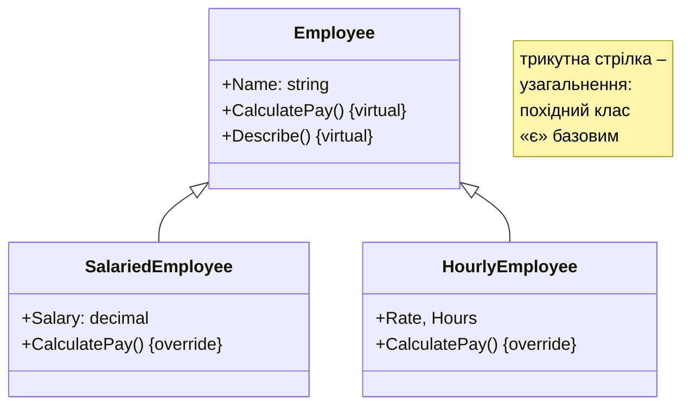
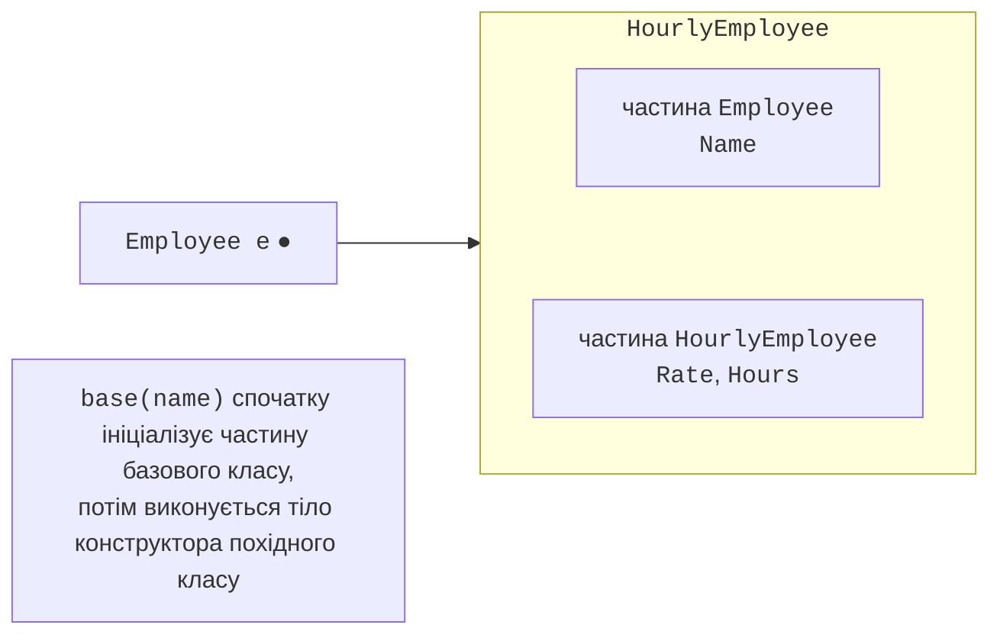

# Наслідування та конструктори

## Наслідування

**Наслідування** (*inheritance*) – механізм, який дозволяє створити новий клас на основі наявного: новий клас отримує всі члени наявного й може додати власні або змінити поведінку успадкованих (<https://learn.microsoft.com/dotnet/csharp/fundamentals/object-oriented/inheritance>). Клас, від якого наслідують, називається **базовим** (*base class*, батьківським), а новий клас – **похідним** (*derived class*, дочірнім). Похідний клас оголошують через двокрапку:

```cs
class Employee { /* Name, CalculatePay() */ }
class HourlyEmployee : Employee { /* Rate, Hours */ }
```

Наслідування моделює відношення **«є»** (*is-a*): погодинний працівник **є** працівником, автомобіль **є** транспортним засобом. Перевірка цим реченням допомагає уникнути помилкового наслідування: якщо речення звучить безглуздо («автомобіль є двигуном»), наслідування не підходить. На UML-діаграмі наслідування (**узагальнення**) позначають лінією з порожнім трикутником біля базового класу (рис. 9.1).



Рис. 9.1. UML-діаграма ієрархії працівників {.caption}

Важливі обмеження C#:

- клас може мати **лише один** базовий клас (помилка CS1721 для `class C : A, B`); множинне наслідування поведінки замінюють інтерфейсами (тема 10);
- якщо базовий клас не вказано, класом є `object` (`System.Object`): усі типи .NET прямо чи опосередковано походять від нього;
- ланцюжок може мати кілька рівнів: `Puppy : Dog : Animal : object`.

## Що наслідується

Похідний клас отримує поля, властивості й методи базового класу, але **доступ** до них визначають модифікатори (тема 8):

- члени `public` і `internal` доступні як звичайно;
- члени `private` існують в об’єкті похідного класу, але звернутися до них із коду похідного класу неможливо (помилка CS0122);
- члени `protected` доступні в базовому класі та в усіх похідних, але не ззовні. Так базовий клас відкриває деталі реалізації лише «нащадкам»: `public decimal Balance { get; protected set; }` дозволяє змінювати баланс у похідних класах рахунків, але не в клієнтському коді.

**Конструктори не наслідуються**: кожен клас оголошує власні конструктори.

Об’єкт похідного класу містить і частину базового класу, і власні дані (рис. 9.2). Тому змінній базового типу можна присвоїти об’єкт похідного класу: `Employee e = new HourlyEmployee(…)`.



Рис. 9.2. Будова об’єкта похідного класу {.caption}

## Конструктори похідного класу

Перед тілом конструктора похідного класу завжди виконується конструктор базового класу. Який саме конструктор викликати й з якими аргументами, вказують після двокрапки ключовим словом `base`:

```cs
var puppy = new Puppy("Рекс");

class Animal
{
    public Animal(string name) =>
        Console.WriteLine($"Animal({name})");
}

class Dog : Animal
{
    public Dog(string name) : base(name) => Console.WriteLine("Dog");
}

class Puppy : Dog
{
    public Puppy(string name) : base(name) =>
        Console.WriteLine("Puppy");
}
```

Результат: `Animal(Рекс)`, `Dog`, `Puppy` – конструктори виконуються від базового класу до похідного. Якщо `base(…)` не записано, викликається конструктор базового класу без параметрів; якщо такого немає, компілятор повідомляє про помилку CS7036. Тому базовий клас зазвичай перевіряє свої дані, а похідний – лише власні.
