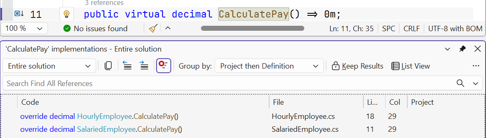
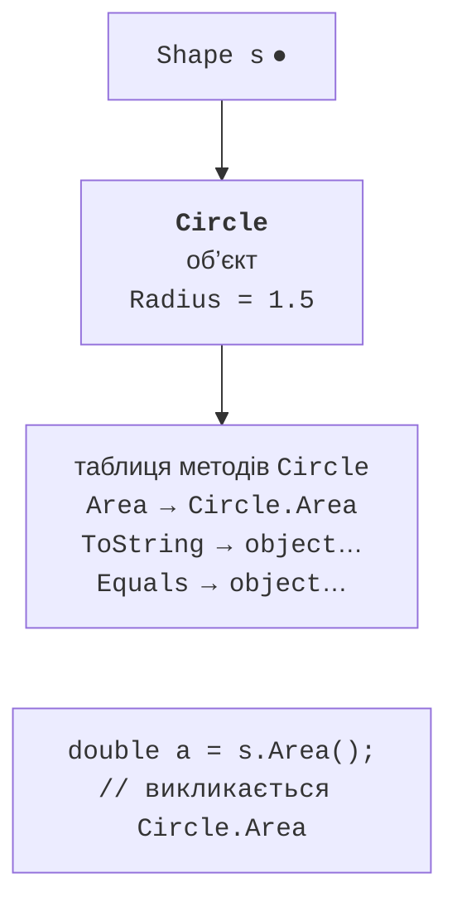
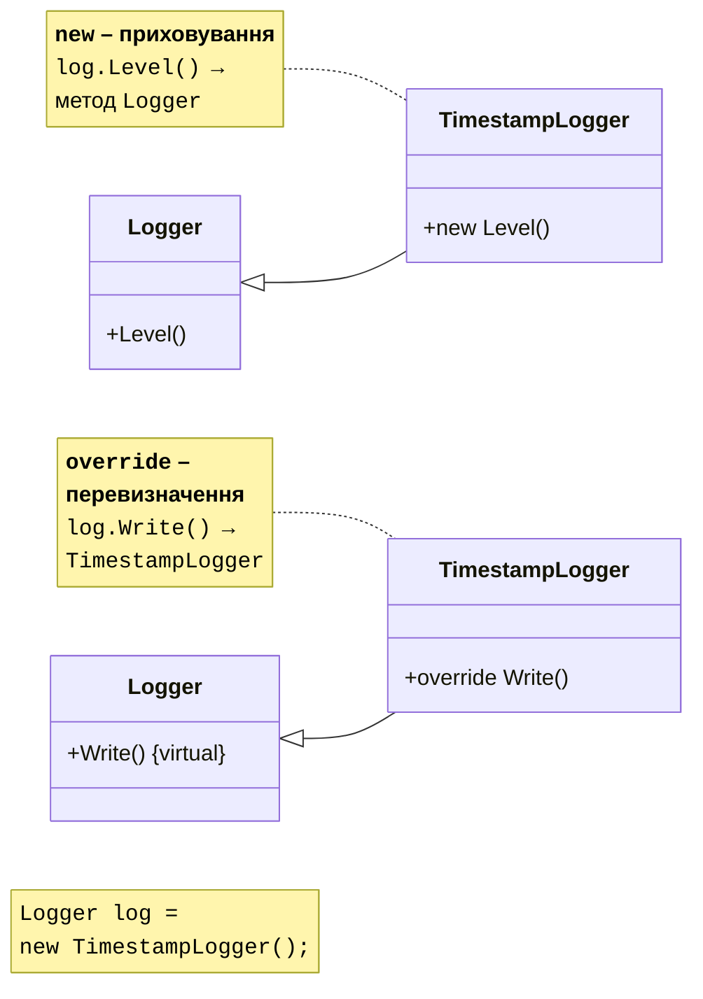

# Віртуальні методи та поліморфізм

## Віртуальні методи та перевизначення

Похідний клас може **змінити поведінку** успадкованого методу. Для цього метод базового класу позначають `virtual`, а в похідному класі оголошують метод із тією самою сигнатурою й модифікатором `override`. Перевизначити можна лише віртуальний, абстрактний або вже перевизначений метод (помилка CS0506). Усередині перевизначення базову реалізацію викликають через `base.Method()`:

```cs
Employee e = new SalariedEmployee("Коваль О.", 32_000m);
Console.WriteLine(e.Describe());           // Коваль О. (оклад)

class Employee(string name)
{
    public string Name { get; } = name;
    public virtual string Describe() => Name;
}

class SalariedEmployee(string name, decimal salary) : Employee(name)
{
    public decimal Salary { get; } = salary;
    public override string Describe() => $"{base.Describe()} (оклад)";
}
```

Властивості також можуть бути віртуальними (`protected virtual decimal Available => Balance;`). Visual Studio генерує заготовки перевизначень: курсор у класі → **Ctrl+.** → *Generate overrides…* (рис. 9.3).


Рис. 9.3. Генерування перевизначень методів {.caption}

Перелік усіх перевизначень віртуального методу показує команда *Go To Implementation* (**Ctrl+F12**) (рис. 9.4).



Рис. 9.4. Перехід до перевизначень віртуального методу {.caption}

## Поліморфізм

**Поліморфізм** (*polymorphism*, «багато форм») – здатність коду, написаного для базового типу, однаково працювати з об’єктами різних похідних типів, при цьому кожен об’єкт виконує **свою** версію віртуального методу (<https://learn.microsoft.com/dotnet/csharp/fundamentals/object-oriented/polymorphism>):

```cs
Employee[] staff = [new SalariedEmployee(…), new HourlyEmployee(…)];
foreach (Employee e in staff)
{
    total += e.CalculatePay();   // для кожного – свій розрахунок
}
```

Цикл нічого не знає про конкретні типи працівників. Якщо згодом додати клас `PieceworkEmployee` з відрядною оплатою, цикл не зміниться: достатньо перевизначити `CalculatePay` у новому класі.

Метод, який буде викликано, визначається **під час виконання** за **фактичним типом об’єкта**, а не за типом змінної: це **пізнє** (динамічне) **зв’язування**. Спрощено кожен об’єкт посилається на **таблицю віртуальних методів** свого класу, у якій для кожного віртуального методу записано реалізацію, що має бути викликана (рис. 9.5). Для невіртуальних методів виклик визначається **під час компіляції** за типом змінної.



Рис. 9.5. Виклик віртуального методу через посилання базового типу {.caption}

У налагоджувачі видно обидва типи: у вікні *Locals* змінна `e` має тип `Employee {HourlyEmployee}` – спочатку тип змінної, у дужках фактичний тип об’єкта (рис. 9.6).


Рис. 9.6. Тип змінної та фактичний тип об’єкта у вікні *Locals* {.caption}

## Приховування членів `new`

Якщо в похідному класі оголосити метод із такою самою сигнатурою, як у базовому, **без** `override`, новий метод **приховує** (*hides*) базовий. Компілятор попереджає про це: CS0108 для невіртуального методу і CS0114 для віртуального (рис. 9.8). Модифікатор `new` прибирає попередження й показує, що приховування зроблене свідомо. На відміну від перевизначення, прихований метод обирається за **типом змінної** (рис. 9.7):



Рис. 9.7. Приховування `new` і перевизначення `override` {.caption}


Рис. 9.8. Попередження про приховування успадкованого члена {.caption}

Приховування майже ніколи не потрібне в новому коді: воно робить поведінку залежною від типу змінної, що заплутує. Зустрічається переважно тоді, коли в базовому класі сторонньої бібліотеки з’явився член з тим самим ім’ям. Докладніше про відмінність <https://learn.microsoft.com/dotnet/csharp/programming-guide/classes-and-structs/knowing-when-to-use-override-and-new-keywords>.

## Клас `object`

Клас `System.Object` містить методи, які мають усі об’єкти (<https://learn.microsoft.com/dotnet/api/system.object>):

- `ToString()` – текстове подання; за замовчуванням повертає ім’я типу;
- `Equals(object? obj)` – рівність; за замовчуванням для класів порівнює **посилання**;
- `GetHashCode()` – хеш-код для хеш-таблиць (словників, множин; тема 13);
- `GetType()` – об’єкт `Type` з інформацією про фактичний тип (невіртуальний метод).

Перші три методи віртуальні й часто перевизначаються. Якщо об’єкти класу мають вважатися рівними за **значенням** (дві книги з однаковим ISBN), перевизначають `Equals` і `GetHashCode` **разом**:

- `Equals` має бути **рефлексивним** (`a.Equals(a)`), **симетричним** (`a.Equals(b) == b.Equals(a)`) і **транзитивним**; для `null` і об’єктів іншого типу повертає `false`;
- рівні об’єкти **мусять** мати однаковий хеш-код; зручно обчислювати його методом `HashCode.Combine` з тих самих полів, що беруть участь у `Equals`;
- поля, що визначають рівність, бажано робити незмінними.

Операція `==` для класів і далі порівнює посилання, якщо її не перевантажено (тема 12). Записи (`record`, тема 11) генерують `Equals`, `GetHashCode` і `==` за значенням автоматично.
