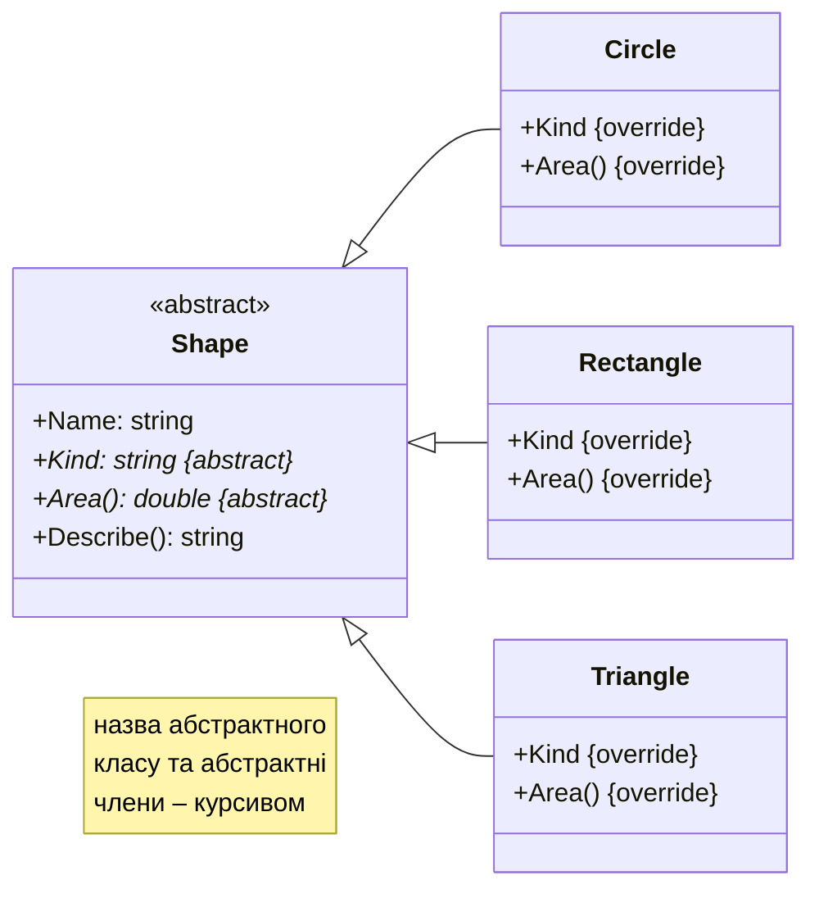
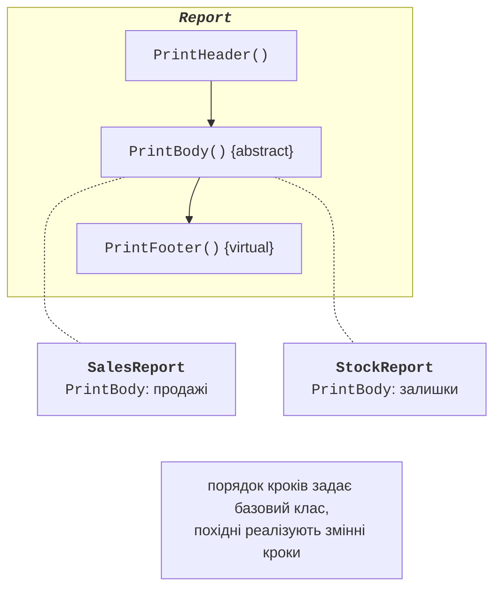

# Абстракція та абстрактні класи

## Абстракція

**Абстракція** (*abstraction*) – виділення суттєвих спільних ознак об’єктів і відкидання несуттєвих деталей. У попередній темі базовий клас `Shape` мав метод `Area`, який повертав 0: для «фігури взагалі» площу обчислити неможливо, і ця реалізація була штучною. Мова C# дозволяє висловити таку ідею прямо: оголосити, **що** повинні вміти похідні класи, не вказуючи, **як**. Для цього існують **абстрактні класи** й **інтерфейси**.

## Абстрактні класи

**Абстрактний клас** позначають модифікатором `abstract`. Він може містити **абстрактні члени** – методи, властивості, індексатори без реалізації, які мусять реалізувати похідні класи (<https://learn.microsoft.com/dotnet/csharp/language-reference/keywords/abstract>):

```cs
abstract class Shape
{
    protected Shape(string name) => Name = name;

    public string Name { get; }
    public abstract double Area();          // без тіла
    public abstract string Kind { get; }

    public string Describe() => $"{Kind}: {Area():F2}";
}
```

Властивості абстрактного класу (рис. 10.1):

- створити об’єкт абстрактного класу неможливо: `new Shape("x")` спричиняє помилку CS0144;
- абстрактний клас може мати поля, звичайні методи й конструктори; конструктор викликається з похідного класу через `base(…)`, тому його роблять `protected`;
- абстрактний член неявно віртуальний, і неабстрактний похідний клас мусить перевизначити **усі** абстрактні члени (`override`), інакше помилка CS0534;
- змінна абстрактного типу може посилатися на об’єкт будь-якого похідного класу: поліморфізм працює так само, як із віртуальними методами.



Рис. 10.1. Абстрактний клас і його реалізації {.caption}

Заготовки перевизначень абстрактних членів Visual Studio створює автоматично: курсор на назві класу з помилкою CS0534 → **Ctrl+.** → *Implement abstract class* (рис. 10.2).


Рис. 10.2. Автоматична реалізація абстрактного класу {.caption}

### Шаблонний метод

Абстрактні класи часто використовують для шаблону проєктування **«шаблонний метод»** (*template method*): базовий клас містить звичайний метод із загальним алгоритмом, окремі кроки якого є абстрактними або віртуальними методами. Похідні класи змінюють кроки, але не порядок їх виконання (рис. 10.3). Приклад наведено в розділі «Приклади програм».



Рис. 10.3. Шаблонний метод {.caption}
