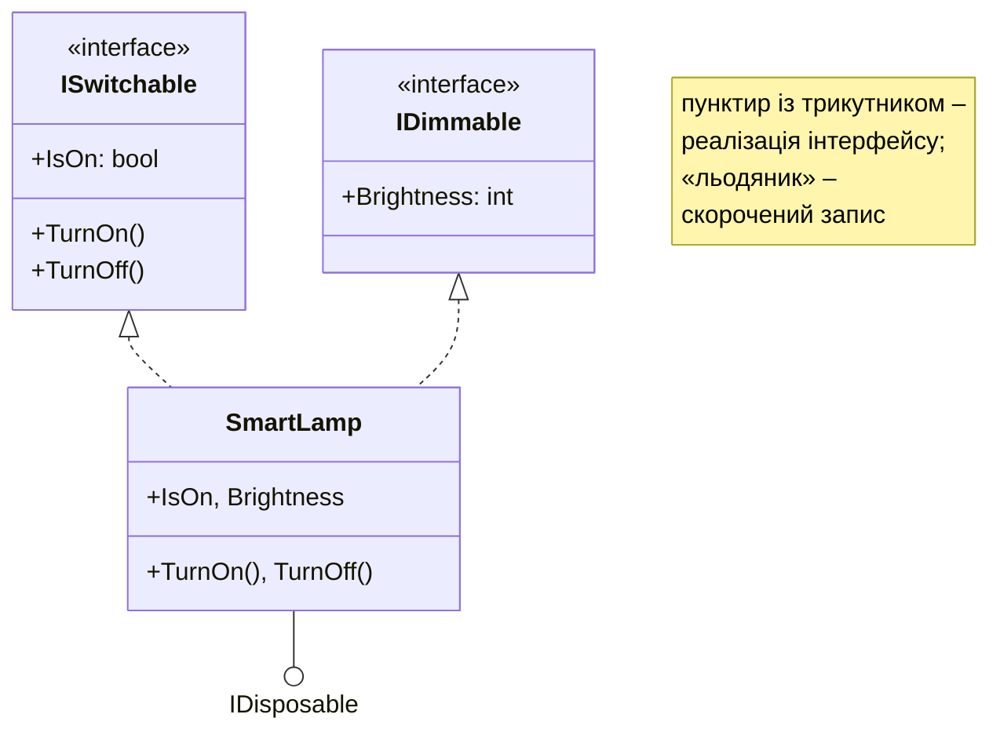

# Інтерфейси

## Інтерфейси

**Інтерфейс** (*interface*) – **контракт**: набір членів, які зобов’язується надати тип, що його реалізує (<https://learn.microsoft.com/dotnet/csharp/fundamentals/types/interfaces>). Назву інтерфейсу за угодою починають з літери `I`: `ISwitchable`, `IComparable<T>`. Інтерфейс оголошує методи, властивості, індексатори й події, але (крім членів за замовчуванням) не містить їх реалізації, полів екземпляра та конструкторів:

```cs
interface ISwitchable
{
    bool IsOn { get; }
    void TurnOn();
    void TurnOff();
}

class Kettle : ISwitchable
{
    public bool IsOn { get; private set; }
    public void TurnOn() => IsOn = true;
    public void TurnOff() => IsOn = false;
}
```

Члени інтерфейсу за замовчуванням публічні, тому й реалізації в класі мають бути `public` (помилка CS0737). Якщо клас не реалізує якийсь член, компілятор повідомляє про помилку CS0535. Visual Studio пропонує заготовки: **Ctrl+.** → *Implement interface* (рис. 10.4).


Рис. 10.4. Автоматична реалізація інтерфейсу {.caption}

### Кілька інтерфейсів

Клас може мати лише один базовий клас, але реалізовувати **будь-яку кількість** інтерфейсів: `class SmartLamp : Device, ISwitchable, IDimmable, IDisposable` (базовий клас записують першим). Змінна інтерфейсного типу може посилатися на будь-який об’єкт, що реалізує інтерфейс, а операція `is` з шаблоном перевіряє, чи підтримує об’єкт інший інтерфейс: `if (device is IDimmable d)`. Так пов’язують класи, які не мають спільного базового класу: чайник і лампа не є «одним видом» пристроїв, але обидва вмикаються (рис. 10.5).



Рис. 10.5. Клас, що реалізує кілька інтерфейсів {.caption}

На UML-діаграмі реалізацію інтерфейсу позначають пунктирною лінією з порожнім трикутником або скороченим «льодяником». Visual Studio може будувати такі діаграми з коду за допомогою необов’язкового компонента *Class Designer*, який встановлюють через Visual Studio Installer.

Інтерфейс можна виділити з наявного класу: курсор на назві класу → **Ctrl+.** → *Extract interface…* (рис. 10.6).


Рис. 10.6. Виділення інтерфейсу з класу {.caption}

### Явна реалізація інтерфейсу

Якщо два інтерфейси мають члени з однаковою сигнатурою, але різним змістом, або член не повинен бути частиною публічного інтерфейсу класу, використовують **явну реалізацію**: у назві члена вказують інтерфейс, а модифікатор доступу не пишуть (<https://learn.microsoft.com/dotnet/csharp/programming-guide/interfaces/explicit-interface-implementation>):

```cs
void IPrintable.Print() { /* друк на принтері */ }
void ILoggable.Print() { /* запис у журнал */ }
```

Явно реалізований член доступний лише через змінну типу інтерфейсу: `((IPrintable)report).Print()`. Приклад наведено в лабораторній роботі.

### Члени за замовчуванням і статичні абстрактні члени

Починаючи з C# 8, інтерфейс може містити **реалізацію за замовчуванням**: клас, що реалізує інтерфейс, отримує її автоматично, але може надати власну. Так до поширеного інтерфейсу додають новий член, не ламаючи наявні класи:

```cs
interface ISwitchable
{
    bool IsOn { get; }
    string Status => IsOn ? "увімк." : "вимк.";   // за замовчуванням
}
```

Член за замовчуванням викликається лише через змінну інтерфейсу. Інтерфейси також можуть оголошувати **статичні абстрактні члени** (C# 11): тип зобов’язується надати статичний метод, властивість або операцію. На цьому побудована узагальнена математика .NET: інтерфейс `INumber<T>` вимагає від числових типів операцій `+`, `*` і властивостей `Zero`, `One`, тому можна написати один метод суми для `int`, `double` і `decimal`. Узагальнення розглядаються в темі 13.
