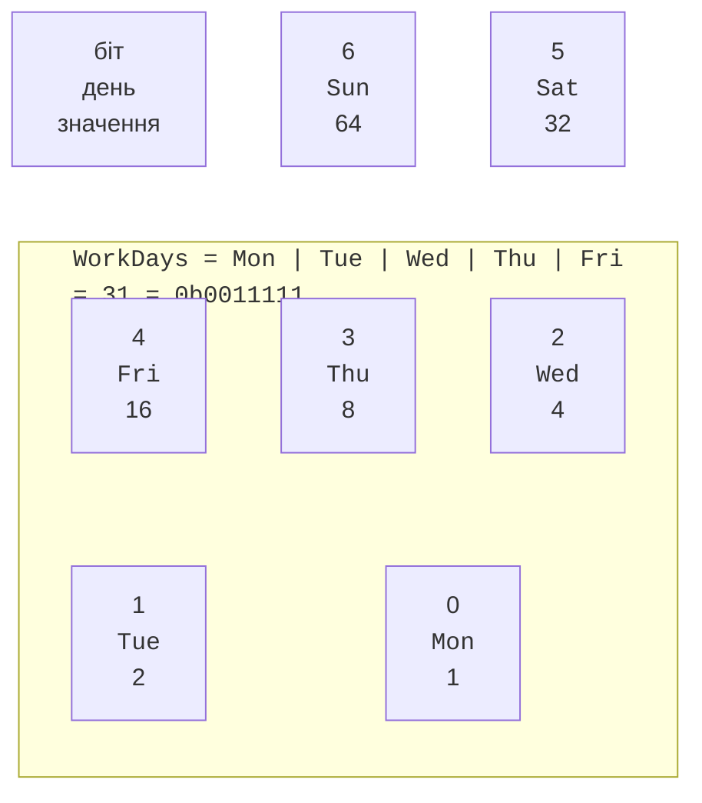
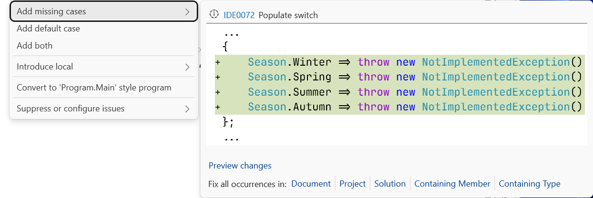
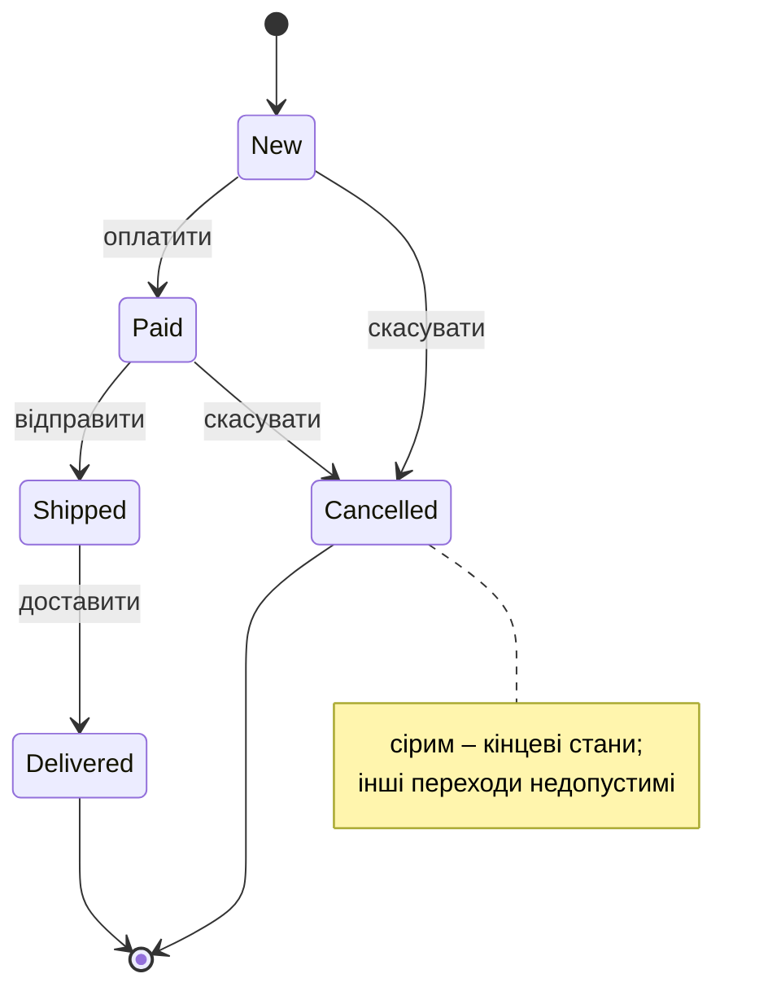

# Перелічення та кортежі

## Перелічення

**Перелічення** (*enumeration*, `enum`) – тип-значення з набором іменованих цілих констант. Замість «магічних чисел» (0 – новий, 1 – оплачений) код використовує осмислені імена, а компілятор перевіряє тип:

```cs
enum Season { Winter, Spring, Summer, Autumn }     // 0, 1, 2, 3

enum HttpStatus : short
{
    Ok = 200,
    NotFound = 404,
    ServerError = 500,
}
```

За замовчуванням базовий тип – `int`, значення починаються з 0 і зростають на 1. Базовий тип можна змінити на будь-який цілий (`byte`, `short`, `long`…), а значення задати явно. Перелічення явно приводиться до числа й назад: `(int)Season.Summer` дорівнює 2, `(Season)3` – `Autumn`.

Основні операції з переліченнями:

- `season.ToString()` – назва константи (`"Summer"`); для значення без назви – число;
- `Enum.Parse<Season>("summer", ignoreCase: true)` – розбір рядка з винятком у разі помилки;
- `Enum.TryParse<Season>(text, true, out var s)` – розбір без винятку;
- `Enum.GetValues<Season>()` і `Enum.GetNames<Season>()` – усі значення та назви;
- `Enum.IsDefined(season)` – чи має значення назву.

Приведення не перевіряє діапазон: `(Season)42` – допустиме значення без назви. Метод `TryParse` також успішно розбирає рядок `"42"`, тому введене користувачем значення додатково перевіряють методом `Enum.IsDefined`.

### Перелічення-прапорці

Якщо змінна може містити **кілька** значень одночасно, перелічення оголошують з атрибутом `[Flags]`, а константам призначають степені двійки: кожна займає окремий біт (рис. 11.5).

```cs
[Flags]
enum Days
{
    None = 0,
    Mon = 1, Tue = 2, Wed = 4, Thu = 8, Fri = 16, Sat = 32, Sun = 64,
    WorkDays = Mon | Tue | Wed | Thu | Fri,
}
```



Рис. 11.5. Перелічення-прапорці як набір бітів {.caption}

Набори значень обробляють побітовими операціями (тема 2): `|` – об’єднання, `&` – перетин, `& ~` – вилучення, `^` – перемикання. Метод `HasFlag` перевіряє наявність прапорця: `days.HasFlag(Days.Sat)` рівнозначне `(days & Days.Sat) == Days.Sat`. Атрибут `[Flags]` змінює `ToString`: значення 37 виводиться як `Mon, Wed, Sat`, а не як число.

### Перелічення у виразах `switch` і скінченні автомати

Перелічення природно обробляти виразом `switch` (тема 3). Якщо перелічено не всі константи, компілятор видає попередження CS8509 і пропонує дію *Add missing cases* (рис. 11.6). Навіть коли перелічено всі константи, залишається попередження CS8524 про значення без назви, наприклад `(Season)4`, тому додають гілку `_`, яка генерує виняток.



Рис. 11.6. Генерування гілок `switch` для перелічення {.caption}

Перелічення станів і вираз `switch` за кортежем `(стан, дія)` утворюють **скінченний автомат** (*finite-state machine*): об’єкт перебуває в одному зі станів, а дозволені переходи задає таблиця (рис. 11.7). Недопустимі переходи обробляє гілка `_`.



Рис. 11.7. Скінченний автомат станів замовлення {.caption}

## Кортежі

**Кортеж** (*tuple*) – легка структура `System.ValueTuple`, що групує кілька значень без оголошення окремого типу. Елементам можна дати імена; без імен вони доступні як `Item1`, `Item2`…

```cs
(string Name, int Age) person = ("Олена", 21);
Console.WriteLine($"{person.Name}, {person.Age}");

var point = (X: 3, Y: 4);                  // імена з літерала
Console.WriteLine(point == (3, 4));         // True
```

Кортежі – типи-значення зі змінними полями. Оператори `==` і `!=` порівнюють елементи попарно; імена елементів на порівняння не впливають. Найчастіше кортеж використовують для повернення кількох значень з методу замість параметрів `out` (тема 5). Тип кортежу з іменами показує підказка Visual Studio (рис. 11.8).

```cs
static (int Min, int Max) Order(int a, int b) =>
    a <= b ? (a, b) : (b, a);
```


Рис. 11.8. Іменований кортеж у підказці Visual Studio {.caption}

Для довгоживучих даних із власною поведінкою кортежі не підходять: краще оголосити запис. Кортеж доречний усередині методу або класу, коли значення тісно пов’язані й використовуються поруч.

### Деконструкція

**Деконструкція** розкладає кортеж або об’єкт на окремі змінні:

```cs
var (min, max) = Order(9, 4);   // нові змінні: 4 і 9
(min, max) = (max, min);        // обмін значень
var (_, top) = Order(9, 4);     // відкидання: лише 9
```

Для власного класу чи структури деконструкцію забезпечує метод `Deconstruct` з параметрами `out`; записи отримують його автоматично:

```cs
var (name, course) = new Student("Ірина", 2);
Console.WriteLine($"{name}, {course} курс");

class Student(string name, int course)
{
    public string Name { get; } = name;
    public int Course { get; } = course;

    public void Deconstruct(out string name, out int course)
    {
        name = Name;
        course = Course;
    }
}
```

### Позиційні шаблони та шаблони властивостей

Шаблони (тема 3) працюють і з новими типами. **Позиційний шаблон** використовує деконструкцію, **шаблон властивостей** перевіряє значення властивостей:

```cs
// Point і Book – записи з попередніх прикладів.
static string Quadrant(Point p) => p switch
{
    (0, 0) => "початок координат",
    (> 0, > 0) => "I чверть",
    (< 0, > 0) => "II чверть",
    { X: 0 } or { Y: 0 } => "на осі",
    _ => "III або IV чверть",
};

static string Era(Book book) => book switch
{
    { Year: < 1900 } => "класика",
    { Author: "Іван Багряний" } => "Багряний",
    _ => "сучасність",
};
```

Кортеж у виразі `switch` дозволяє аналізувати кілька значень одночасно, як у таблиці переходів автомата станів: `(state, action) switch { (New, Pay) => Paid, … }`.
