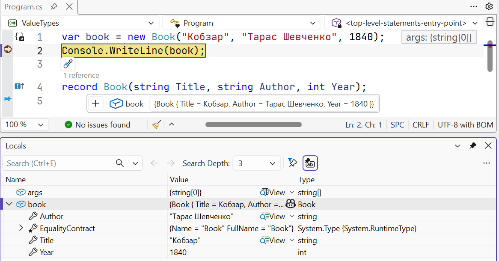
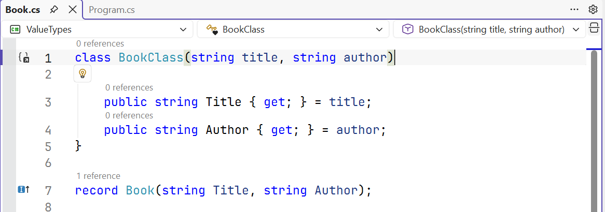

# Записи

## Записи

**Запис** (*record*) – тип, призначений насамперед для зберігання даних. Компілятор автоматично генерує для нього рівність значень, `GetHashCode`, `ToString`, метод копіювання та деконструкцію. Найкоротша, **позиційна** форма оголошення:

```cs
record Book(string Title, string Author, int Year);
```

Для кожного параметра створюється властивість лише для читання з аксесором `init`, а також первинний конструктор і метод `Deconstruct`. Оголошення `record` рівнозначне `record class`: запис є посилальним типом. Порівняння з класом:

- **рівність значень**: `==` і `Equals` порівнюють значення всіх властивостей і тип запису, а не посилання (у темі 9 для цього доводилося перевизначати `Equals` і `GetHashCode` вручну);
- `ToString` виводить назву типу й значення властивостей: `Book { Title = Кобзар, … }`;
- властивості позиційного запису незмінні: `book.Year = 2025` спричиняє помилку CS8852.

Запис може мати тіло з додатковими властивостями, методами й перевіркою параметрів. Вигляд запису в налагоджувачі показано на рис. 11.3.



Рис. 11.3. Автоматичний `ToString` запису в налагоджувачі {.caption}

### Вирази `with`, деконструкція, наслідування

Незмінний запис не змінюють, а створюють змінену копію **виразом** `with`: копіюються всі властивості, а вказані в фігурних дужках отримують нові значення. **Деконструкція** розкладає запис на змінні в порядку позиційних параметрів; непотрібні значення відкидають символом `_`:

```cs
Book book = new("Кобзар", "Тарас Шевченко", 1840);
Book reprint = book with { Year = 2024 };
var (title, _, year) = reprint;     // "Кобзар", 2024
```

Запис може наслідувати **лише інший запис**. Похідний запис передає параметри в базовий, а до рівності додається перевірка типу: `Book` і `EBook` з однаковими назвою, автором і роком не рівні. Вирази `with` працюють також для структур і анонімних типів.

Позиційний запис скорочує оголошення даних порівняно з класом із первинним конструктором і властивостями (рис. 11.4); додатково він отримує рівність значень та інші згенеровані члени запису.



Рис. 11.4. Клас із властивостями та позиційний запис {.caption}

### `record struct` і вибір типу

Оголошення `record struct` створює **структуру-запис**: тип-значення зі згенерованими `Equals`, `==`, `GetHashCode`, `ToString` і деконструкцією. На відміну від `record class`, властивості позиційної `record struct` **змінні** (`get; set;`). Незмінну структуру-запис оголошують як `readonly record struct`:

```cs
record struct Size(int Width, int Height);          // змінна
readonly record struct Point(double X, double Y);  // незмінна
```

Узагальнене порівняння варіантів наведено в табл. 11.1.

Таблиця 11.1. Порівняння класів, структур і записів {.caption}

| **Ознака** | `class` | `struct` | `record` | `record` `struct` |
| --- | --- | --- | --- | --- |
| вид типу | посилання | значення | посилання | значення |
| рівність | посилань | полів | значень | значень |
| генерується `==` | ні | ні | так | так |
| `ToString` з даними | ні | ні | так | так |
| позиційні властивості незмінні | – | – | так | з `readonly` |
| вираз `with` | ні | так | так | так |
| наслідування | так | ні | від записів | ні |

Практичні рекомендації: сутності з поведінкою та ідентичністю (рахунок, користувач) – класи; незмінні дані, що порівнюються за значенням (книга в каталозі, повідомлення, результат обчислення), – записи; невеликі значення (точка, грошова сума, колір) – `readonly struct` або `readonly record struct`.
