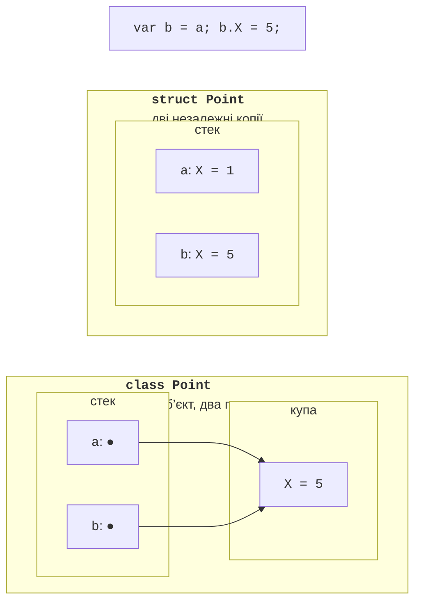
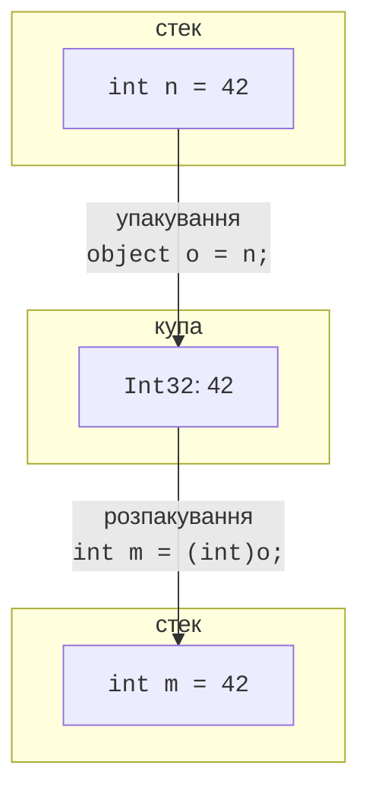

# Структури

## Структури

**Структура** (*structure*) оголошується ключовим словом `struct` і, як клас, може містити поля, властивості, методи та конструктори. Головна відмінність: структура є **типом-значенням** (тема 2). Змінна структури зберігає саме значення, а не посилання, тому присвоєння, передавання в метод і повернення з методу **копіюють** усі поля (рис. 11.1).

```cs
struct Point
{
    public int X;
    public int Y;

    public Point(int x, int y) { X = x; Y = y; }

    public override string ToString() => $"({X}; {Y})";
}
```



Рис. 11.1. Копіювання структури та класу {.caption}

Якщо `Point` оголошено як `struct`, після `var b = a; b.X = 5;` змінна `a` не змінюється: `b` – окрема копія. Якщо `Point` – клас, обидві змінні посилаються на один об’єкт у купі, і зміна через `b` видна через `a`.

Особливості структур:

- структура не може наслідувати інший клас чи структуру (неявно наслідує `System.ValueType`), і від неї не можна наслідуватися, але вона може реалізовувати інтерфейси;
- значення за замовчуванням `default(Point)` та елементи нового масиву `new Point[10]` мають усі поля з нульовими значеннями; конструктори при цьому **не викликаються**;
- з C# 10 структура може мати власний конструктор без параметрів та ініціалізатори полів, але `default` їх однаково ігнорує;
- змінна структури не може мати значення `null`; для відсутнього значення використовують `Point?` (`Nullable<Point>`, тема 2).

### Коли обирати структуру

Бібліотека .NET містить багато структур: `int`, `double`, `decimal`, `bool`, `char`, `DateTime`, `TimeSpan`, `Guid`. Настанови проєктування .NET рекомендують структуру, якщо тип логічно представляє одне значення (як число чи дата), має невеликий розмір (орієнтовно до 16 байтів), є незмінним і не потребує частого упакування. В інших випадках обирають клас. Великі структури погіршують швидкодію, бо копіюються повністю під час кожного присвоєння.

### `readonly struct` і пастка зміни копії

Структуру з модифікатором `readonly` компілятор перевіряє на незмінність: усі поля мають бути `readonly`, а властивості – без `set` (або з `init`). Окремий метод чи властивість звичайної структури теж можна позначити `readonly`, якщо вони не змінюють стан.

Змінні структури небезпечні через копіювання. Властивість або метод, що повертає структуру, повертає **копію**, тому її зміна не мала б сенсу, і компілятор її забороняє:

```cs
Label label = new();
label.Position.X = 5;               // CS1612
label.Position = new Point(5, 0);   // правильно: нове значення

Point[] points = new Point[3];
points[0].X = 5;                    // масив: змінюється сам елемент

class Label
{
    public Point Position { get; set; }
}
```

Помилка CS1612 повідомляє, що не можна змінити значення, яке повертає `Label.Position`, бо воно не є змінною. Незмінні структури (`readonly struct`) таких проблем не мають: для зміни створюють нове значення.

### Упакування структур

Присвоєння структури змінній типу `object` або інтерфейсу виконує **упакування** (рис. 11.2): у купі створюється копія значення. Методи, викликані через інтерфейс, змінюють **упаковану копію**, а не вихідну змінну:

```cs
Counter c = new();
IIncrementable boxed = c;   // упакування: копія в купі
boxed.Increment();
Console.WriteLine(c.Value); // 0 – змінилася лише копія

interface IIncrementable { void Increment(); }

struct Counter : IIncrementable
{
    public int Value;
    public void Increment() => Value++;
}
```



Рис. 11.2. Упакування та розпакування значення {.caption}
