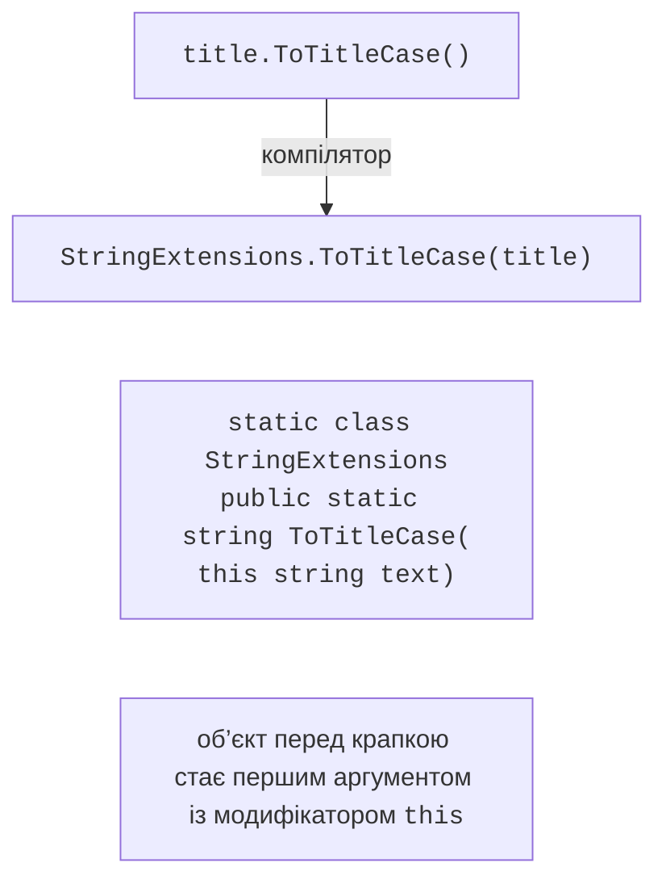

# Методи розширення

## Методи розширення

**Метод розширення** (*extension method*) додає метод до існуючого типу, не змінюючи його коду й не створюючи похідного класу. Так можна розширити навіть типи, код яких недоступний: `string`, `int`, `DateTime`, інтерфейси. Класичний метод розширення – статичний метод статичного неузагальненого класу, перший параметр якого має модифікатор `this`:

```cs
int count = "об’єктно-орієнтоване програмування".WordCount(); // 2

static class StringExtensions
{
    public static int WordCount(this string text) =>
        text.Split(' ', StringSplitOptions.RemoveEmptyEntries).Length;
}
```

Метод розширення викликається як метод екземпляра, але компілятор перетворює виклик на звичайний виклик статичного методу (рис. 12.6). Тому метод розширення не має доступу до закритих членів типу й може бути викликаний навіть для `null`.



Рис. 12.6. Виклик методу розширення {.caption}

Методи розширення доступні лише тоді, коли простір імен їхнього статичного класу підключено директивою `using` (або клас розташовано в тому самому просторі імен). IntelliSense позначає їх окремою піктограмою та словом *extension* (рис. 12.7). Методи розширення бібліотеки LINQ (тема 15) стають доступними після `using System.Linq`, яку для консольних проєктів підключено неявно.


Рис. 12.7. Метод розширення у списку IntelliSense {.caption}

### Правила розв’язання

- **Метод екземпляра має пріоритет**: якщо тип має власний метод з відповідною сигнатурою, метод розширення з тим самим ім’ям не викликається (без попередження).
- Розширення для інтерфейсу доступне для всіх класів, що його реалізують; так побудовано LINQ для `IEnumerable<T>`.
- Якщо кілька підключених просторів імен містять однакові розширення, виклик неоднозначний (помилка компіляції); тоді метод викликають явно: `StringExtensions.WordCount(text)`.

Метод розширення доречний для допоміжних операцій над чужими типами. Для власного класу звичайний метод класу зрозуміліший: його видно в коді класу, і він має доступ до закритих членів.

### Блоки `extension`

У C# 14 з’явилися **блоки розширень** (*extension members*). Блок `extension(DateTime date)` всередині статичного класу оголошує параметр-отримувач один раз для всіх членів блоку й дозволяє, окрім методів, оголошувати **властивості**, **статичні члени** та операції:

```cs
bool rest = DateTime.Today.IsWeekend;
DateTime first = DateTime.FirstOfMonth(2026, 9);

static class DateExtensions
{
    extension(DateTime date)           // члени екземпляра
    {
        public bool IsWeekend =>
            date.DayOfWeek is DayOfWeek.Saturday or DayOfWeek.Sunday;
    }

    extension(DateTime)                // статичні члени
    {
        public static DateTime FirstOfMonth(int year, int month) =>
            new(year, month, 1);
    }
}
```

Класичні методи розширення й блоки `extension` сумісні між собою: компілятор перетворює обидві форми на статичні методи. Нові блоки доцільні, коли потрібні властивості чи статичні члени; у наявному коді й документації найчастіше трапляються класичні методи з `this`.
