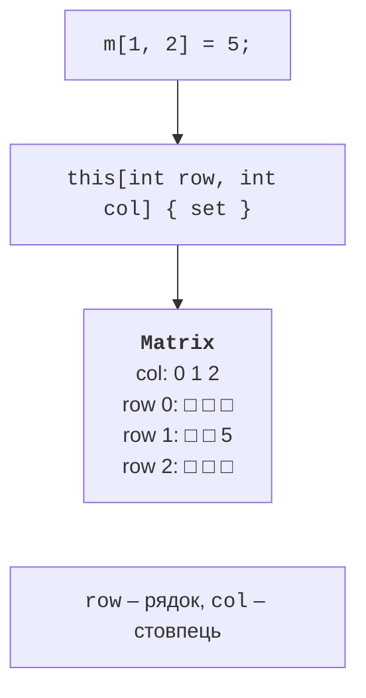

# Індексатори

## Індексатори

**Індексатор** (*indexer*) дозволяє звертатися до об’єкта як до масиву: `list[3]`, `matrix[1, 2]`, `board["e4"]`. Індексатор оголошують як властивість з ім’ям `this` і параметрами у квадратних дужках:

```cs
public double this[int power]
{
    get => power < coefficients.Length ? coefficients[power] : 0;
    set => coefficients[power] = value;
}
```

Особливості індексаторів:

- аксесори `get` і `set` працюють як у властивостей; індексатор лише для читання має тільки `get`;
- параметрів може бути кілька (`this[int row, int col]`) і будь-якого типу, зокрема рядки (`this[string square]`);
- індексатори можна перевантажувати за кількістю й типами параметрів;
- індексатор має перевіряти межі й генерувати `ArgumentOutOfRangeException` або `IndexOutOfRangeException` для некоректних індексів.

Звертання `m[1, 2] = 5` викликає аксесор `set` з параметрами `row = 1`, `col = 2` і `value = 5` (рис. 12.4). У налагоджувачі значення індексаторів можна обчислити у вікні *Watch* (рис. 12.5).



Рис. 12.4. Індексатор двовимірної матриці {.caption}


Рис. 12.5. Обчислення індексаторів у вікні Watch {.caption}

### Індекси з кінця та діапазони

Індекси з кінця `^1` і діапазони `1..3` (тема 4) працюють і з власними типами. Якщо тип має властивість `Length` або `Count` та індексатор з параметром `int`, вираз `seq[^1]` компілятор перетворює на `seq[seq.Length - 1]`. Для діапазонів потрібен ще метод `Slice(int start, int length)`:

```cs
Readings r = new();
Console.WriteLine(r[^1]);                     // 14,2
Console.WriteLine(string.Join("; ", r[1..3])); // 13,1; 12,9

class Readings
{
    private readonly double[] values = [12.5, 13.1, 12.9, 14.2];

    public int Length => values.Length;
    public double this[int index] => values[index];
    public double[] Slice(int start, int length) =>
        values[start..(start + length)];
}
```
