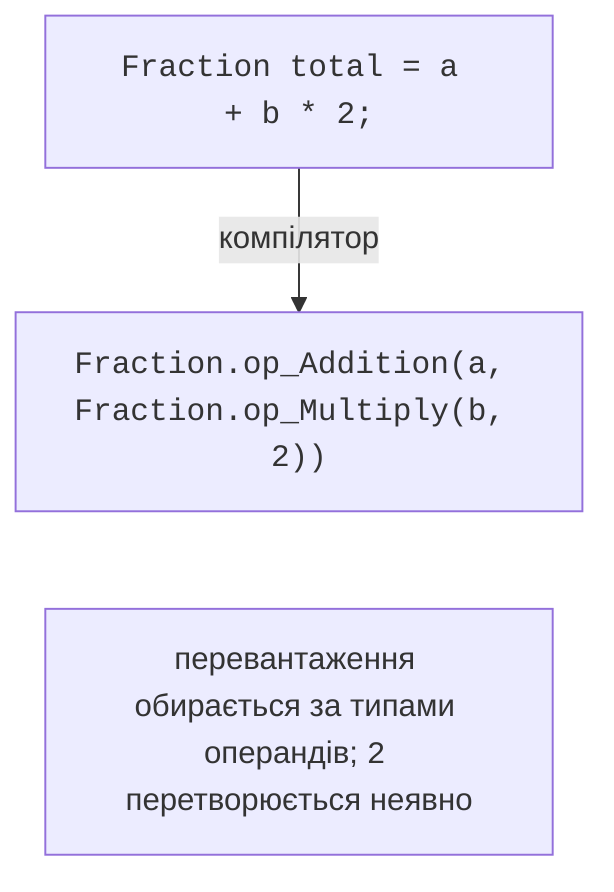
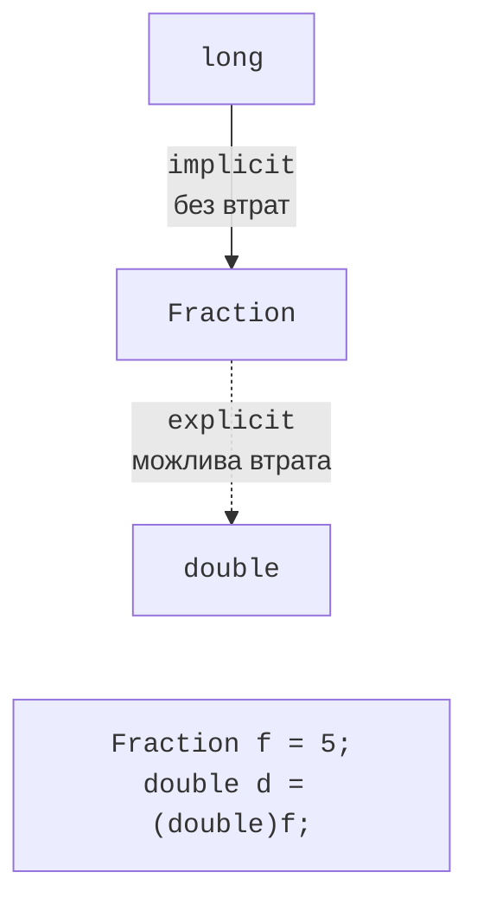

# Перевантаження операцій

## Перевантаження операцій

Для вбудованих типів запис `a + b * 2` природний і зрозумілий. Якщо в програмі є власні математичні типи (дроби, вектори, матриці, грошові суми), виклики `a.Add(b.Multiply(2))` читати значно важче. **Перевантаження операцій** (*operator overloading*) дозволяє визначити, що означають `+`, `*`, `==` та інші операції для власного класу чи структури.

Перевантажувати операції варто лише тоді, коли їхній зміст очевидний: `+` для дробів додає дроби. Операція `+`, яка додає товар у кошик або зберігає файл, лише заплутує код; для таких дій краще звичайний метод з осмисленою назвою.

### Синтаксис

Операцію оголошують як **публічний статичний метод** з ключовим словом `operator`. Хоча б один параметр має бути того типу, у якому оголошено операцію:

```cs
public static Fraction operator +(Fraction x, Fraction y) =>
    new(x.Numerator * y.Denominator + y.Numerator * x.Denominator,
        x.Denominator * y.Denominator);

public static Fraction operator -(Fraction x) =>   // унарний мінус
    new(-x.Numerator, x.Denominator);
```

Унарні операції (`+`, `-`, `!`, `~`, `++`, `--`) мають один параметр, бінарні – два. Типи операндів можуть відрізнятися: для множення вектора на число оголошують дві операції, `Vector2 * double` і `double * Vector2`, бо компілятор не переставляє операнди сам.

Компілятор перетворює вираз з операціями на виклики статичних методів зі спеціальними іменами `op_Addition`, `op_Multiply` тощо (рис. 12.1). Перевантаження обирається за типами операндів, так само як для звичайних методів (тема 5). Яку саме операцію буде викликано, показує підказка Visual Studio (рис. 12.2).



Рис. 12.1. Перетворення виразу з операціями на виклики методів {.caption}


Рис. 12.2. Перевантажена операція в підказці Visual Studio {.caption}

### Операції порівняння

Операції порівняння перевантажують **парами**: `==` і `!=`, `<` і `>`, `<=` і `>=`. Якщо оголосити лише одну операцію пари, компілятор видає помилку CS0216. Операція `==` має бути узгоджена з методом `Equals`: інакше `a == b` і `a.Equals(b)` дадуть різні результати, а колекції (тема 13), що використовують `Equals` і `GetHashCode`, працюватимуть неправильно. Тому компілятор попереджає CS0660 і CS0661, якщо `==` оголошено без перевизначення `Equals` і `GetHashCode`.

Типовий шаблон – реалізувати `IEquatable<T>` (тема 10) і виразити операції через `Equals`:

```cs
public bool Equals(Fraction other) =>
    Numerator == other.Numerator
    && Denominator == other.Denominator;
public override bool Equals(object? obj) =>
    obj is Fraction other && Equals(other);
public override int GetHashCode() =>
    HashCode.Combine(Numerator, Denominator);

public static bool operator ==(Fraction x, Fraction y) =>
    x.Equals(y);
public static bool operator !=(Fraction x, Fraction y) =>
    !x.Equals(y);
```

Операції `<` і `>` доцільно узгодити з `IComparable<T>`: якщо `CompareTo` повертає від’ємне число, `<` має повертати `true`. Записи (тема 11) генерують `==` і `!=` автоматично.

### Інші операції

Операції `++` і `--` оголошують як статичні методи, що повертають нове значення; компілятор сам реалізує префіксну й постфіксну форми. Операції `true` і `false` (також парні) дозволяють використовувати об’єкт в умові `if` і разом з `&` та `|` – в операціях `&&` і `||`:

```cs
public static bool operator true(Duration d) => d.Minutes > 0;
public static bool operator false(Duration d) => d.Minutes == 0;

if (duration) { /* тривалість ненульова */ }
```

Не можна перевантажити присвоєння `=`, доступ до члена `.`, умовну операцію `?:`, операції `??`, `&&`, `||`, `new`, `is`, `as`, `typeof`, `nameof`. Замість операцій `[]` і приведення типу оголошують відповідно індексатори й операції перетворення. Спроба оголосити, наприклад, `operator &&` спричиняє помилку CS1020.

### Складене присвоєння та `checked`-операції

Складене присвоєння `a += b` за замовчуванням виконується як `a = a + b`: окремо оголошувати його не потрібно. Для великих об’єктів (матриць, буферів) це означає створення нового об’єкта під час кожного `+=`. Починаючи з C# 14, клас може оголосити **власну** складену операцію як нестатичний метод, що змінює сам об’єкт:

```cs
class Mileage(long km)
{
    public long Km { get; private set; } = km;

    public static Mileage operator +(Mileage a, Mileage b) =>
        new(a.Km + b.Km);

    // Перевірена версія для контексту checked (C# 11).
    public static Mileage operator checked +(Mileage a, Mileage b) =>
        new(checked(a.Km + b.Km));

    // Власне складене присвоєння (C# 14): без нового об’єкта.
    public void operator +=(Mileage other) => Km += other.Km;
}
```

Операція з модифікатором `checked` викликається у контексті `checked` (тема 2) і має генерувати `OverflowException` у разі переповнення, а звичайна версія – діяти без перевірки. Так власні числові типи поводяться як вбудовані `int` і `long`.

## Операції перетворення

**Операції перетворення** (*conversion operators*) визначають приведення між власним типом та іншими типами. Перетворення `implicit` виконується автоматично, `explicit` – лише з явним приведенням `(double)f` (рис. 12.3):

```cs
public static implicit operator Fraction(long n) => new(n, 1);

public static explicit operator double(Fraction f) =>
    (double)f.Numerator / f.Denominator;
```



Рис. 12.3. Неявне та явне перетворення {.caption}

Неявним перетворення має бути лише тоді, коли воно **завжди** успішне й не втрачає інформації, як `int` → `long` для вбудованих типів. Якщо можливі втрата точності (дріб 1/3 у `double`) або виняток, перетворення оголошують явним. Неявне перетворення з `long` дозволяє писати `a + 2`: компілятор перетворює 2 на дріб і викликає `operator +(Fraction, Fraction)`.
