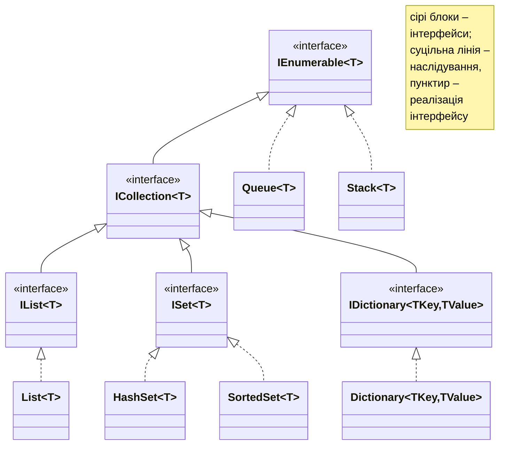
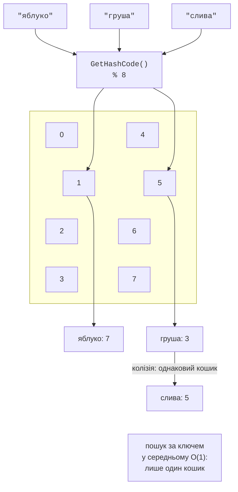
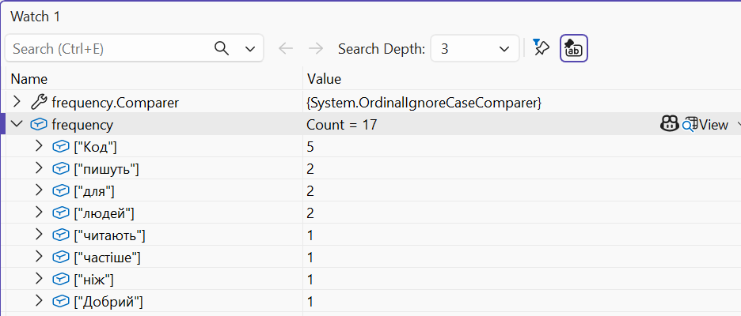
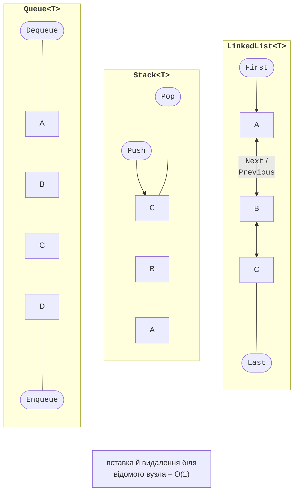

# Колекції .NET

## Колекції .NET

**Колекція** – об’єкт, що зберігає групу елементів і змінює розмір автоматично, на відміну від масиву. Узагальнені колекції реалізують спільні інтерфейси (рис. 13.3), тому код, що працює з `IEnumerable<T>`, приймає будь-яку з них. Діаграма спрощена: наприклад, `IDictionary` успадковує `ICollection<KeyValuePair<TKey, TValue>>`, а `Queue<T>` і `Stack<T>` реалізують `IEnumerable<T>` через `IReadOnlyCollection<T>`.



Рис. 13.3. Інтерфейси та класи колекцій (спрощено) {.caption}

Колекцію обирають за операціями, які виконуються найчастіше, та за їх **складністю** – залежністю часу виконання від кількості елементів *n*: O(1) – сталий час, O(log *n*) – логарифмічний, O(*n*) – лінійний (табл. 13.2).

Таблиця 13.2. Вибір колекції (<sup>\*</sup> – у середньому) {.caption}

| **Колекція** | **Призначення** | **Складність** |
| --- | --- | --- |
| `List<T>` | список з доступом за індексом | індекс O(1), `Add` O(1)<sup>\*</sup>, пошук O(*n*) |
| `Dictionary` | пари «ключ – значення» | пошук за ключем O(1)<sup>\*</sup> |
| `HashSet<T>` | множина унікальних елементів | `Contains` O(1)<sup>\*</sup> |
| `SortedDictionary`, `SortedSet<T>` | упорядковані ключі чи елементи | пошук, вставка O(log *n*) |
| `Queue<T>`, `Stack<T>` | черга FIFO, стек LIFO | додавання, вилучення O(1) |
| `PriorityQueue` | черга з пріоритетом | додавання, вилучення O(log *n*) |
| `LinkedList<T>` | двозв’язний список | вставка біля вузла O(1), пошук O(*n*) |

### `List<T>`

`List<T>` – найуживаніша колекція: динамічний масив, який збільшує внутрішній масив удвічі, коли місця не вистачає. Поточний розмір внутрішнього масиву повертає властивість `Capacity`, кількість елементів – `Count`.

```cs
List<string> cities = ["Лондон", "Мадрид"]; // вираз колекції
cities.Add("Париж");
cities.Insert(0, "Відень");                // зсуває решту: O(n)
cities.Remove("Мадрид");                   // перший збіг
bool hasLondon = cities.Contains("Лондон"); // лінійний пошук
int index = cities.IndexOf("Париж");        // 2 або -1
cities.Sort();                              // IComparable<string>
cities.Sort(new ByLength());                // власний IComparer<T>
List<string> copy = [.. cities];            // копія
```

Метод `Sort` без аргументів використовує `IComparable<T>` елементів, а з аргументом – порівнювач `IComparer<T>` (тема 10). Короткий запис порівнювача лямбда-виразом розглядається в темі 14.

### `Dictionary<TKey, TValue>`

**Словник** зберігає пари «ключ – значення» з унікальними ключами й знаходить значення за ключем у середньому за сталий час. Для цього словник обчислює `GetHashCode()` ключа й за ним визначає **кошик** (*bucket*), у якому шукає ключ методом `Equals` (рис. 13.4).



Рис. 13.4. Розміщення елементів у хеш-таблиці словника {.caption}

```cs
Dictionary<string, int> stock = new()
{
    ["яблуко"] = 7,
    ["груша"] = 3,
};
stock["слива"] = 5;                  // додавання або заміна
stock.Add("груша", 1);               // ArgumentException: ключ є
int pears = stock["груша"];     // KeyNotFoundException, якщо немає

if (stock.TryGetValue("вишня", out int cherries))   // без винятку
{
    Console.WriteLine(cherries);
}
bool added = stock.TryAdd("груша", 1);             // false
foreach (KeyValuePair<string, int> pair in stock)
{
    Console.WriteLine($"{pair.Key}: {pair.Value}");
}
```

Вимоги до ключа: `Equals` і `GetHashCode` мають бути узгоджені (тема 9), а ключ не повинен змінюватися, поки він у словнику. Рядки, числа, записи й перелічення підходять як ключі. Спосіб порівняння рядків задає аргумент конструктора: словник, створений з аргументом `StringComparer.OrdinalIgnoreCase`, не розрізняє регістр. Вміст словника зручно переглядати в налагоджувачі (рис. 13.5).



Рис. 13.5. Словник у налагоджувачі {.caption}

### Множини та впорядковані колекції

`HashSet<T>` зберігає **унікальні** елементи й швидко перевіряє належність. Операції над множинами змінюють поточну множину:

```cs
HashSet<string> monday = ["Олена", "Петро", "Ірина"];
HashSet<string> tuesday = ["Петро", "Андрій"];

bool added = monday.Add("Олена");     // false: уже є
monday.IntersectWith(tuesday);        // перетин: { Петро }
tuesday.UnionWith(["Ірина"]);         // об’єднання
tuesday.ExceptWith(["Андрій"]);       // різниця
bool subset = monday.IsSubsetOf(tuesday);
```

`SortedSet<T>` і `SortedDictionary<TKey, TValue>` підтримують елементи впорядкованими (дерево пошуку), а `SortedList<TKey, TValue>` зберігає впорядковані масиви ключів і значень та доступ за номером. Вони корисні, коли потрібен перебір у порядку ключів, найменший чи найбільший елемент.

### Черги, стеки та зв’язні списки

`Queue<T>` – **черга** (FIFO, «першим прийшов – першим вийшов»): `Enqueue` додає в кінець, `Dequeue` вилучає з початку. `Stack<T>` – **стек** (LIFO, «останнім прийшов – першим вийшов»): `Push` кладе на вершину, `Pop` знімає з вершини. `Peek` повертає елемент без вилучення, а методи `TryDequeue`, `TryPop`, `TryPeek` не генерують винятку для порожньої колекції (рис. 13.6).



Рис. 13.6. Черга, стек і двозв’язний список {.caption}

`PriorityQueue<TElement, TPriority>` вилучає першим елемент з **найменшим** пріоритетом. Порядок елементів з однаковим пріоритетом не гарантовано: у перевірці черга з пріоритетами `a` 1, `b` 1, `c` 1 повернула їх у порядку `a`, `c`, `b`. Якщо порядок надходження важливий, до пріоритету додають номер надходження, наприклад кортежем `(пріоритет, номер)`.

`LinkedList<T>` – двозв’язний список вузлів `LinkedListNode<T>` з посиланнями `Next` і `Previous`. Вставка й видалення біля відомого вузла (`AddAfter`, `AddBefore`, `Remove(node)`) не зсувають інших елементів, але доступу за індексом немає. На практиці `List<T>` здебільшого швидший, тому `LinkedList<T>` обирають для частих вставок у середину, наприклад у LRU-кеші.

### Інтерфейси колекцій

Метод, що лише перебирає елементи, приймає найзагальніший інтерфейс `IEnumerable<T>`, тоді в нього можна передати масив, список, множину чи результат ітератора. Метод, що повертає внутрішню колекцію, повертає її як `IReadOnlyList<T>` або `IReadOnlyDictionary<TKey, TValue>`, щоб код ззовні не міг її змінити:

```cs
class Course
{
    private readonly List<string> students = [];

    public IReadOnlyList<string> Students => students; // читання

    public void Enroll(string name) => students.Add(name);
}
```

`IEnumerable<T>` дозволяє лише перебір; `ICollection<T>` додає `Count`, `Add`, `Remove`, `Contains`; `IList<T>` – доступ за індексом. Для колекцій, які після створення не змінюються, простір імен `System.Collections.Immutable` містить незмінні колекції, а `System.Collections.Frozen` – `FrozenDictionary` і `FrozenSet`, оптимізовані для швидкого читання (метод `ToFrozenDictionary()`). Список об’єктів зручно переглядати візуалізатором налагоджувача (рис. 13.7).


Рис. 13.7. Візуалізатор колекції IEnumerable {.caption}
