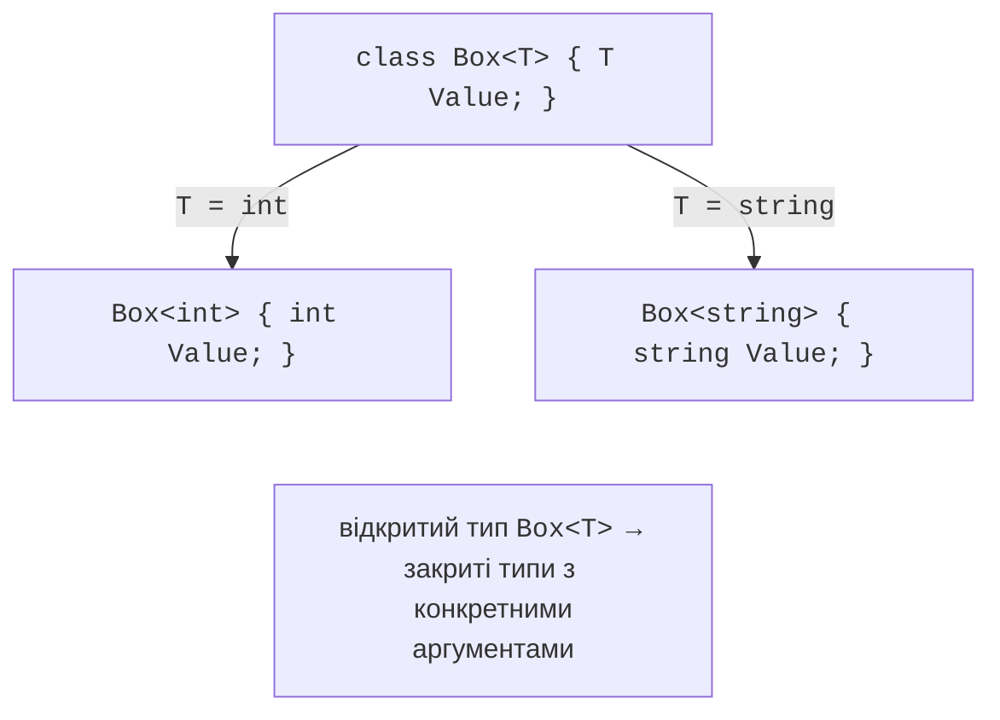

# Узагальнені методи й класи

## Навіщо потрібні узагальнення

Метод пошуку максимуму для масиву `int` відрізняється від методу для `double` чи `string` лише типом. Писати кілька копій одного коду незручно, а спільна версія з типом `object` втрачає безпеку типів. Саме так працювали колекції перших версій .NET, наприклад `ArrayList`:

```cs
using System.Collections;

ArrayList values = new() { 10, 20, "тридцять" };   // будь-що
int sum = 0;
foreach (object item in values)
{
    sum += (int)item;       // InvalidCastException на третьому
}
```

Такий код має три недоліки: помилку типу виявляє не компілятор, а програма під час виконання; кожен `int` упаковується (тема 11); потрібні явні приведення. **Узагальнення** (*generics*) усувають ці недоліки: тип даних стає **параметром типу**, а компілятор перевіряє кожне використання. Сучасний код використовує лише узагальнені колекції простору імен `System.Collections.Generic`.

## Узагальнені методи

**Узагальнений метод** оголошує один або кілька параметрів типу в кутових дужках після назви. Під час виклику тип зазвичай не вказують: компілятор **виводить** його з аргументів:

```cs
static void Swap<T>(ref T a, ref T b) => (a, b) = (b, a);

int x = 1, y = 2;
Swap(ref x, ref y);                 // T = int
string s1 = "а", s2 = "б";
Swap<string>(ref s1, ref s2);       // тип указано явно
```

Параметр типу позначають літерою `T` або назвою з префіксом `T`: `TKey`, `TValue`, `TResult`. Виведений аргумент типу показує підказка Visual Studio (рис. 13.1).


Рис. 13.1. Виведений аргумент типу в підказці {.caption}

## Узагальнені класи та інтерфейси

Параметри типу може мати й клас, структура, інтерфейс чи запис. Узагальнений тип `Box<T>` – **відкритий**: це шаблон, з якого для кожного аргументу типу утворюється **закритий** тип `Box<int>`, `Box<string>` (рис. 13.2). Закриті типи з різними аргументами є різними типами.

```cs
Pair<string, int> age = new("Олена", 21);
Pair<DateOnly, double> rate = new(new(2026, 9, 16), 41.25);

class Pair<TFirst, TSecond>(TFirst first, TSecond second)
{
    public TFirst First { get; } = first;
    public TSecond Second { get; } = second;

    public override string ToString() => $"({First}, {Second})";
}
```



Рис. 13.2. Підстановка аргументу типу в узагальнений клас {.caption}

Усередині узагальненого коду значення «за замовчуванням» для невідомого типу дає вираз `default(T)` або скорочено `default`: `0` для чисел, `false` для `bool`, `null` для посилальних типів. Його використовують, наприклад, у методі `TryPop(out T item)` власного стека, коли стек порожній.

### Обмеження параметрів типу

Без обмежень з об’єктом типу `T` можна виконувати лише операції класу `object`. Щоб викликати, наприклад, `CompareTo`, параметр типу **обмежують** ключовим словом `where`:

```cs
static T FindMax<T>(T[] items) where T : IComparable<T>
```

Тепер компілятор дозволяє виклик `item.CompareTo(max)` і не дозволяє викликати метод для типу, що не реалізує `IComparable<T>`. Основні обмеження наведено в табл. 13.1.

Таблиця 13.1. Обмеження параметрів типу {.caption}

| **Обмеження** | **Вимога до аргументу типу** |
| --- | --- |
| `where T : class` | посилальний тип |
| `where T : struct` | тип-значення (крім `Nullable<T>`) |
| `where T : notnull` | тип, що не допускає `null` |
| `where T : new()` | є відкритий конструктор без параметрів |
| `where T : Shape` | клас `Shape` або похідний від нього |
| `where T : IEntity` | реалізує інтерфейс `IEntity` |
| `where T : class, IEntity, new()` | кілька обмежень одночасно |

**Узагальнена математика** (*generic math*, .NET 7) дозволяє записати арифметику для будь-якого числового типу через статичні абстрактні члени інтерфейсів (тема 10). Обмеження `INumber<T>` надає операції `+`, `*`, `T.Zero` тощо:

```cs
using System.Numerics;

static T Sum<T>(T[] items) where T : INumber<T>
{
    T total = T.Zero;
    foreach (T item in items)
    {
        total += item;
    }
    return total;
}

// Sum([1, 2, 3]) == 6;  Sum([1.5m, 2.25m]) == 3.75m
```
