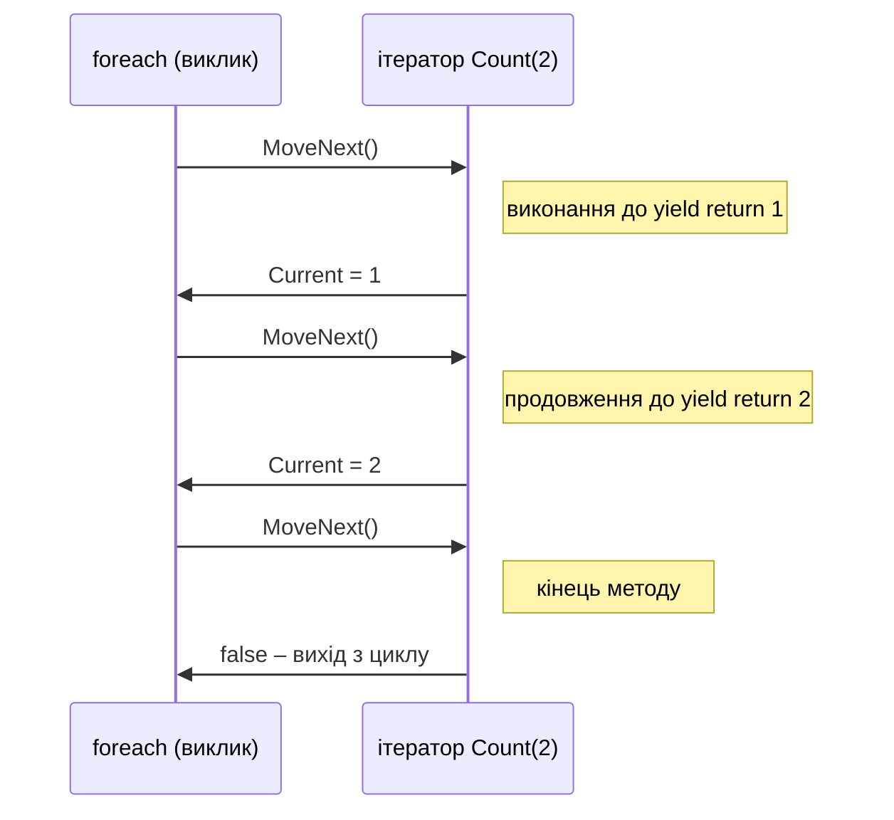
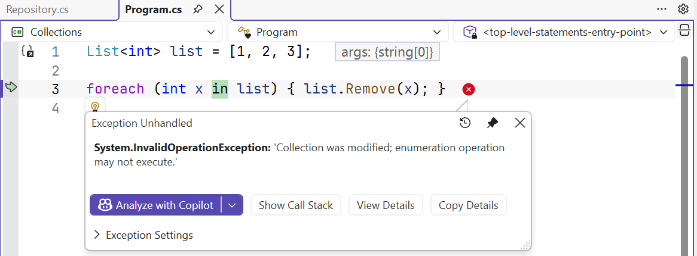

# Ітератори

## Ітератори

Цикл `foreach` працює з будь-яким об’єктом, що має метод `GetEnumerator()`. Компілятор перетворює цикл на виклики `MoveNext()` і читання `Current` об’єкта-перелічувача. Власну послідовність найпростіше створити **ітератором** – методом, який повертає `IEnumerable<T>` і використовує `yield return`:

```cs
foreach (int n in Count(2))
{
    Console.Write($"{n} ");      // [yield] 1 [yield] 2
}

static IEnumerable<int> Count(int limit)
{
    for (int i = 1; i <= limit; i++)
    {
        Console.Write("[yield] ");
        yield return i;          // повернути значення й призупинитися
    }
}
```

Ітератор виконується **відкладено**: тіло методу не запускається під час виклику `Count(2)`, а кожен виклик `MoveNext()` продовжує виконання до наступного `yield return` (рис. 13.8). Оператор `yield break` завершує послідовність.



Рис. 13.8. Виконання ітератора з `yield return` {.caption}

Колекцію не можна змінювати під час перебору: після `Add` або `Remove` у тілі `foreach` наступний `MoveNext()` генерує `InvalidOperationException` з повідомленням «Collection was modified; enumeration operation may not execute» (рис. 13.9). Щоб видалити елементи, перебирають копію або використовують цикл `for` від кінця.



Рис. 13.9. Зміна колекції під час перебору {.caption}
