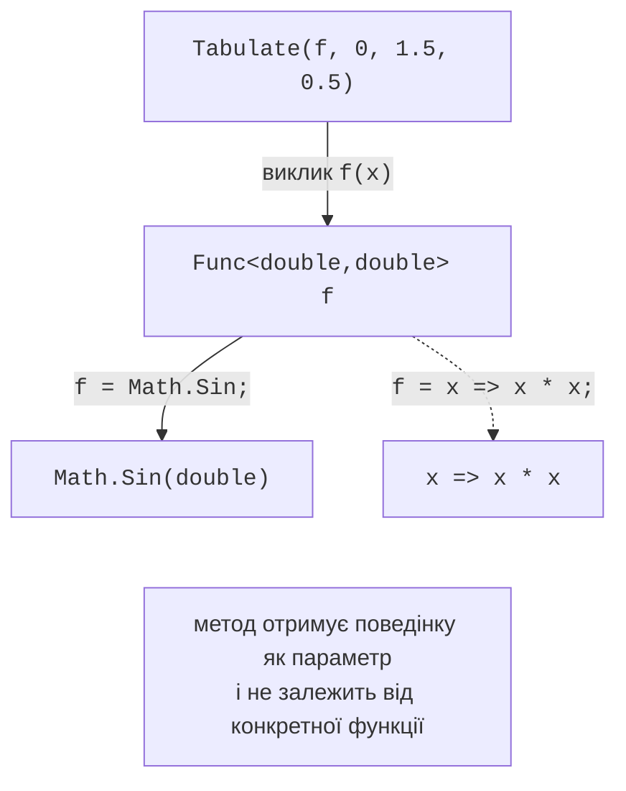
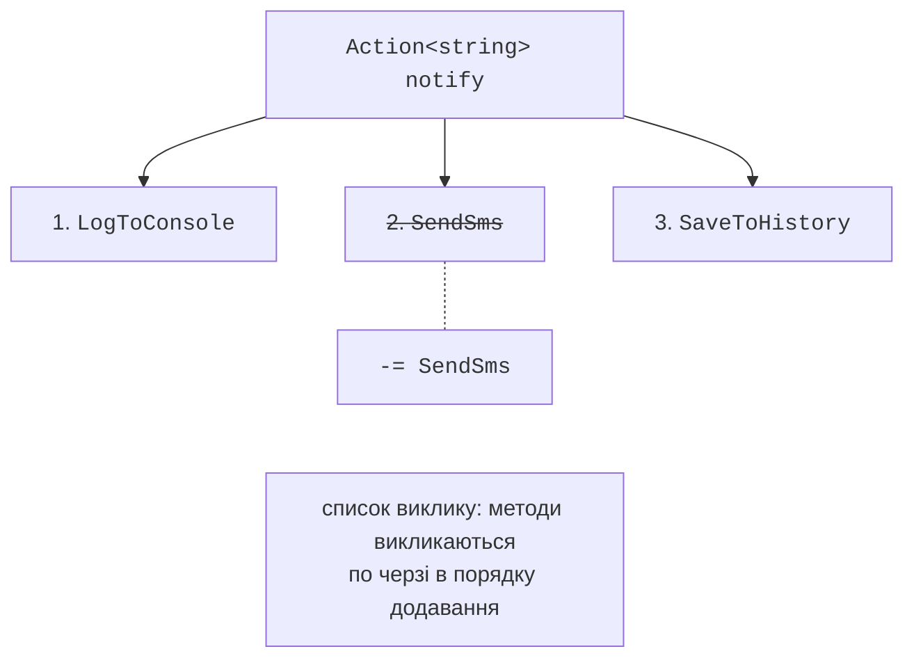

# Делегати

## Метод як значення

Досі методи отримували як параметри лише дані. Проте часто потрібно передати в метод **поведінку**: умову фільтрації, правило сортування, функцію для табулювання, дію, яку слід виконати після завершення операції (*зворотний виклик*, *callback*). У темі 10 для цього використовувалися інтерфейси (`IComparer<T>`), але оголошувати окремий клас для однієї короткої функції незручно. Мова C# дозволяє зберігати посилання на метод у змінній **делегата**.

## Делегати

**Делегат** (*delegate*) – тип, значеннями якого є посилання на методи з певною сигнатурою (рис. 14.1). Тип делегата оголошують ключовим словом `delegate`:

```cs
Operation op = Add;               // посилання на метод
Console.WriteLine(op(2, 3));      // 5 – виклик через делегат
op = Multiply;
Console.WriteLine(op.Invoke(2, 3)); // 6 – те саме, що op(2, 3)

static int Add(int a, int b) => a + b;
static int Multiply(int a, int b) => a * b;

delegate int Operation(int a, int b);
```



Рис. 14.1. Делегат як посилання на метод {.caption}

Метод **сумісний** з делегатом, якщо збігаються кількість і типи параметрів (разом з модифікаторами `ref`, `out`, `in`) і тип результату; ім’я методу значення не має. Делегатові можна присвоїти статичний метод, метод конкретного об’єкта (`account.Deposit`) або лямбда-вираз. Делегати – посилальні типи: змінна делегата може мати значення `null`, і виклик такого делегата генерує `NullReferenceException`. Тому необов’язковий делегат викликають через `?.Invoke`:

```cs
Action? onFinished = null;
onFinished?.Invoke();            // нічого не відбувається
```

### Групові делегати

Делегат може посилатися на кілька методів одночасно. Операція `+=` додає метод до **списку виклику** (*invocation list*), `-=` вилучає його. Виклик такого **групового** (*multicast*) делегата по черзі викликає всі методи в порядку додавання (рис. 14.2):

```cs
Action<string> notify = LogToConsole;
notify += SendSms;
notify += SaveToHistory;
notify("Замовлення оплачено");   // три виклики
notify -= SendSms;               // вилучення зі списку
```



Рис. 14.2. Список виклику групового делегата {.caption}

Особливості групових делегатів:

- якщо делегат повертає значення, результатом виклику є значення **останнього** методу списку; результати інших методів втрачаються;
- якщо один з методів генерує виняток, решта методів списку не викликається;
- кількість методів повертає `GetInvocationList().Length`.

Тому групові делегати використовують переважно з методами `void`, насамперед у подіях.

## Вбудовані делегати

Оголошувати власний тип делегата для кожної сигнатури не потрібно: .NET містить узагальнені делегати, що покривають майже всі випадки (табл. 14.1).

Таблиця 14.1. Вбудовані делегати .NET {.caption}

| **Делегат** | **Сигнатура та приклад** |
| --- | --- |
| `Action`, `Action<T1, …, T16>` | без результату: `Action<string> print` |
| `Func<TResult>`, `Func<T1, …, TResult>` | останній параметр типу – результат: `Func<double, double> f` |
| `Predicate<T>` | умова, `bool` для одного аргументу: `List<T>.FindAll`, `RemoveAll`, `Array.FindAll` |
| `Comparison<T>` | порівняння двох елементів, `int`: `List<T>.Sort`, `Array.Sort` |
| `EventHandler`, `EventHandler<TEventArgs>` | обробник події: `(object? sender, TEventArgs e)` |

Методи бібліотеки .NET приймають такі делегати як параметри. Наприклад, `list.Sort(comparison)` сортує за правилом, переданим делегатом `Comparison<T>`, без окремого класу `IComparer<T>` (тема 13), а `list.RemoveAll(predicate)` вилучає елементи, що задовольняють умову.
