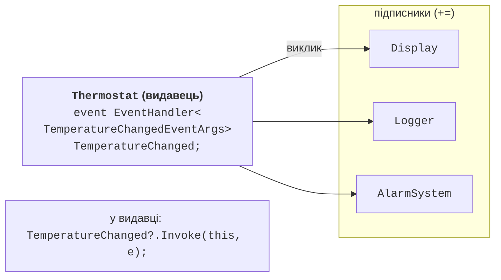

# Події

## Події

**Подія** (*event*) – член класу, що дозволяє об’єкту-**видавцю** (*publisher*) повідомляти інші об’єкти-**підписники** (*subscribers*) про те, що щось сталося: змінилася температура, натиснуто кнопку, завершено завантаження. Подію оголошують ключовим словом `event` з типом делегата:

```cs
Button button = new();
button.Clicked += (sender, e) => Console.WriteLine("Натиснуто");
button.Click();

class Button
{
    public event EventHandler? Clicked;

    public void Click() => Clicked?.Invoke(this, EventArgs.Empty);
}
```

Подія схожа на відкрите поле делегата, але ключове слово `event` обмежує доступ ззовні класу: можна лише підписатися (`+=`) або відписатися (`-=`). Викликати подію, присвоїти їй `null` або замінити список обробників може лише сам клас. Спроба `button.Clicked(null, EventArgs.Empty)` або `button.Clicked = null` ззовні спричиняє помилку CS0070. Відкрите поле делегата такого захисту не має: будь-який код міг би згенерувати «подію» або стерти всіх підписників.

### Стандартний шаблон подій .NET

Події в .NET оголошують за єдиним шаблоном (рис. 14.6):

- тип події – `EventHandler` (подія без даних) або `EventHandler<TEventArgs>`;
- обробник має параметри `object? sender` (хто згенерував подію) і `TEventArgs e` (дані події);
- дані події передаються в класі, похідному від `EventArgs`, з назвою на `EventArgs`: `TemperatureChangedEventArgs`;
- подію генерує захищений віртуальний метод `OnНазваПодії`, який похідні класи можуть перевизначити;
- назва події – дієслово або дієприкметник: `Clicked`, `TemperatureChanged`, `Closing`.



Рис. 14.6. Видавець і підписники події {.caption}

```cs
public event EventHandler<TemperatureChangedEventArgs>?
    TemperatureChanged;

protected virtual void OnTemperatureChanged(
    TemperatureChangedEventArgs e) =>
    TemperatureChanged?.Invoke(this, e);
```

Visual Studio може створити обробник з потрібною сигнатурою: після `+=` вказують ім’я нового обробника та викликають *Ctrl+.* → *Generate method*. Згенерований результат показано на рис. 14.7; тіло-заглушку потрібно замінити власною обробкою події.


Рис. 14.7. Згенерований обробник події {.caption}

### Підписка, відписка та шаблон «Спостерігач»

Видавець зберігає посилання на всіх підписників через список виклику делегата. Поки підписка існує, збирач сміття не звільнить об’єкт-підписник, навіть якщо він більше ніде не використовується. Тому довгоживучий видавець (наприклад, статичний сервіс) із незнятими підписками короткоживучих об’єктів спричиняє **витік пам’яті**. Підписник, що завершує роботу, має відписатися.

Відписатися можна від методу (`-= LogChange`) або від збереженого в змінній делегата. Відписка лямбдою, записаною повторно (`-= (s, e) => …`), не працює: це новий, інший об’єкт делегата. Якщо відписка знадобиться, лямбду спочатку зберігають у змінній.

Події реалізують шаблон проєктування **«Спостерігач»** (*Observer*, тема 17): видавець не знає конкретних класів підписників, а підписники можуть з’являтися й зникати під час роботи програми. Альтернатива – інтерфейс підписника з методом, який викликає видавець; вона зручна, коли подій багато і вони логічно пов’язані. Для потоків подій .NET має також інтерфейси `IObservable<T>` та `IObserver<T>`.
