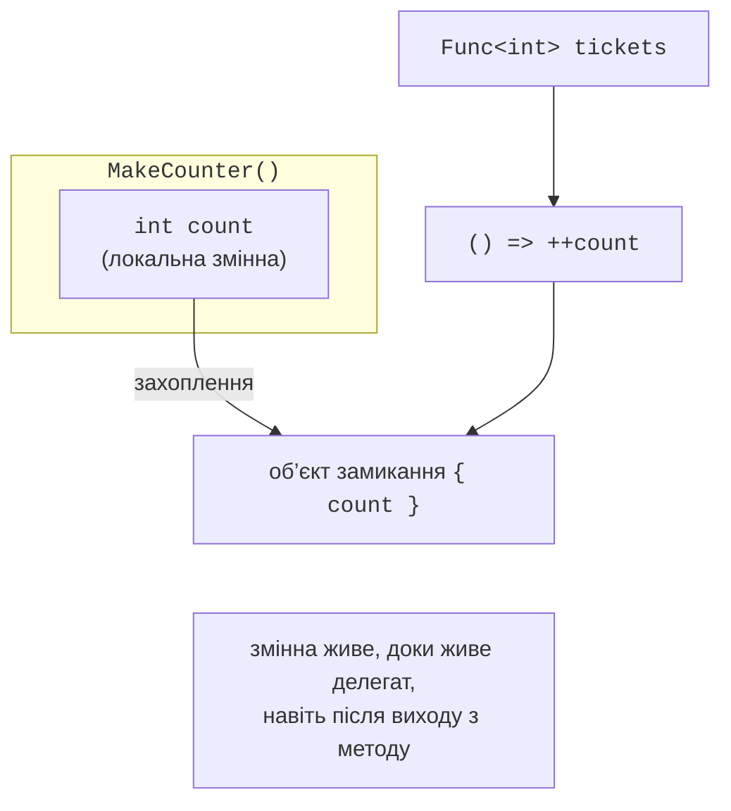
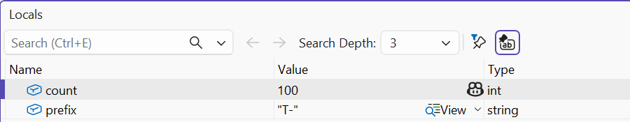

# Лямбда-вирази та замикання

## Лямбда-вирази

**Лямбда-вираз** (*lambda expression*) – короткий запис анонімного методу безпосередньо в місці використання. Ліворуч від `=>` записують параметри, праворуч – вираз або блок інструкцій:

```cs
Func<int, int> square = x => x * x;              // лямбда-вираз
Func<int, int, int> add = (a, b) => a + b;       // кілька параметрів
Action greet = () => Console.WriteLine("Привіт");  // без параметрів
Func<string, bool> isLong = (string s) =>        // явні типи
{
    string trimmed = s.Trim();                   // лямбда-блок
    return trimmed.Length > 10;
};
Func<int, int, int> first = (x, _) => x;         // відкидання
```

Типи параметрів зазвичай виводяться з типу делегата. Якщо тип делегата не вказано (`var`), компілятор визначає **природний тип** лямбди: `var square = (int x) => x * x;` має тип `Func<int, int>` (рис. 14.3). Для лямбди без явних типів параметрів (`var f = x => x;`) тип вивести неможливо – помилка CS8917.


Рис. 14.3. Природний тип лямбда-виразу в підказці {.caption}

Модифікатор `static` перед лямбдою (`static x => x * 2`) забороняє їй використовувати локальні змінні й члени екземпляра зовнішнього коду (помилка CS8820). Так гарантують, що лямбда не створює замикання. Анонімні методи зі старшим синтаксисом `delegate (int x) { return x * x; }` трапляються в наявному коді, але в новому коді використовують лямбда-вирази.

## Замикання

Лямбда може використовувати локальні змінні та параметри методу, у якому її оголошено. Така лямбда утворює **замикання** (*closure*): вона **захоплює** саму змінну, а не копію її значення. Компілятор переносить захоплену змінну в прихований об’єкт у купі, тому змінна продовжує існувати, доки існує делегат, навіть після виходу з методу (рис. 14.4):

```cs
Func<int> next = MakeCounter();
Console.WriteLine(next());   // 1
Console.WriteLine(next());   // 2 – змінна count збереглася

static Func<int> MakeCounter()
{
    int count = 0;
    return () => ++count;
}
```



Рис. 14.4. Захоплення змінної замиканням {.caption}

Під час налагодження значення захоплених змінних видно у вікні *Locals*, коли точку зупину встановлено всередині лямбди (рис. 14.5).



Рис. 14.5. Захоплена змінна у вікні Locals {.caption}

Оскільки захоплюється змінна, всі лямбди, створені в циклі `for`, бачать **одну** змінну лічильника й після завершення циклу отримують її останнє значення. У циклі `foreach` змінна ітерації створюється заново на кожному кроці, тому такої проблеми немає. Для циклу `for` значення копіюють у локальну змінну всередині тіла циклу (приклад «Лічильники й пастка змінної циклу»).

## Функції вищого порядку

**Функція вищого порядку** – метод, який приймає делегати як параметри або повертає делегат. Вони дозволяють будувати нові функції з наявних:

```cs
// Композиція: спочатку f, потім g.
static Func<T, TResult> Compose<T, TMiddle, TResult>(
    Func<T, TMiddle> f, Func<TMiddle, TResult> g) =>
    x => g(f(x));

// Мемоізація: запам’ятовування обчислених результатів.
static Func<int, long> Memoize(Func<int, long> slow)
{
    Dictionary<int, long> cache = [];
    return n =>
    {
        if (!cache.TryGetValue(n, out long result))
        {
            result = slow(n);
            cache[n] = result;
        }
        return result;
    };
}

Func<double, double> root = Math.Sqrt;
Func<double, string> format = Compose(root, x => $"{x:F2}");
Console.WriteLine(format(2));   // 1,41
```

Типові функції вищого порядку: фільтр і сортування з умовою, табулювання функції, повторна спроба операції (`Retry`), вимірювання часу виконання дії. У темі 15 бібліотека LINQ побудована саме на методах, що приймають делегати.
