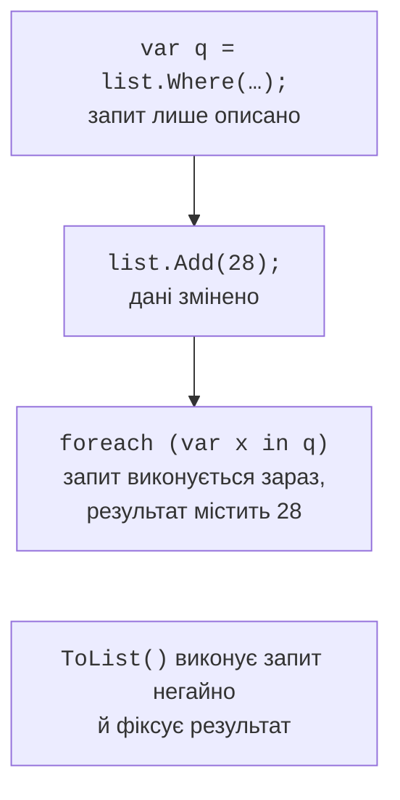
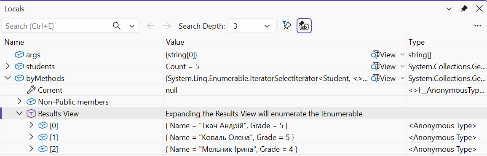

# Виконання та агрегування

## Відкладене та негайне виконання

Більшість операторів, що повертають послідовність (`Where`, `Select`, `OrderBy`, `Take`), мають **відкладене виконання** (*deferred execution*): виклик лише створює опис запиту, а дані обробляються під час перебору результату (рис. 15.4). Такі оператори побудовані на ітераторах (тема 13). Наслідки:

- запит бачить зміни джерела, зроблені після його створення;
- кожен перебір (`foreach`, `Count()`, `string.Join`) виконує запит заново.



Рис. 15.4. Відкладене виконання запиту {.caption}

Оператори, що повертають одне значення (`Count`, `Sum`, `First`, `Any`), і оператори перетворення (`ToList`, `ToArray`, `ToDictionary`, `ToHashSet`, `ToLookup`) виконуються **негайно**. Щоб виконати запит один раз і зберегти результат, викликають `ToList()` або `ToArray()`.

У налагоджувачі вікно *Locals* для змінної запиту показує вузол *Results View* з попередженням, що його розгортання перебирає послідовність (рис. 15.5).



Рис. 15.5. Відкладений запит у налагоджувачі {.caption}

## Елементи, кванти та агрегування

Оператори отримання одного елемента поводяться по-різному, якщо елемента немає або їх кілька (табл. 15.1).

Таблиця 15.1. Оператори отримання елемента {.caption}

| **Оператор** | **Немає елементів** | **Кілька елементів** |
| --- | --- | --- |
| `First` | виняток | перший |
| `FirstOrDefault` | `default` або задане значення | перший |
| `Single` | виняток | виняток |
| `SingleOrDefault` | `default` або задане значення | виняток |
| `Last`, `LastOrDefault` | як `First`, `FirstOrDefault` | останній |
| `ElementAt(i)` | виняток | елемент з номером `i` |

Виняток у таблиці – `InvalidOperationException`, для `ElementAt` – `ArgumentOutOfRangeException`.

Повідомлення винятків: «Sequence contains no elements» для порожньої послідовності та «Sequence contains more than one matching element» для `Single` з умовою. `First` обирають, коли потрібен будь-який перший відповідний елемент, `Single` – коли за змістом елемент має бути **один** (пошук за унікальним ключем), і його дублікат є помилкою даних.

**Кванти** повертають `bool`: `Any()` – чи є хоча б один елемент (або елемент з умовою), `All(predicate)` – чи всі елементи задовольняють умову, `Contains(value)` – чи є значення.

**Агрегатні оператори** обчислюють одне значення: `Count`, `Sum`, `Average`, `Min`, `Max`. `MinBy(key)` і `MaxBy(key)` (.NET 6) повертають **елемент** з найменшим чи найбільшим ключем, а не значення ключа. `Aggregate` виконує довільне накопичення:

```cs
int[] numbers = [4, 8, 15, 16, 23, 42];

int count = numbers.Count(n => n % 2 == 0);        // 4
double average = numbers.Average();                // 18
int product = numbers.Take(3).Aggregate((a, b) => a * b);   // 480
Student best = students.MaxBy(s => s.Average)!;   // елемент
bool hasFailed = students.Any(s => s.Average < 3); // чи є
```

`Sum`, `Average`, `Min`, `Max` для порожньої послідовності поводяться по-різному: `Sum` повертає 0, а `Average`, `Min`, `Max` для типів-значень генерують `InvalidOperationException`.
