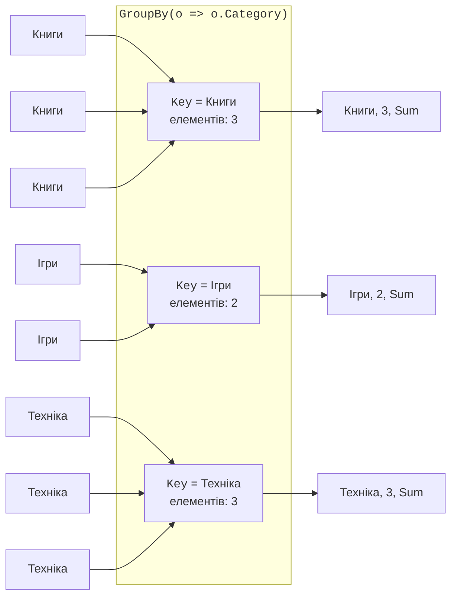
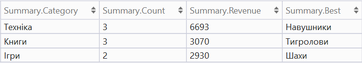
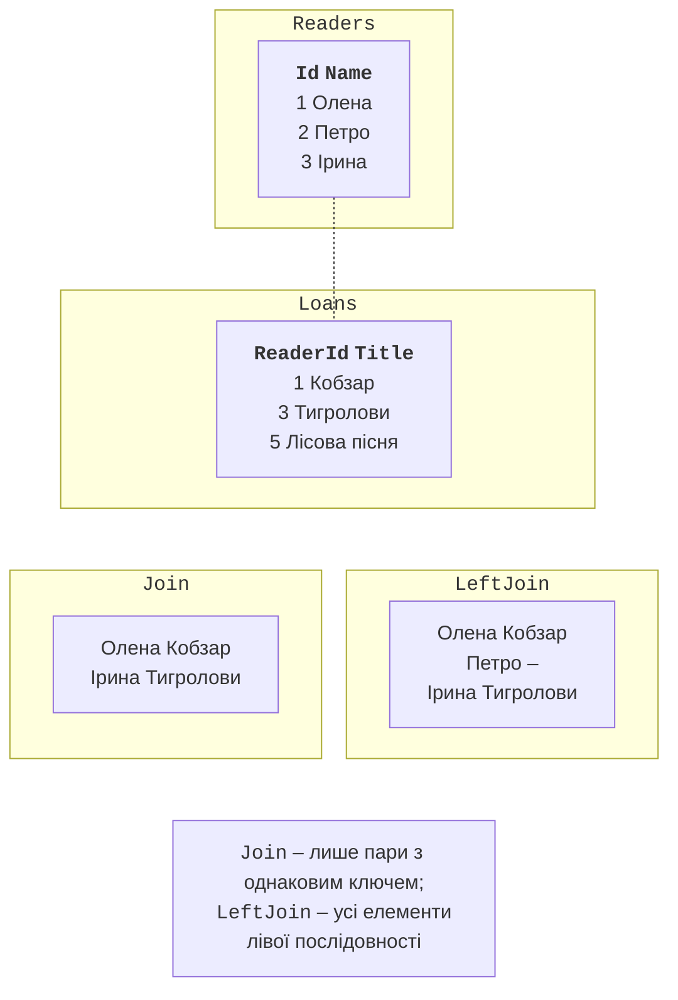

# Групування, з’єднання та устрій LINQ

## Групування

`GroupBy(key)` розбиває послідовність на групи елементів з однаковим ключем (рис. 15.6). Кожна група реалізує `IGrouping<TKey, TElement>`: має властивість `Key` і є послідовністю своїх елементів, тож до неї застосовують агрегатні оператори:

```cs
var summary = orders
    .GroupBy(o => o.Category)
    .Select(g => new { Category = g.Key, Count = g.Count(),
                       Total = g.Sum(o => o.Price) });

// Синтаксис запитів: into продовжує запит після групування.
var summary2 =
    from o in orders
    group o by o.Category into g
    select new { Category = g.Key, Count = g.Count() };
```



Рис. 15.6. Групування елементів `GroupBy` {.caption}

Для підрахунку й накопичення за ключем .NET 9 додав коротші оператори без проміжних груп: `CountBy(key)` повертає пари «ключ – кількість», а `AggregateBy(key, seed, func)` – «ключ – накопичене значення». `ToLookup(key)` виконує групування негайно й дозволяє звертатися до групи за ключем: `lookup["Книги"]`. Результат групування зручно переглядати у візуалізаторі налагоджувача (рис. 15.7). На знімку проєкцію оформлено іменованим записом `Summary` з тими самими чотирма полями, щоб заголовки стовпців були короткими.



Рис. 15.7. Результат групування у візуалізаторі {.caption}

## З’єднання

`Join` зіставляє елементи двох послідовностей за рівністю ключів і повертає лише пари, що збіглися (**внутрішнє з’єднання**). `GroupJoin` для кожного елемента першої послідовності повертає групу відповідних елементів другої, можливо порожню. У .NET 10 з’явилися `LeftJoin` і `RightJoin`: **ліве з’єднання** повертає всі елементи першої послідовності, підставляючи `default` (для класів – `null`), якщо пари немає (рис. 15.8).

```cs
var pairs = readers.Join(loans,
    r => r.Id,                 // ключ першої послідовності
    l => l.ReaderId,           // ключ другої
    (r, l) => new { r.Name, l.Title });

// Те саме в синтаксисі запитів.
var pairs2 =
    from r in readers
    join l in loans on r.Id equals l.ReaderId
    select new { r.Name, l.Title };
```



Рис. 15.8. Внутрішнє та ліве з’єднання {.caption}

До .NET 10 ліве з’єднання записували через `GroupJoin` і `SelectMany` з `DefaultIfEmpty()`; цей шаблон трапляється в наявному коді. Оператор `Zip` з’єднує дві послідовності **за позицією**: `names.Zip(scores)` повертає кортежі (перше ім’я, перший бал) тощо.

## Розбиття, множинні операції та генерування

- `Skip(n)`, `Take(n)` – пропустити або взяти *n* елементів; `SkipWhile`, `TakeWhile` – поки умова істинна; `Take(^3..)` – останні три. Разом `Skip` і `Take` реалізують посторінковий вивід.
- `Chunk(size)` (.NET 6) – розбиття на масиви заданого розміру.
- `Distinct()`, `DistinctBy(key)` – унікальні елементи; `Union`, `Intersect`, `Except` та їхні версії `…By` – множинні операції над двома послідовностями.
- `Index()` (.NET 9) – пари `(Index, Item)` для перебору з номером у `foreach`.
- `Enumerable.Range(start, count)`, `Enumerable.Repeat(value, count)`, `Enumerable.Empty<T>()` – генерування послідовностей.

```cs
foreach (var (i, word) in new[] { "а", "б", "в" }.Index())
{
    Console.Write($"{i}:{word} ");             // 0:а 1:б 2:в
}
int[] squares = Enumerable.Range(1, 5).Select(x => x * x).ToArray();
string[][] pages = Enumerable.Range(1, 23)
    .Select(i => $"Товар {i}").Chunk(5).ToArray();   // 5 сторінок
```

## Як LINQ працює всередині

Відкладений оператор – метод розширення для `IEnumerable<T>`, реалізований ітератором `yield return`. Спрощена реалізація `Where` виглядає так:

```cs
static class MyLinq
{
    public static IEnumerable<T> MyWhere<T>(
        this IEnumerable<T> source, Func<T, bool> predicate)
    {
        foreach (T item in source)
        {
            if (predicate(item))
            {
                yield return item;
            }
        }
    }
}
```

Тому ланцюжок `Where(…).Select(…)` не створює проміжних списків: під час перебору кожен елемент по черзі проходить усі оператори конвеєра. Так само можна створювати власні оператори (приклад 3 лабораторної роботи). Реальні оператори .NET додатково перевіряють аргументи та оптимізовані для масивів і списків.
