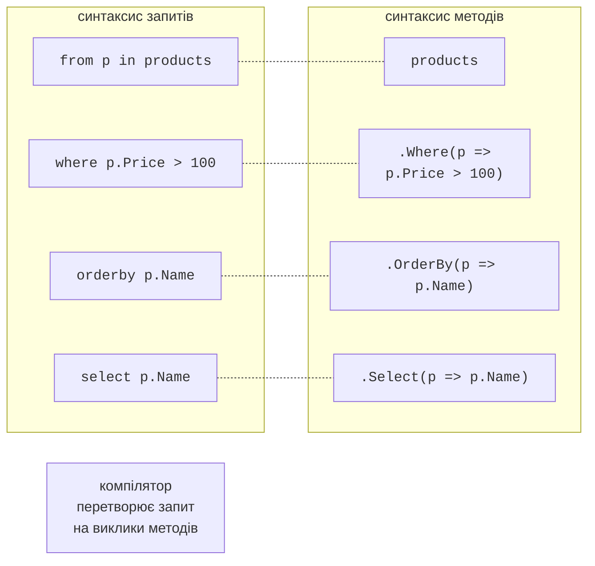
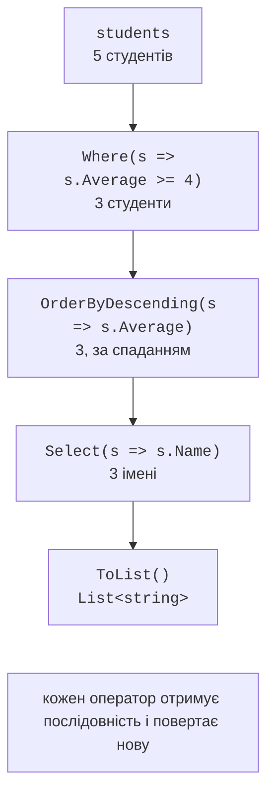

# Основи LINQ

## Що таке LINQ

**LINQ** (*Language-Integrated Query*, мова інтегрованих запитів) – набір можливостей мови C# і бібліотеки .NET для запитів до даних: фільтрації, сортування, групування, з’єднання. Замість циклів з умовами й проміжними списками запит описує, **що** потрібно отримати:

```cs
// Без LINQ.
List<string> names = [];
foreach (Student s in students)
{
    if (s.Average >= 4.0)
    {
        names.Add(s.Name);
    }
}
names.Sort();

// З LINQ.
List<string> names2 = students
    .Where(s => s.Average >= 4.0)
    .Select(s => s.Name)
    .Order()
    .ToList();
```

LINQ до об’єктів (*LINQ to Objects*) працює з будь-якою послідовністю `IEnumerable<T>`: масивами, списками, словниками, результатами ітераторів. Оператори LINQ – методи розширення (тема 12) статичного класу `System.Linq.Enumerable`, які приймають делегати (тема 14). Простір імен `System.Linq` у консольних проєктах підключено неявно. Той самий синтаксис запитів використовують і для інших джерел даних: LINQ to XML (`XDocument`) і Entity Framework Core для баз даних, де запит через інтерфейс `IQueryable<T>` перетворюється на SQL.

Visual Studio пропонує перетворити цикл `foreach` на запит LINQ (рис. 15.1).


Рис. 15.1. Перетворення циклу на запит LINQ {.caption}

## Синтаксис методів і синтаксис запитів

Запит можна записати двома способами. **Синтаксис методів** – ланцюжок викликів операторів з лямбда-виразами. **Синтаксис запитів** нагадує SQL і починається з `from`:

```cs
var expensive =
    from p in products
    where p.Price > 100
    orderby p.Name
    select p.Name;
```

Компілятор перетворює синтаксис запитів на виклики тих самих методів (рис. 15.2), тому обидва записи рівнозначні за результатом і швидкодією. Синтаксис запитів має ключові слова лише для частини операторів (`where`, `select`, `orderby`, `group … by`, `join`, `let`); оператори `Count`, `Take`, `Distinct`, `ToList` викликаються методами. У сучасному коді частіше використовують синтаксис методів, а синтаксис запитів – для складних з’єднань і групувань.



Рис. 15.2. Синтаксис запитів і синтаксис методів {.caption}

## Фільтрація, проєкція та сортування

Оператори з’єднуються в **конвеєр**: кожен отримує послідовність і повертає нову (рис. 15.3).



Рис. 15.3. Конвеєр операторів LINQ {.caption}

- `Where(predicate)` – **фільтрація**: елементи, для яких умова істинна.
- `Select(selector)` – **проєкція**: перетворення кожного елемента. Перевантаження `Select((x, i) => …)` отримує також номер елемента.
- `SelectMany(selector)` – проєкція кожного елемента в послідовність з об’єднанням результатів, наприклад усі теги всіх статей.
- `OfType<T>()` – елементи потрібного типу з послідовності різнотипних об’єктів.
- `OrderBy(key)`, `OrderByDescending(key)` – сортування за ключем; `ThenBy`, `ThenByDescending` – за додатковими ключами; `Order()`, `OrderDescending()` (.NET 7) – за самими елементами. Сортування LINQ **стійке**: елементи з однаковим ключем зберігають вихідний порядок.

Проєкція часто створює **анонімний тип** – тип без назви, оголошений виразом `new { … }`:

```cs
var cards = students.Select(s => new
{
    s.Name,                            // ім’я властивості – Name
    Grade = Math.Round(s.Average),
});
foreach (var card in cards)
{
    Console.WriteLine($"{card.Name}: {card.Grade}");
}
```

Властивості анонімного типу лише для читання, а `Equals` і `ToString` порівнюють і виводять значення. Змінну анонімного типу можна оголосити тільки через `var`, тому такі типи використовують усередині методу; для повернення з методу оголошують запис (тема 11).
