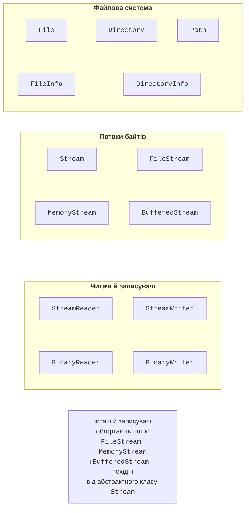
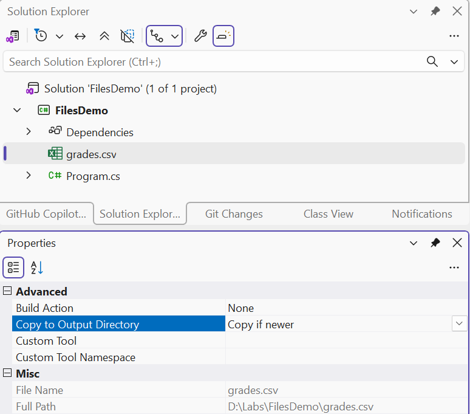

# Файлова система та кодування

## Файлова система в .NET

Класи для роботи з файлами розташовані в просторі імен `System.IO`, підключеному в консольних проєктах неявно. Їх можна поділити на три групи (рис. 16.1): класи файлової системи, потоки байтів і класи для читання та запису даних поверх потоків.



Рис. 16.1. Основні класи простору імен `System.IO` {.caption}

### Шляхи

**Абсолютний шлях** починається з кореня диска (`C:\Labs\data\books.json`), **відносний** (`data\books.json`) відраховується від **робочого каталогу** процесу `Environment.CurrentDirectory`. Під час запуску з Visual Studio робочим каталогом є вихідний каталог збірки (`bin\Debug\net10.0`), а під час `dotnet run` – каталог, з якого виконано команду. Тому файли даних, що постачаються разом із програмою, шукають відносно каталогу застосунку `AppContext.BaseDirectory`.

Шляхи не склеюють вручну: роздільник у Windows – `\`, у Linux і macOS – `/`. Клас `Path` формує й розбирає шляхи для поточної операційної системи:

```cs
string path = Path.Combine("data", "reports", "2026-09.txt");
Console.WriteLine(Path.GetFileName(path));           // 2026-09.txt
Console.WriteLine(Path.GetFileNameWithoutExtension(path)); // 2026-09
Console.WriteLine(Path.GetExtension(path));          // .txt
Console.WriteLine(Path.GetDirectoryName(path));      // data\reports
Console.WriteLine(Path.GetFullPath(path));           // абсолютний
string temp = Path.Combine(Path.GetTempPath(), "import.tmp");
```

Щоб файл даних із проєкту потрапив у вихідний каталог, у властивостях файлу встановлюють *Copy to Output Directory* = *Copy if newer* (рис. 16.2).



Рис. 16.2. Копіювання файлу даних у вихідний каталог {.caption}

### Класи `File` і `Directory`

Статичні класи `File` і `Directory` виконують типові операції одним викликом (табл. 16.1).

Таблиця 16.1. Основні методи класів `File` і `Directory` {.caption}

| **Метод** | **Призначення** |
| --- | --- |
| `File.Exists`, `Directory.Exists` | перевірка наявності |
| `File.ReadAllText`, `ReadAllLines` | прочитати весь файл у рядок чи масив рядків |
| `File.ReadLines` | читати рядки поступово (відкладено) |
| `File.WriteAllText`, `WriteAllLines` | створити або **перезаписати** файл |
| `File.AppendAllText` | дописати в кінець файлу |
| `File.Copy`, `Move`, `Delete` | копіювати, перемістити, видалити |
| `Directory.CreateDirectory` | створити каталог разом з відсутніми батьківськими |
| `Directory.EnumerateFiles` | перелічити файли за маскою, зокрема рекурсивно |

`ReadAllText` і `ReadAllLines` завантажують увесь файл у пам’ять, що зручно для невеликих файлів. `File.ReadLines` повертає `IEnumerable<string>` і читає наступний рядок лише під час перебору, тому придатний для файлів будь-якого розміру та запитів LINQ (тема 15). `Delete` не генерує винятку, якщо файлу немає.

### `FileInfo` і `DirectoryInfo`

Класи `FileInfo` і `DirectoryInfo` описують конкретний файл чи каталог: розмір `Length`, дати `CreationTime` і `LastWriteTime`, розширення `Extension`, батьківський каталог. Вони зручні, коли потрібно кілька властивостей одного файлу або рекурсивний обхід:

```cs
DirectoryInfo dir = new("data");
foreach (FileInfo file in
    dir.EnumerateFiles("*.json", SearchOption.AllDirectories))
{
    Console.WriteLine($"{file.Name,-20} {file.Length,8} Б " +
        $"{file.LastWriteTime:dd.MM.yyyy HH:mm}");
}
```

## Кодування тексту

Текстовий файл зберігає **байти**, а програма працює із **символами**. Відповідність між ними задає **кодування**. Методи `File` і `StreamWriter` за замовчуванням записують UTF-8 **без BOM** (*byte order mark*, три службові байти на початку файлу), а під час читання розпізнають BOM автоматично. Кириличний символ в UTF-8 займає 2 байти: рядок «Привіт» записується 12 байтами.

Старі файли Windows часто мають кодування Windows-1251. У .NET його потрібно спочатку зареєструвати, інакше кирилиця читатиметься як символи заміни «�»:

```cs
using System.Text;

Encoding.RegisterProvider(CodePagesEncodingProvider.Instance);
Encoding win1251 = Encoding.GetEncoding(1251);
string text = File.ReadAllText("old-report.txt", win1251);
File.WriteAllText("report-utf8.txt", text);      // перекодування
```
