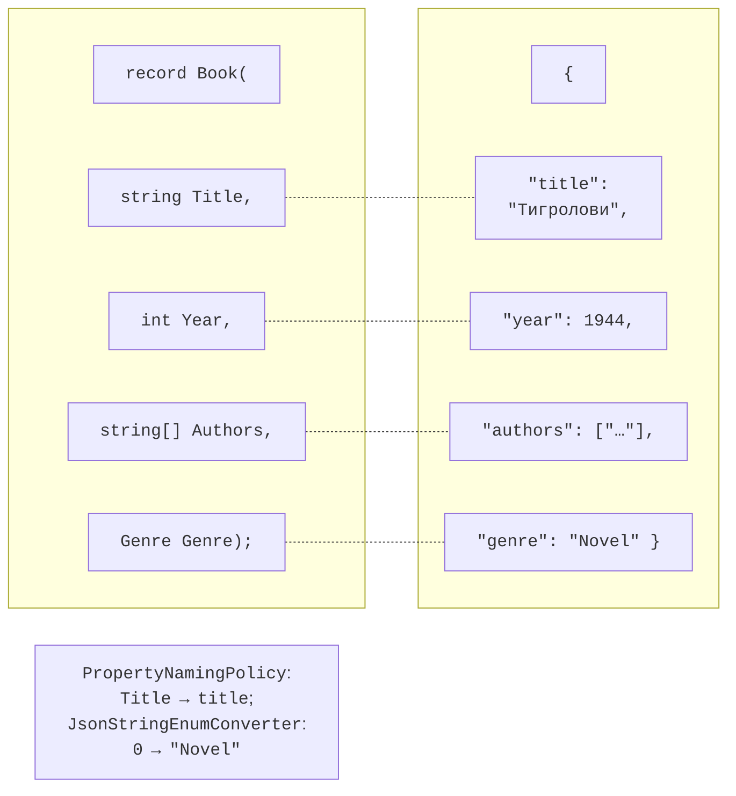

# JSON та асинхронні операції

## JSON і `System.Text.Json`

**JSON** (*JavaScript Object Notation*) – текстовий формат обміну даними з об’єктами `{ }`, масивами `[ ]`, рядками, числами, `true`, `false` і `null`. **Серіалізація** – перетворення об’єкта на JSON, **десеріалізація** – відновлення об’єкта з JSON. У .NET для цього використовують клас `JsonSerializer` простору імен `System.Text.Json`:

```cs
using System.Text.Json;

Book book = new("Тигролови", 1944, ["Іван Багряний"], Genre.Novel);
string json = JsonSerializer.Serialize(book);
Book? copy = JsonSerializer.Deserialize<Book>(json);

record Book(string Title, int Year, string[] Authors, Genre Genre);
enum Genre { Novel, Poetry, Drama }
```

Серіалізуються відкриті властивості. Записи, класи з властивостями `init`, колекції, словники, `DateTime` і `DateOnly` (формат ISO 8601, `"2026-09-16"`) підтримуються без додаткового коду. `Deserialize` повертає `null` для JSON `null` і генерує `JsonException`, якщо текст не є коректним JSON або значення не відповідає типу властивості.

::: tip Порада
Для файлових застосунків (`dotnet run app.cs`, тема 1) за замовчуванням увімкнено компіляцію Native AOT, у якій серіалізація через відображення вимкнена: виклик `JsonSerializer.Serialize` генерує `InvalidOperationException`. Для навчальних прикладів додають першим рядком файлу директиву `#:property PublishAot=false`. У звичайних проєктах Visual Studio це не потрібно.
:::

### Налаштування серіалізації

Об’єкт `JsonSerializerOptions` змінює поведінку серіалізатора (рис. 16.6). Його створюють один раз і використовують повторно:

```cs
using System.Text.Encodings.Web;
using System.Text.Json.Serialization;

JsonSerializerOptions options = new(JsonSerializerDefaults.Web)
{
    WriteIndented = true,                        // відступи
    Converters = { new JsonStringEnumConverter() },
    Encoder = JavaScriptEncoder.UnsafeRelaxedJsonEscaping,
};
```

- `JsonSerializerDefaults.Web` задає стиль вебу: назви властивостей у *camelCase* (`title`), десеріалізація без урахування регістру назв, числа можна читати з рядків.
- `WriteIndented = true` форматує JSON з відступами для читання людиною.
- `JsonStringEnumConverter` записує перелічення назвою (`"Novel"`), а не числом (1).
- За замовчуванням серіалізатор екранує всі символи поза ASCII: «Кобзар» записується як `\u041A\u043E\u0431\u0437\u0430\u0440`. Кодувальник `UnsafeRelaxedJsonEscaping` залишає кирилицю читабельною; його використовують для файлів, а не для JSON, що вбудовується у вебсторінки.



Рис. 16.6. Відповідність об’єкта C# і документа JSON {.caption}

Рядок JSON зручно переглядати в налагоджувачі візуалізатором *JSON Visualizer* (рис. 16.7).


Рис. 16.7. Перегляд JSON у візуалізаторі {.caption}

### Атрибути серіалізації

Атрибути властивостей керують відповідністю окремих властивостей і JSON:

```cs
class AppSettings
{
    [JsonPropertyName("font_size")]      // назва в JSON
    public int FontSize { get; set; } = 14;   // типове значення

    [JsonRequired]                       // обов’язкова в JSON
    public string Theme { get; set; } = "light";

    [JsonIgnore]                         // не серіалізується
    public bool IsDark => Theme == "dark";
}
```

Якщо властивості немає в JSON, вона зберігає значення з ініціалізатора, тому ініціалізатори задають значення за замовчуванням. Для відсутньої властивості з `[JsonRequired]` генерується `JsonException` «JSON deserialization for type 'AppSettings' was missing required properties including: 'Theme'». Невідомі властивості JSON за замовчуванням ігноруються.

### Поліморфна серіалізація

Якщо колекція містить об’єкти похідних типів, серіалізатор за замовчуванням записує лише властивості оголошеного базового типу, а під час читання не знає, який тип створити. Атрибути `[JsonDerivedType]` на базовому типі додають до JSON **дискримінатор типу** `$type`:

```cs
Item[] items = [new BookItem("Atlas", 350), new DiscItem("Jazz", 60)];
string json = JsonSerializer.Serialize(items);
// [{"$type":"book","Pages":350,"Title":"Atlas"},
//  {"$type":"disc","Minutes":60,"Title":"Jazz"}]
Item[] back = JsonSerializer.Deserialize<Item[]>(json)!;

[JsonDerivedType(typeof(BookItem), "book")]
[JsonDerivedType(typeof(DiscItem), "disc")]
abstract record Item(string Title);
record BookItem(string Title, int Pages) : Item(Title);
record DiscItem(string Title, int Minutes) : Item(Title);
```

Після десеріалізації масив містить об’єкти `BookItem` і `DiscItem`. Для JSON довільної структури без відповідного класу використовують `JsonNode.Parse(json)` з доступом `node["title"]` або `JsonDocument` для швидкого читання.

## Асинхронні файлові операції

Читання великого файлу або файлу з мережевого диска може тривати довго. Щоб програма з графічним інтерфейсом чи вебсервер не «зависали» в очікуванні, .NET має асинхронні версії методів: `File.ReadAllTextAsync`, `WriteAllTextAsync`, `ReadLinesAsync`, `JsonSerializer.SerializeAsync` тощо. Їх викликають з оператором `await`, який звільняє потік виконання на час очікування:

```cs
string json = await File.ReadAllTextAsync("data/books.json");
Console.WriteLine($"Прочитано символів: {json.Length}");
```

В інструкціях верхнього рівня `await` можна використовувати безпосередньо; у власних методах потрібен модифікатор `async` і тип результату `Task`. Детально асинхронне програмування в цьому курсі не розглядається; у консольних лабораторних роботах достатньо синхронних методів.
