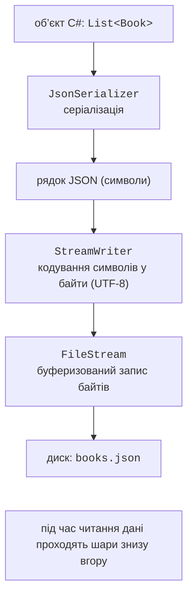
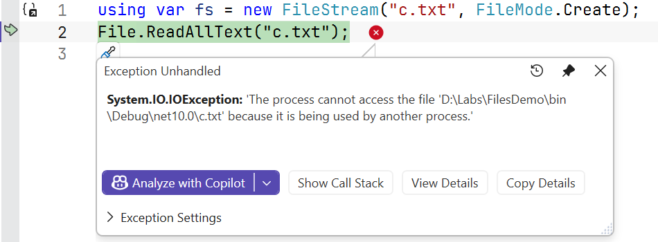
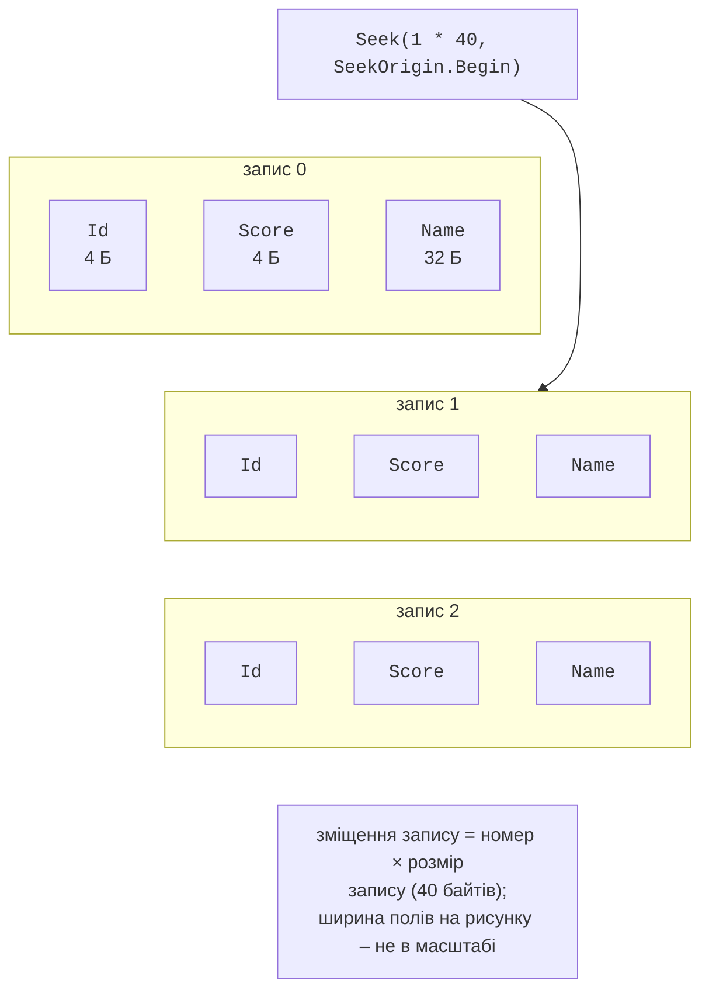

# Потоки та формат CSV

## Потоки

**Потік** (*stream*) – абстракція послідовності байтів, яку можна читати або записувати. Абстрактний клас `Stream` визначає методи `Read`, `Write`, `Seek`, властивості `Position`, `Length`, `CanRead`, `CanWrite`, `CanSeek`. Похідні класи працюють з різними джерелами: `FileStream` – з файлом, `MemoryStream` – з масивом у пам’яті, `NetworkStream` – з мережею. Код, що працює з `Stream`, однаково обробляє будь-яке джерело.

Під час запису об’єкта у файл дані проходять кілька шарів (рис. 16.3): серіалізатор перетворює об’єкт на текст, `StreamWriter` кодує символи в байти, а `FileStream` накопичує байти в буфері й записує їх на диск.



Рис. 16.3. Шари обробки даних під час запису у файл {.caption}

Конструктор `FileStream` приймає режим відкриття `FileMode` і вид доступу `FileAccess`:

```cs
using FileStream stream = new("data.bin",
    FileMode.OpenOrCreate,     // Create, Open, Append, Truncate…
    FileAccess.ReadWrite);     // Read, Write, ReadWrite
stream.Seek(0, SeekOrigin.End);  // перейти в кінець
Console.WriteLine($"{stream.Position} / {stream.Length}");
```

### `StreamReader` і `StreamWriter`

`StreamReader` і `StreamWriter` читають і записують **текст** поверх потоку, виконуючи кодування. Їх можна створити безпосередньо за шляхом до файлу:

```cs
using (StreamWriter writer = new("log.txt", append: true))
{
    writer.WriteLine($"{DateTime.Now:HH:mm} запуск");
}

using StreamReader reader = new("log.txt");
while (reader.ReadLine() is string line)   // null – кінець файлу
{
    Console.WriteLine(line);
}
```

Потоки, читачі й записувачі реалізують `IDisposable` (тема 10). Метод `Dispose` записує залишок буфера на диск і закриває файл. Якщо об’єкт не закрито, частина даних може не потрапити у файл, а сам файл залишається відкритим і **зайнятим**: спроба відкрити його повторно генерує `IOException` (рис. 16.4). Тому потоки завжди створюють в операторі `using` або `using`-оголошенні.



Рис. 16.4. Виняток доступу до зайнятого файлу {.caption}

### Двійкові файли

`BinaryWriter` і `BinaryReader` записують і читають значення простих типів у двійковому вигляді: `int` – 4 байти, `double` – 8 байтів, незалежно від кількості цифр. Двійкові файли компактні, і їх неможливо переглянути текстовим редактором. Якщо всі записи мають **фіксовану довжину**, до запису з номером *n* можна перейти одразу методом `Seek(n · розмір запису)` без читання попередніх (рис. 16.5). Рядки в таких записах зберігають з фіксованою кількістю символів.



Рис. 16.5. Двійковий файл із записами фіксованої довжини {.caption}

### Винятки вводу-виводу

Файлові операції залежать від зовнішнього середовища, тому їх завжди перевіряють на винятки (табл. 16.2). Перевірка `File.Exists` перед відкриттям не гарантує успіху: файл можуть видалити або заблокувати між перевіркою та відкриттям.

Таблиця 16.2. Основні винятки вводу-виводу {.caption}

| **Виняток** | **Причина** |
| --- | --- |
| `FileNotFoundException` | файлу не існує («Could not find file …») |
| `DirectoryNotFoundException` | частини шляху не існує («Could not find a part of the path …») |
| `UnauthorizedAccessException` | немає прав доступу або файл лише для читання |
| `IOException` | файл зайнятий іншим процесом, диск заповнений тощо (базовий клас) |
| `PathTooLongException` | шлях задовгий |

`FileNotFoundException`, `DirectoryNotFoundException` і `PathTooLongException` є похідними від `IOException`, тому в ланцюжку `catch` їх розміщують раніше за `IOException` (тема 6).

## Формат CSV

**CSV** (*comma-separated values*) – текстовий табличний формат: кожен рядок – запис, поля розділені комами, перший рядок часто містить заголовки. Під час обробки CSV враховують:

- **культуру чисел і дат**: у файлі записують `92.5` і `2026-06-10` незалежно від мови системи, тому розбір виконують з `CultureInfo.InvariantCulture` та явним форматом дати; в українській культурі `double.Parse("92.5")` дасть 925;
- **лапки**: поле з комою записують у лапках (`"Шевченко, Тарас"`), а лапки всередині поля подвоюють; простий `Split(',')` таких полів не обробляє, тому для складних файлів використовують бібліотеки на кшталт CsvHelper;
- **роздільник**: Excel в українській локалі зберігає CSV з крапкою з комою `;`;
- **помилкові рядки**: некоректний рядок пропускають з повідомленням, а не зупиняють увесь імпорт.
