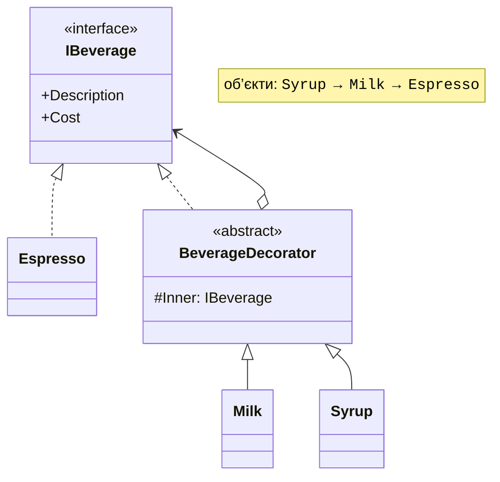
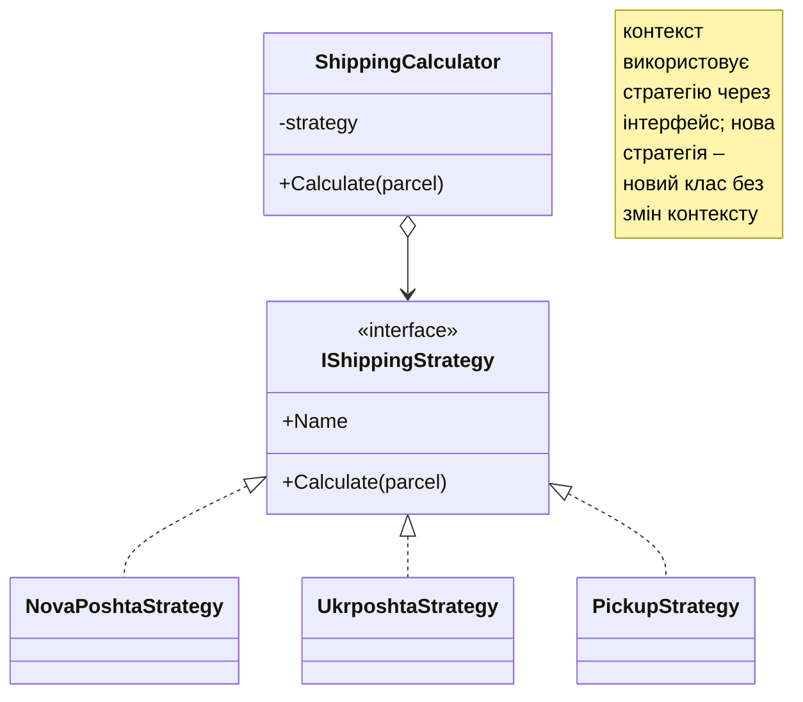
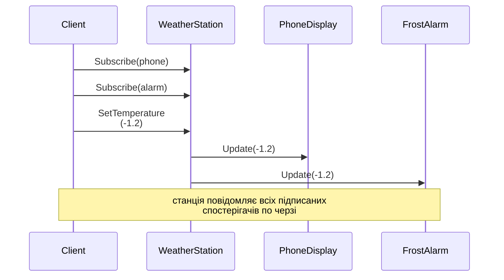
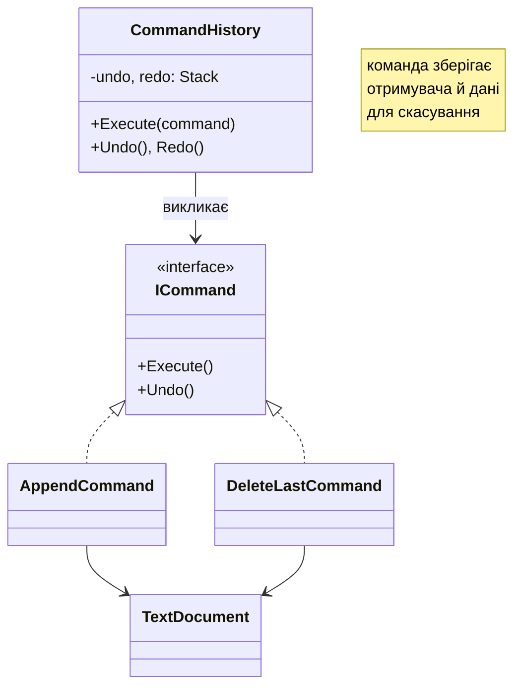

# Шаблони проєктування

## Шаблони проєктування

**Шаблон проєктування** (*design pattern*) – типове перевірене рішення поширеної задачі проєктування, описане незалежно від мови. Класичний каталог із 23 шаблонів опубліковали 1994 року Е. Гамма, Р. Гелм, Р. Джонсон і Дж. Вліссідес («банда чотирьох», *Gang of Four*, GoF). Шаблони поділяють на три групи (табл. 17.2). Опис шаблону містить назву, задачу, рішення (UML-діаграму) і наслідки застосування.

Таблиця 17.2. Класифікація шаблонів проєктування {.caption}

| **Група** | **Призначення** | **Шаблони лекції** |
| --- | --- | --- |
| породжувальні | створення об’єктів | Фабричний метод, Будівельник, Одинак |
| структурні | компонування класів і об’єктів | Адаптер, Декоратор, Фасад, Компонувальник |
| поведінкові | взаємодія й розподіл обов’язків | Стратегія, Спостерігач, Команда, Стан |

### Породжувальні шаблони

**Фабричний метод** (*Factory Method*) відокремлює код, що використовує об’єкти, від вибору їхніх конкретних класів. У класичній формі базовий клас оголошує абстрактний метод створення, а похідні класи вирішують, що саме створити:

```cs
abstract class Logistics
{
    // Фабричний метод: похідні класи обирають транспорт.
    protected abstract ITransport CreateTransport();

    public string Deliver(string cargo) =>
        CreateTransport().Carry(cargo);
}

class RoadLogistics : Logistics
{
    protected override ITransport CreateTransport() => new Truck();
}
```

На практиці часто використовують спрощену форму – статичний метод, який за параметром повертає потрібну реалізацію інтерфейсу (приклад 2). В обох випадках назви конкретних класів зосереджено в одному місці.

**Будівельник** (*Builder*) покроково створює складний об’єкт з багатьма необов’язковими частинами й перевіряє коректність перед створенням (приклад 3). Методи будівельника повертають `this`, що дозволяє записувати виклики ланцюжком. У .NET так працює `StringBuilder`.

**Одинак** (*Singleton*) гарантує існування одного екземпляра класу з глобальним доступом:

```cs
sealed class AppConfig
{
    private static readonly Lazy<AppConfig> instance =
        new(() => new());

    private AppConfig() { }                  // заборона new ззовні

    public static AppConfig Instance => instance.Value;
}
```

`Lazy<T>` створює об’єкт під час першого звертання й безпечний для багатопотоковості. Проте «Одинак» фактично є глобальною змінною: він приховує залежності та ускладнює тестування. Замість нього краще створити один об’єкт у композиційному корені й передавати його через конструктор (або зареєструвати як `AddSingleton` у DI-контейнері).

### Структурні шаблони

**Адаптер** (*Adapter*) дозволяє використати клас із несумісним інтерфейсом: адаптер реалізує очікуваний інтерфейс і перетворює виклики до обгорнутого об’єкта (приклад 2 лабораторної роботи). Типове застосування – сторонні бібліотеки й застарілий код, який не можна змінити.

**Декоратор** (*Decorator*) динамічно додає об’єкту поведінку, обгортаючи його об’єктом з тим самим інтерфейсом (рис. 17.5). Декоратори можна комбінувати в будь-якому порядку, тоді як успадкування потребувало б класу для кожної комбінації. У .NET за цим шаблоном побудовані потоки: `BufferedStream` і `GZipStream` обгортають інший `Stream`.



Рис. 17.5. Шаблон «Декоратор» {.caption}

**Фасад** (*Facade*) надає простий інтерфейс до складної підсистеми. Наприклад, клас `TravelBookingFacade` з одним методом `BookTrip` послідовно звертається до сервісів квитків, готелів і оплати, приховуючи від клієнта порядок викликів і обробку помилок.

**Компонувальник** (*Composite*) дозволяє однаково працювати з окремими об’єктами та їх групами: файл і папка реалізують спільний інтерфейс із властивістю `Size`, а розмір папки дорівнює сумі розмірів вкладених елементів, зокрема інших папок.

### Поведінкові шаблони

**Стратегія** (*Strategy*) інкапсулює сімейство алгоритмів у класах зі спільним інтерфейсом; об’єкт-контекст отримує стратегію й делегує їй роботу (рис. 17.6). Стратегію можна замінити під час роботи програми. Для простих стратегій замість інтерфейсу достатньо делегата `Func<…>` (тема 14).



Рис. 17.6. Шаблон «Стратегія» {.caption}

**Спостерігач** (*Observer*) визначає залежність «один до багатьох»: коли стан суб’єкта змінюється, усі підписані спостерігачі отримують повідомлення (рис. 17.7). У .NET шаблон вбудовано в мову як **події** (тема 14), тому окремі інтерфейси спостерігачів потрібні рідко (приклад 4).



Рис. 17.7. Взаємодія в шаблоні «Спостерігач» {.caption}

**Команда** (*Command*) перетворює запит на об’єкт з методами `Execute` і `Undo` (рис. 17.8). Команди можна зберігати в історії, скасовувати й повторювати, ставити в чергу, записувати в журнал (приклад 3 лабораторної роботи).



Рис. 17.8. Шаблон «Команда» {.caption}

**Стан** (*State*) дозволяє об’єкту змінювати поведінку залежно від стану, виносячи кожен стан в окремий клас. Торговий автомат у стані «очікування» на `InsertCoin` переходить у стан «гроші внесено», а в стані «видача» ту саму дію відхиляє. Порівняно зі `switch` за переліченням (тема 11) шаблон зручний, коли станів і дій багато. Структурно «Стан» схожий на «Стратегію», але стан зазвичай змінюється сам під час роботи об’єкта, а стратегію обирає клієнт.

### Шаблони в .NET і антишаблони

Бібліотека .NET використовує шаблони повсюдно: ітератор (`IEnumerable<T>`, `yield`), декоратор (`Stream`-обгортки), будівельник (`StringBuilder`, `UriBuilder`), спостерігач (події), стратегія (`IComparer<T>`), фабричний метод (`Encoding.GetEncoding`, `Enumerable.Range`).

**Антишаблони** – поширені погані рішення: «божественний об’єкт» (*God Object*), що робить усе; «спагеті-код» без структури; зловживання шаблонами там, де достатньо простого методу; передчасна абстракція (інтерфейс з однією реалізацією «на майбутнє», що суперечить YAGNI). Шаблон обирають тоді, коли виникла відповідна проблема, а не заради шаблону.
