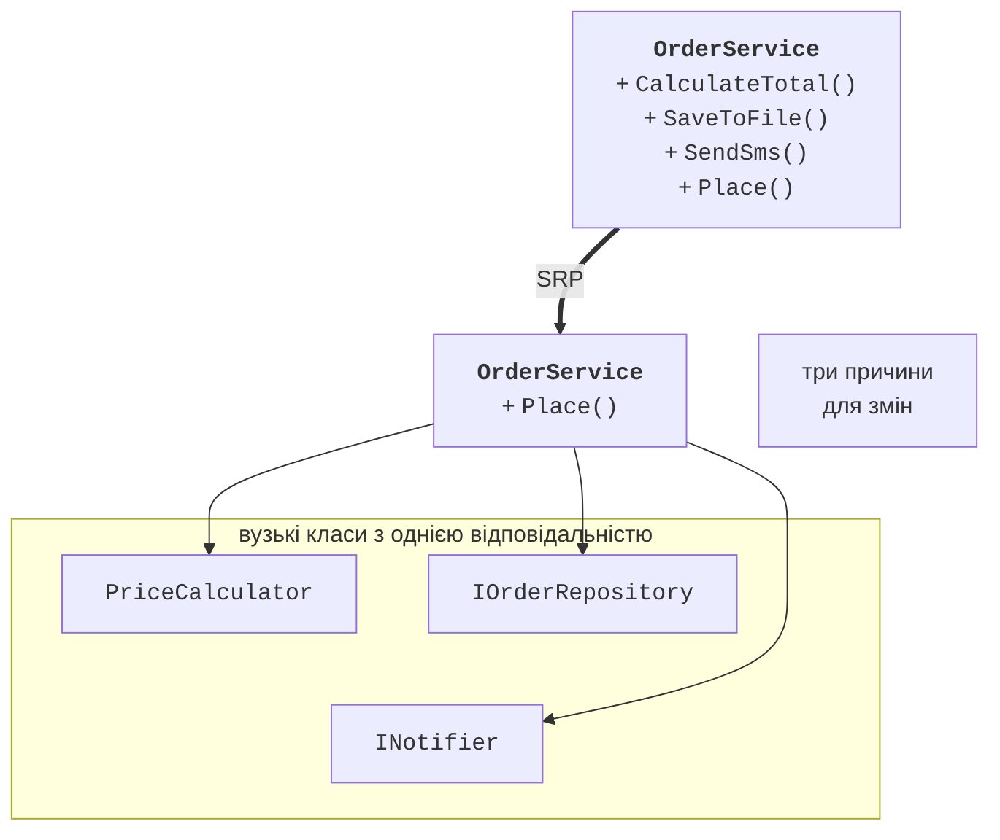
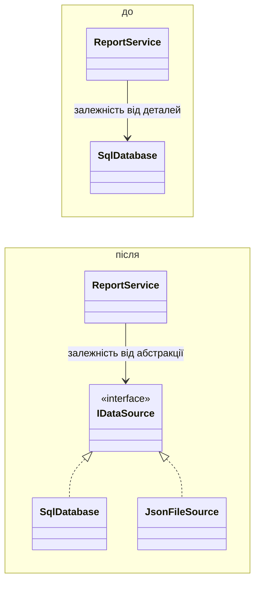
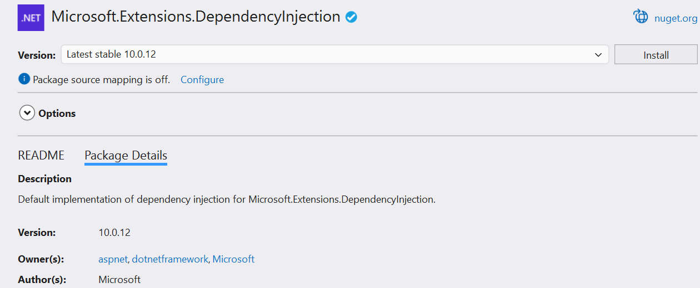

# SOLID і впровадження залежностей

## Якість проєктування

Програма, що працює, ще не є добре спроєктованою. Якісний код легко читати, змінювати й тестувати. Дві основні характеристики проєктування:

- **зв’язність** (*cohesion*) – наскільки члени класу пов’язані спільною метою; висока зв’язність означає, що клас робить одну справу;
- **зчеплення** (*coupling*) – наскільки класи залежать один від одного; слабке зчеплення дозволяє змінювати один клас, не зачіпаючи інших.

Мета проєктування – **висока зв’язність і слабке зчеплення**. Ознаки поганого проєктування («запахи коду», тема 18): клас на тисячі рядків, що «вміє все», довгі `switch` за типом об’єкта, повторюваний код, зміна однієї вимоги, що зачіпає багато класів.

Загальні принципи:

- **DRY** (*Don’t Repeat Yourself*) – кожне знання повинно мати одне представлення в коді;
- **KISS** (*Keep It Simple*) – найпростіше рішення, що працює, найкраще;
- **YAGNI** (*You Aren’t Gonna Need It*) – не реалізовувати можливості «про запас».

## Принципи SOLID

**SOLID** – п’ять принципів об’єктно-орієнтованого проєктування, сформульованих Робертом Мартіном (табл. 17.1).

Таблиця 17.1. Принципи SOLID {.caption}

|  | **Принцип** | **Суть** |
| --- | --- | --- |
| **S** | єдиної відповідальності (*Single Responsibility*) | клас має лише одну причину для змін |
| **O** | відкритості/закритості (*Open/Closed*) | клас відкритий для розширення, закритий для змін |
| **L** | підстановки Лісков (*Liskov Substitution*) | об’єкт похідного класу можна використати замість базового без порушення роботи |
| **I** | розділення інтерфейсів (*Interface Segregation*) | клієнт не повинен залежати від методів, яких не використовує |
| **D** | інверсії залежностей (*Dependency Inversion*) | модулі залежать від абстракцій, а не від конкретних реалізацій |

### Принцип єдиної відповідальності

Клас `OrderService`, який обчислює суму замовлення, зберігає його у файл і надсилає SMS, має три причини для змін: нові правила знижок, інше сховище, інший канал повідомлень. Зміна однієї частини ризикує зламати інші, а протестувати обчислення без файлів і SMS неможливо. За **SRP** такий клас розділяють на вузькі класи (рис. 17.1); `OrderService` лише координує їх (приклад 1).



Рис. 17.1. Розділення класу за принципом єдиної відповідальності {.caption}

### Принцип відкритості/закритості

Код, що вибирає поведінку за типом через `switch`, доводиться змінювати для кожного нового варіанта:

```cs
decimal Cost(string method, Parcel p) => method switch
{
    "nova" => 70m + 12m * (decimal)p.WeightKg,
    "ukrposhta" => 45m + 8m * (decimal)Math.Ceiling(p.WeightKg),
    _ => throw new ArgumentException(method),   // нова служба – зміна
};
```

За **OCP** варіанти поведінки виносять у класи зі спільним інтерфейсом (поліморфізм, теми 9–10). Новий спосіб доставки – новий клас, а наявний код не змінюється (приклад 2).

### Принцип підстановки Лісков

Похідний клас не повинен посилювати передумови, послаблювати постумови або генерувати несподівані винятки порівняно з базовим. Класичний приклад порушення: `Square` успадковує `Rectangle` і в сеттері `Width` змінює також `Height`. Код, що встановлює ширину 5 і висоту 4 та очікує площу 20, для квадрата отримає 16. Інший приклад – клас `Penguin`, похідний від `Bird` з методом `Fly`, що генерує `NotSupportedException` (приклад 1 лабораторної роботи). Виправлення – переглянути ієрархію: спільне залишити в базовому класі, а особливі здатності винести в окремі інтерфейси.

### Принцип розділення інтерфейсів

«Товстий» інтерфейс `IMultifunctionDevice` з методами `Print`, `Scan`, `Fax` змушує простий принтер реалізовувати `Scan` і `Fax` винятками. За **ISP** його розділяють на `IPrinter`, `IScanner`, `IFax`; багатофункціональний пристрій реалізує всі три, а простий принтер – лише `IPrinter`.

### Принцип інверсії залежностей

Якщо `ReportService` створює `new SqlDatabase()` усередині, він назавжди прив’язаний до цієї бази даних. За **DIP** обидва класи залежать від абстракції `IDataSource` (рис. 17.2): сервіс працює з будь-яким джерелом даних, зокрема тестовим.



Рис. 17.2. Інверсія залежностей {.caption}

## Впровадження залежностей

**Впровадження залежностей** (*dependency injection*, DI) – спосіб реалізації DIP: клас не створює залежності сам, а отримує їх ззовні, найчастіше через конструктор:

```cs
class ReportService(IDataSource source, INotifier notifier)
{
    public void Send() => notifier.Notify(source.Load().ToString()!);
}
```

Конкретні реалізації обирають в одному місці на початку програми – **композиційному корені** (*composition root*). Visual Studio генерує конструктор з параметрами для полів класу дією *Generate constructor*: виділяють потрібні поля, викликають **Ctrl+.** і переглядають зміни перед застосуванням (рис. 17.3).


Рис. 17.3. Генерування конструктора для залежностей {.caption}

У великих застосунках об’єкти створює **DI-контейнер**. У .NET це бібліотека `Microsoft.Extensions.DependencyInjection` (NuGet-пакет для консольних проєктів, вбудована в ASP.NET Core). Реєстрація визначає, яку реалізацію й з яким часом життя надати:

```cs
using Microsoft.Extensions.DependencyInjection;

ServiceCollection services = new();
services.AddSingleton<INotifier, SmsNotifier>();   // один на програму
services.AddTransient<OrderService>();             // новий щоразу
using ServiceProvider provider = services.BuildServiceProvider();

// Контейнер сам створює SmsNotifier і передає в конструктор.
OrderService service = provider.GetRequiredService<OrderService>();
```

Пакет додають через *Manage NuGet Packages* (рис. 17.4) або командою `dotnet add package Microsoft.Extensions.DependencyInjection`. У лабораторних роботах достатньо ручного впровадження через конструктор.



Рис. 17.4. Встановлення пакета DI-контейнера {.caption}
