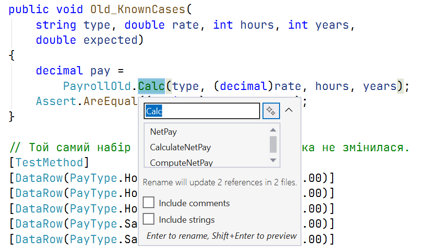

# Рефакторинг

## Рефакторинг

**Рефакторинг** – зміна внутрішньої структури коду **без зміни його поведінки** з метою покращити читабельність і спростити подальші зміни. Рефакторинг виконують малими кроками, запускаючи тести після кожного. Якщо тестів немає, спочатку пишуть **характеризаційні тести**, що фіксують поточну поведінку, навіть якщо вона дивна (приклади 4 і 3 лабораторної роботи).

Ознаки коду, що потребує рефакторингу, називають **«запахами коду»** (*code smells*, табл. 18.3).

Таблиця 18.3. «Запахи коду» та відповідні рефакторинги {.caption}

| **«Запах»** | **Рефакторинг** |
| --- | --- |
| довгий метод | виділити методи (*Extract Method*) |
| магічні числа й рядки | іменовані константи (*Introduce Constant*), перелічення |
| дублювання коду | виділити спільний метод або клас |
| великий клас | розділити за відповідальностями (SRP) |
| довгий список параметрів | об’єднати параметри в запис або клас |
| незрозумілі назви (`r`, `t`, `Calc`) | перейменувати (*Rename*) |
| `switch` за типом у кількох місцях | поліморфізм, «Стратегія» (тема 17) |
| закоментований і мертвий код | видалити (історія є в системі контролю версій) |

### Інструменти рефакторингу Visual Studio

Visual Studio виконує рефакторинги автоматично й безпечно для всього рішення:

- **Rename** (**Ctrl+R, Ctrl+R**) – перейменування символу в усіх місцях використання (рис. 18.11);
- **Extract Method** (**Ctrl+R, Ctrl+M** або **Ctrl+.** на виділеному фрагменті) – виділення методу з автоматичним визначенням параметрів і результату (рис. 18.10);
- **Introduce constant / local** – заміна виразу константою або змінною;
- **Inline method / temporary variable** – зворотна операція;
- **Change signature** – зміна порядку й складу параметрів з оновленням викликів;
- **Move type to file** – перенесення класу в окремий файл з відповідною назвою.

Рис. 18.10. Рефакторинг «Extract Method» {.caption}

Рис. 18.11. Перейменування символу в усьому рішенні {.caption}

Аналізатори коду .NET і файл налаштувань стилю `.editorconfig` дозволяють автоматично виявляти частину «запахів» і порушень стилю під час збирання.
