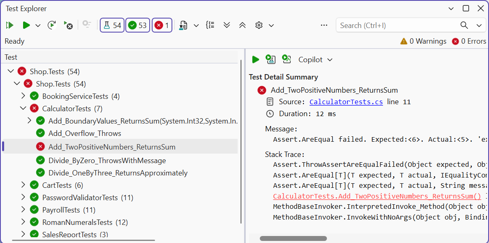
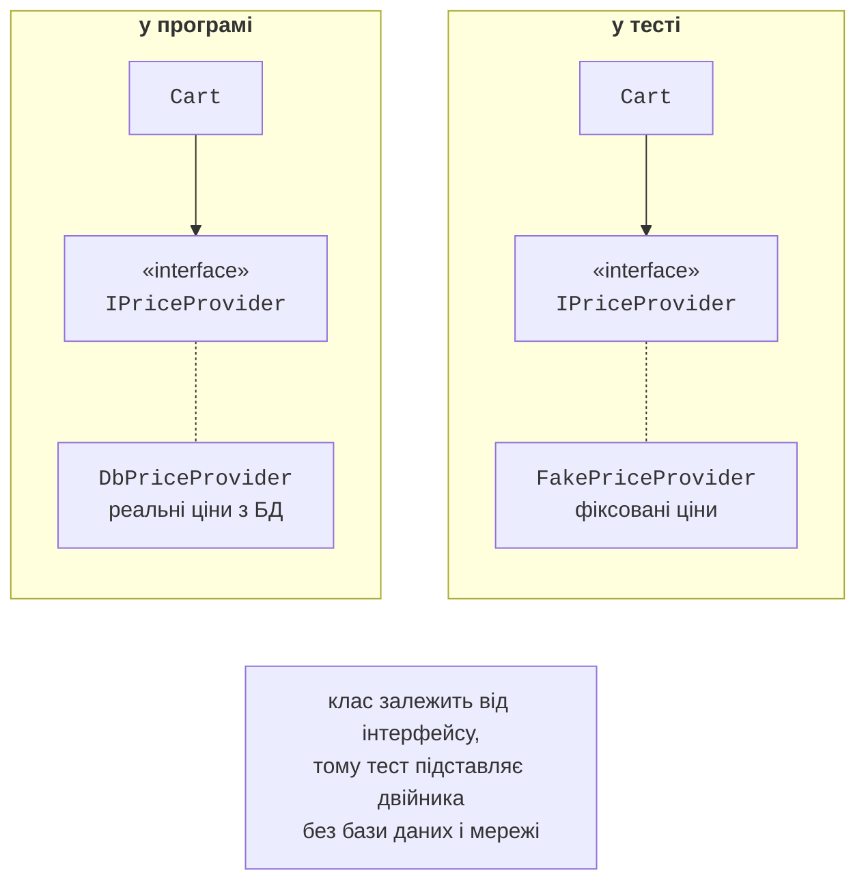
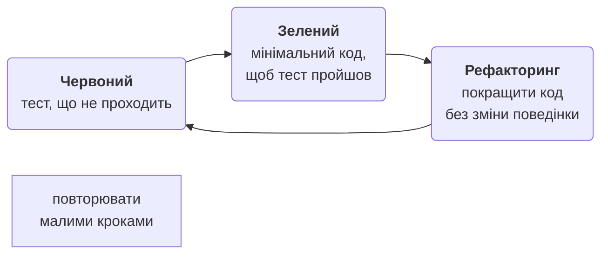
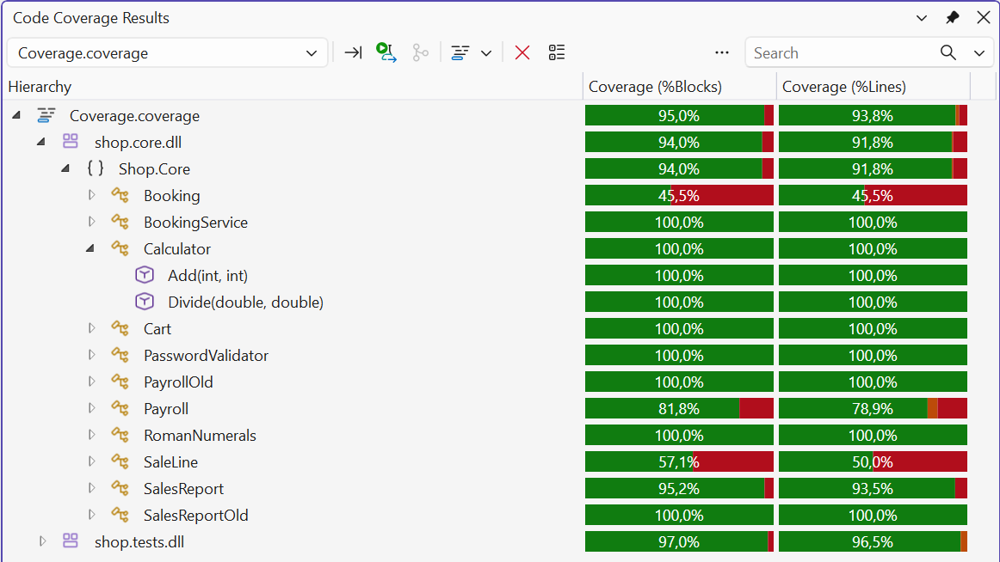

# Запуск, ізоляція, TDD і покриття

## Запуск тестів

У Visual Studio тести запускає вікно **Test Explorer** (*Test → Test Explorer*, **Ctrl+E, T**): *Run All* виконує всі тести, а дерево групує їх за проєктами, класами й методами (рис. 18.5). Для тесту, що не пройшов, панель деталей показує повідомлення твердження та стек викликів. Тест можна налагоджувати (*Debug*) з точками зупину, повторно запускати лише невдалі (*Run Failed Tests*) і фільтрувати за назвою.



Рис. 18.5. Результати у вікні Test Explorer {.caption}

З командного рядка тести запускає `dotnet test` (рис. 18.6). Команда збирає рішення, виконує тести й виводить підсумок; для тестів, що не пройшли, виводяться повідомлення. Параметр `--filter "FullyQualifiedName~Cart"` запускає лише тести, повна назва яких містить `Cart`. Повідомлення невдалого твердження MSTest 4 містить очікуване й фактичне значення та вирази:

```
  Failed Add_Wrong_Fails [401 ms]
  Error Message:
   Assert.AreEqual failed. Expected:<6>. Actual:<5>.
   'expected' expression: '6', 'actual' expression:
   'calculator.Add(2, 3)'.
Failed!  - Failed:     1, Passed:     7, Skipped:     0,
Total:     8, Duration: 415 ms - Shop.Tests.dll (net10.0)
```


Рис. 18.6. Запуск тестів із командного рядка {.caption}

У .NET 10 `dotnet test` може працювати з двома платформами виконання: класичною VSTest (за замовчуванням) і новою Microsoft.Testing.Platform, яку вмикають у файлі `global.json`. Для написання тестів ця відмінність не має значення.

## Ізоляція залежностей

Модульний тест не повинен звертатися до бази даних, мережі, файлової системи чи поточного часу: такі тести повільні, залежать від середовища й дають різні результати. Тому клас отримує залежності через інтерфейси (DIP, тема 17), а в тесті їх замінюють **тестовими двійниками** (*test doubles*, рис. 18.7):

- **заглушка** (*stub*) повертає фіксовані значення;
- **фейк** (*fake*) має спрощену робочу реалізацію, наприклад словник замість бази даних;
- **мок** (*mock*) додатково запам’ятовує виклики, щоб тест перевірив, чи й як їх зроблено.



Рис. 18.7. Заміна залежності тестовим двійником {.caption}

У курсі двійники пишуть вручну як невеликі класи, що реалізують інтерфейс (приклад 2). У великих проєктах використовують бібліотеки мокування (NSubstitute, Moq), які створюють двійників автоматично.

Поточний час – теж залежність: тест, що використовує `DateTime.Now`, дає різні результати в різні дні. Клас `TimeProvider` (.NET 8) абстрагує час: у програмі передають `TimeProvider.System`, а в тесті – `FakeTimeProvider` з пакета `Microsoft.Extensions.TimeProvider.Testing`, у якого час задається й переводиться методом `Advance` (приклад 2 лабораторної роботи).

## Розробка через тестування

**Розробка через тестування** (*Test-Driven Development*, TDD) – підхід, у якому тест пишуть **до** коду. Робота йде короткими циклами «червоний – зелений – рефакторинг» (рис. 18.8):

1. **червоний**: написати маленький тест для наступної вимоги; він не проходить (або не компілюється);
2. **зелений**: написати мінімальний код, достатній, щоб пройшли всі тести;
3. **рефакторинг**: покращити код (прибрати дублювання, дати зрозумілі назви), не змінюючи поведінки; тести підтверджують, що нічого не зламано.



Рис. 18.8. Цикл розробки через тестування {.caption}

TDD змушує продумати поведінку до реалізації, дає повний набір тестів і простий дизайн: код, який важко протестувати, зазвичай погано спроєктований. Приклад 3 показує послідовність кроків TDD.

## Покриття коду

**Покриття коду** (*code coverage*) – частка рядків або гілок коду, виконаних під час тестів. Visual Studio показує покриття командою *Test → Analyze Code Coverage for All Tests* (рис. 18.9), а з командного рядка його збирають параметром `dotnet test --collect "Code Coverage"`.



Рис. 18.9. Результати покриття коду {.caption}

Покриття показує **неперевірений** код, але не якість тестів: тест без тверджень теж «покриває» рядки. Тому 100 % не є метою; важливо, щоб були перевірені бізнес-правила, граничні значення й обробка помилок.
