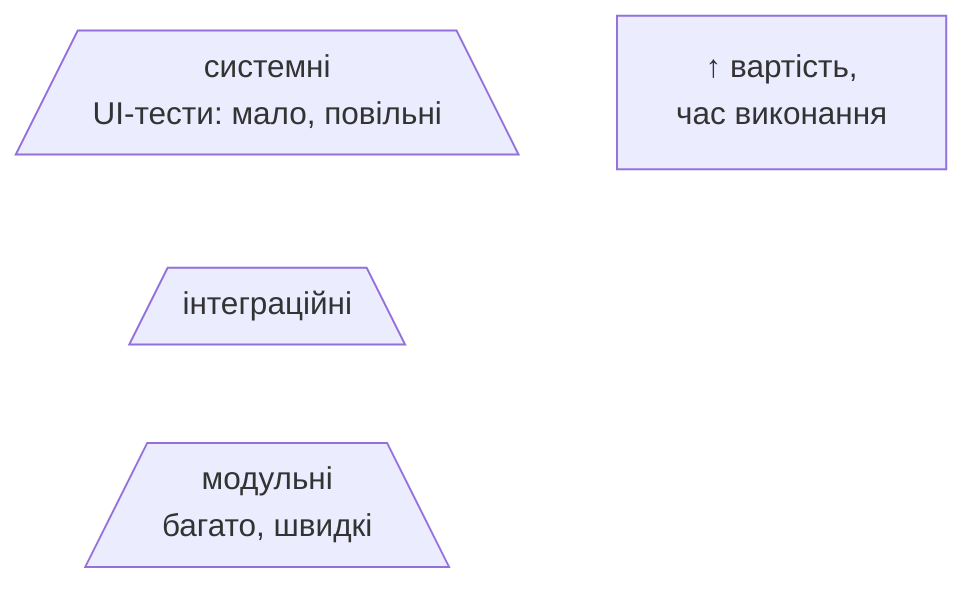
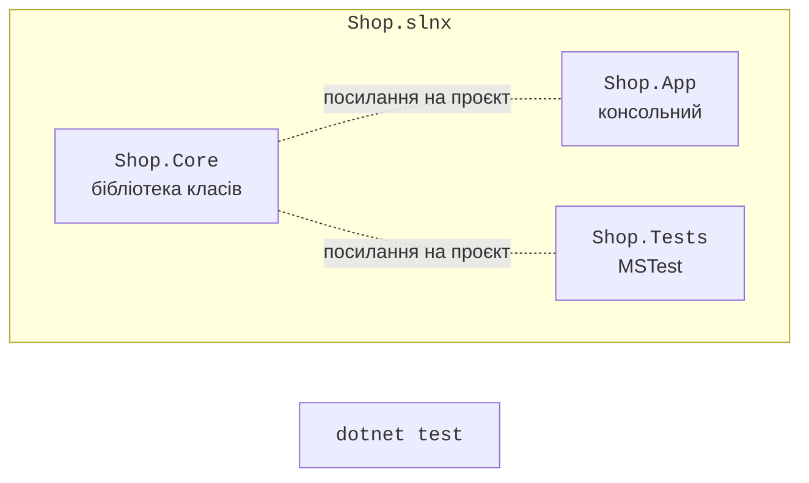
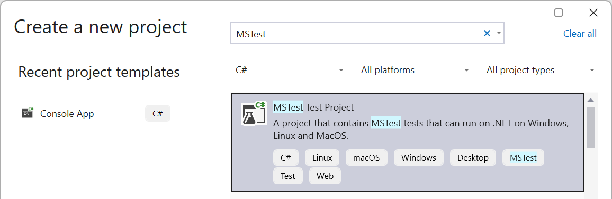
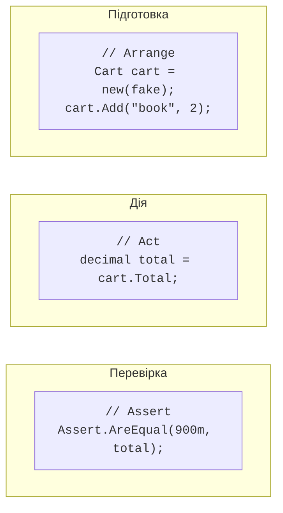

# Тести та MSTest

## Навіщо тести

Ручна перевірка програми після кожної зміни повільна й ненадійна: легко пропустити випадок, який раніше працював, а після зміни зламався (**регресія**). **Автоматизований тест** – код, який викликає код програми з відомими вхідними даними й перевіряє результат. Набір тестів виконується за секунди після кожної зміни й одразу показує, що саме зламалося.

Розрізняють рівні тестування:

- **модульні** (*unit*) тести перевіряють окремий метод або клас ізольовано від бази даних, файлів, мережі;
- **інтеграційні** тести перевіряють взаємодію кількох компонентів, наприклад сервісу й бази даних;
- **системні** (наскрізні, UI) тести перевіряють застосунок цілком з погляду користувача.

Модульних тестів має бути найбільше: вони швидкі, дешеві та точно вказують на помилку (**піраміда тестування**, рис. 18.1).



Рис. 18.1. Піраміда тестування {.caption}

Хороші модульні тести відповідають принципам **FIRST**: швидкі (*Fast*), незалежні один від одного (*Independent*), повторювані з тим самим результатом (*Repeatable*), самоперевірні – результат «пройшов/не пройшов» без ручного аналізу (*Self-validating*), написані своєчасно, разом із кодом (*Timely*).

## Фреймворки та структура рішення

Для .NET поширені три фреймворки модульного тестування: **MSTest** (розробляє Microsoft, шаблон Visual Studio за замовчуванням), **xUnit** і **NUnit**. Вони мають однакові можливості й відрізняються переважно назвами атрибутів (табл. 18.1). У курсі використовується MSTest.

Таблиця 18.1. Атрибути фреймворків тестування {.caption}

| **Призначення** | **MSTest** | **xUnit** | **NUnit** |
| --- | --- | --- | --- |
| клас тестів | `[TestClass]` | – | `[TestFixture]` |
| тест | `[TestMethod]` | `[Fact]` | `[Test]` |
| параметризований тест | `[DataRow]` | `[Theory]`, `[InlineData]` | `[TestCase]` |
| перед кожним тестом | `[TestInitialize]` | конструктор | `[SetUp]` |

Тести розміщують в **окремому тестовому проєкті**, що посилається на проєкт з кодом. Тому код, який тестують, виносять у **бібліотеку класів**, а консольний застосунок лише використовує її (рис. 18.2). Команди створення такого рішення (тема 8):

```
dotnet new sln -n Shop
dotnet new classlib -n Shop.Core
dotnet new mstest -n Shop.Tests
dotnet sln add Shop.Core Shop.Tests
dotnet add Shop.Tests reference Shop.Core
dotnet test
```



Рис. 18.2. Рішення з бібліотекою класів і тестовим проєктом {.caption}

У Visual Studio тестовий проєкт додають через *Add → New Project* шаблоном *MSTest Test Project* (рис. 18.3). Шаблон підключає NuGet-пакет `MSTest` (у .NET 10 – версії 4.x) і файл `MSTestSettings.cs`, що дозволяє паралельне виконання тестів.



Рис. 18.3. Створення тестового проєкту {.caption}

## Перший тест у MSTest

Тестовий клас позначають атрибутом `[TestClass]`, а кожен тест – відкритий метод без параметрів з атрибутом `[TestMethod]`. Тест складається з трьох частин – шаблон **Arrange–Act–Assert** (рис. 18.4):

- **Arrange** (підготовка) – створити об’єкти й вхідні дані;
- **Act** (дія) – викликати метод, що перевіряється;
- **Assert** (перевірка) – порівняти результат з очікуваним.



Рис. 18.4. Структура тесту Arrange–Act–Assert {.caption}

Назва тесту описує, що перевіряється, за схемою «метод\_сценарій\_очікуваний результат», наприклад `Divide_ByZero_Throws`. Тоді за назвою тесту, що не пройшов, зрозуміло, яка поведінка порушена. Один тест перевіряє одну поведінку.

### Твердження

Клас `Assert` містить методи перевірки; якщо умова не виконується, тест завершується невдачею з повідомленням (табл. 18.2).

Таблиця 18.2. Основні твердження MSTest {.caption}

| **Твердження** | **Перевіряє** |
| --- | --- |
| `Assert.AreEqual(expected, actual)` | рівність (спочатку очікуване!) |
| `Assert.AreEqual(0.333, x, delta: 0.001)` | рівність `double` з допуском |
| `Assert.IsTrue(c)`, `IsFalse`, `IsNull` | логічну умову, `null` |
| `Assert.ThrowsExactly<T>(() => …)` | що генерується виняток саме типу `T` |
| `Assert.HasCount(n, list)`, `IsEmpty` | кількість елементів колекції |
| `CollectionAssert.AreEqual`, `Contains` | колекції поелементно, наявність елемента |
| `StringAssert.Contains`, `StartsWith` | вміст рядка |

Дійсні числа порівнюють з допуском, бо обчислення з `double` мають похибку (тема 2). `ThrowsExactly` повертає виняток, тож можна додатково перевірити його повідомлення. Атрибут `[ExpectedException]` старих версій MSTest у версії 4 вилучено.

### Параметризовані тести

Щоб не копіювати тест для кожного набору даних, метод отримує параметри, а атрибути `[DataRow]` задають значення. Кожен рядок виконується й відображається як окремий тест. Значення атрибутів мають бути константами, тому `decimal` передають як `double` і перетворюють у тесті. Для складних даних (об’єкти, колекції) використовують `[DynamicData]` з властивістю або методом, що повертає набори аргументів.

Тестові дані обирають методом **класів еквівалентності** та **граничних значень**: значення, для яких програма поводиться однаково, утворюють клас, і з кожного класу беруть одне значення, а також значення на межах класів і поряд із ними. Для знижки «від 1000 грн» це 999,99, 1000 і 1000,01; для кількості товару – 0, 1 і −1; для перетворення в римські числа – 0, 1, 3999, 4000.
