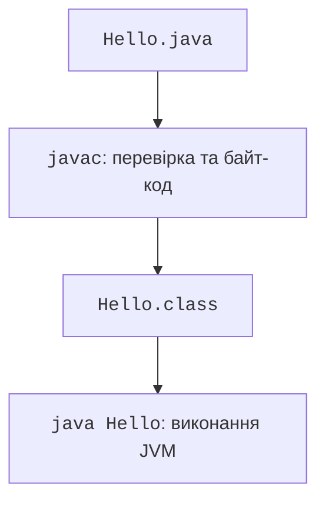

# Компіляція, запуск і структура програми

## Компіляція та запуск у терміналі

Створіть каталог `hello`, а в ньому файл `Hello.java`. Текстовий редактор має зберігати UTF-8 і не додавати приховане розширення `.txt`. Для публічного класу ім’я файла збігається з ім’ям класу з урахуванням регістру.

### Приклад 1. Привітання та аргументи

```java
public class Hello {
    public static void main(String[] args) {
        String name = args.length == 0 ? "студент" : args[0];
        System.out.println("Вітаю, " + name + "!");
        System.out.println("Аргументів: " + args.length);
    }
}
```

```powershell
javac -encoding UTF-8 Hello.java
java Hello Olena
```

Очікуваний результат:

```
Вітаю, Olena!
Аргументів: 1
```

Команда `javac` створює `Hello.class`. У команді запуску пишуть ім’я класу без розширення `.class`. Каталог із файлом класу має бути доступний через classpath. Для поточного каталогу можна явно задати:

```powershell
java -cp . Hello Olena
```



Рис. 1.3. Етапи компіляції та запуску класу {.caption}

Команда `java Hello.java Olena` запускає вихідний файл. Вона все одно потребує компіляції всередині запуску, але не вимагає попереднього окремого виклику `javac`. Це зручний режим для коротких прикладів; він не перетворює мову на «нетипізований сценарій».

Не плутайте аргументи JVM, ім’я програми й аргументи самої програми. Опції JVM розташовуються перед класом або `-jar`. Слова після імені класу потрапляють до `args`. Аргумент із пробілом передають у лапках:

```powershell
java Hello "Olena Kovalenko"
```

Тут масив `args` має один елемент. У різних оболонках правила лапок відрізняються; у звіті вказуйте оболонку й точну команду. На першому кроці використовуйте ASCII-аргументи, а український вивід перевірте окремо.

## Структура звичайної програми

`public class Hello` оголошує клас. Тіло класу містить метод `main`. `public` дозволяє доступ, `static` позначає метод класу, `void` означає відсутність поверненого значення. Параметр `String[] args` є масивом рядків. Детально класи розглянемо з теми 5; зараз цей каркас потрібний для запуску.

Фігурні дужки визначають межі блоків. Крапка з комою завершує інструкцію, а відступи допомагають читачеві бачити структуру. Регістр важливий: `System` і `system` є різними ідентифікаторами. Імена класів зазвичай починаються з великої літери, методів і змінних – із малої.

Коментар `//` триває до кінця рядка. Блоковий коментар пишуть між `/*` і `*/`; такі коментарі не вкладають один в один. Коментар має пояснювати причину рішення, а не просто повторювати інструкцію іншими словами.

Літерал у подвійних лапках є рядком. `println` друкує й переводить рядок, `print` не додає переведення. Конкатенація через `+` залежить від типів операндів: `"Сума: " + 2 + 3` дає текст із цифрами `23`, а `"Сума: " + (2 + 3)` – текст із числом `5`. Дужки тут змінюють групування обчислення.

### Приклад 2. Компактний вихідний файл

Починаючи з Java 25 компактні файли й методи `main` екземпляра є завершеною можливістю. Вони дозволяють навчальній програмі починатися без явного оголошення класу. Збережіть цей окремий приклад як `Welcome.java`:

```java
void main() {
    IO.println("Привіт із компактного файла!");
    IO.println("JDK " + Runtime.version().feature());
}
```

```powershell
java Welcome.java
```

Результат на цільовій JDK:

```
Привіт із компактного файла!
JDK 27
```

Компілятор усе одно створює неявний клас. Компактний файл автоматично імпортує доступні публічні типи з `java.base`; у звичайному файлі правила імпорту залишаються явними. `java.lang.IO` доступний для простого рядкового введення-виведення. Не змішуйте `IO.readln` і `Scanner` для одного потоку введення: обидва засоби можуть буферизувати байти.

Специфікація можливості: <https://openjdk.org/jeps/512>. Компактний формат зручний для першої спроби, але основні багатофайлові приклади курсу використовують явні класи, пакети та звичайний `main`. Не називайте завершену можливість preview і не додавайте `--enable-preview` без потреби.
