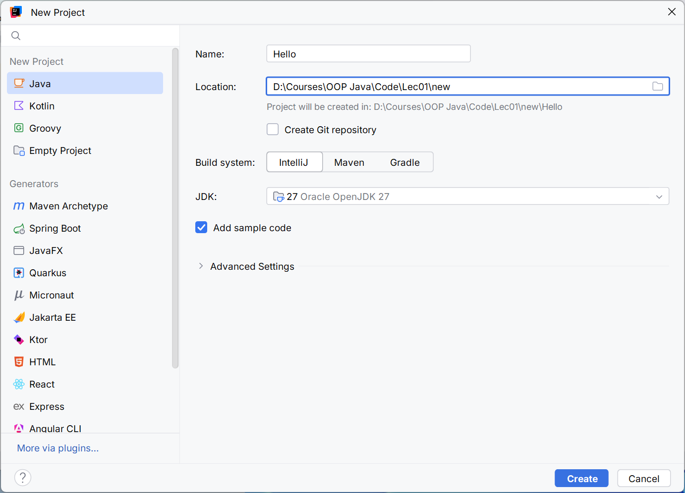
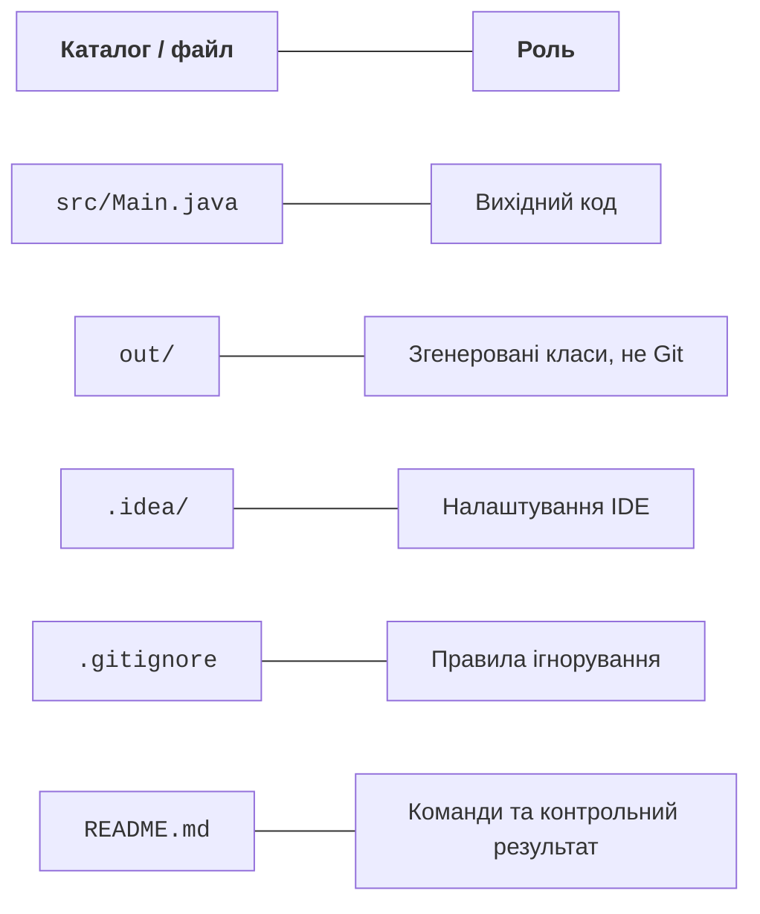
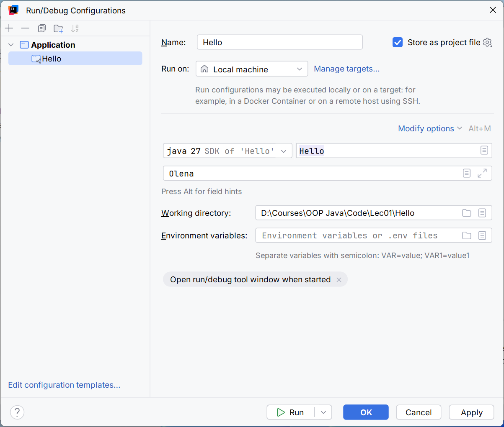
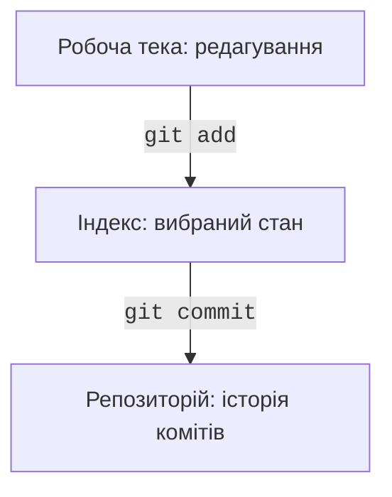
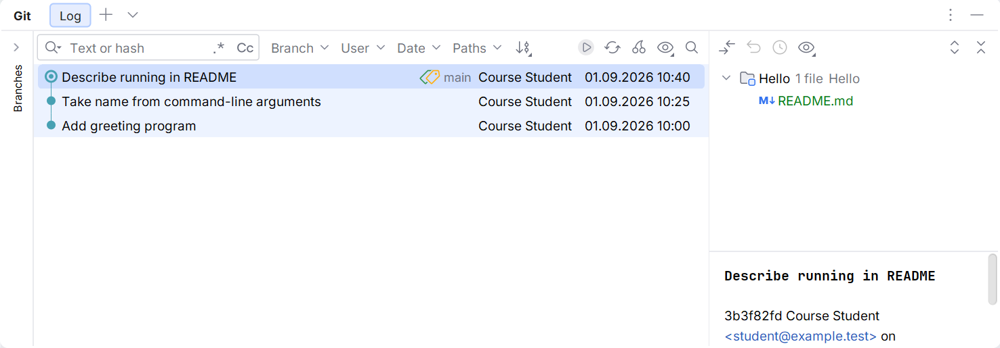

# IntelliJ IDEA, JShell і помилки

## IntelliJ IDEA: проєкт і конфігурація

IntelliJ IDEA має єдиний дистрибутив із безкоштовними базовими можливостями Java; частина розширених можливостей потребує відповідної ліцензії. Актуальні умови й завантаження: <https://www.jetbrains.com/idea/download/>. Посібник встановлення: <https://www.jetbrains.com/help/idea/installation-guide.html>.

Завантажуйте IDE з офіційного джерела. Оберіть відповідну ОС і архітектуру, перевірте вимоги поточної версії. Для лабораторної роботи достатньо базового Java-проєкту; налаштування зовнішньої бази даних або фреймворків на цьому етапі не потрібне.

У вікні *New Project* задайте ім’я `Hello`, мову *Java*, систему збирання *IntelliJ* і JDK 27. Майстер може запропонувати завантаження JDK; вибір *Project SDK* не змінює автоматично `JAVA_HOME` в усіх зовнішніх терміналах.



Рис. 1.4. Створення Java-проєкту з JDK 27 {.caption}

Відкрийте `src/Main.java`. Зелена кнопка біля `main` запускає відповідний клас. Вікно *Run* показує вивід і код завершення. Якщо запускається старий клас, перевірте вибрану конфігурацію, а не змінюйте код навмання.



Рис. 1.5. Вихідні файли, налаштування та результат компіляції {.caption}

`src` містить вихідний код, а `out` – згенеровані класи в проєкті із системою збирання IntelliJ. `.idea` містить налаштування IDE. Структура Maven буде іншою: `src/main/java` та `target`. Не перейменовуйте каталоги за аналогією між різними системами, не змінюючи їхню конфігурацію.

Аргументи задають у *Run → Edit Configurations…* в полі *Program arguments*. Опції JVM мають окреме поле *VM options*. Робочий каталог визначає базу відносних шляхів; він не обов’язково збігається з каталогом конкретного файла `Main.java`.



Рис. 1.6. Аргументи та робочий каталог запуску {.caption}

### Приклад 3. Відомості про середовище

```java
public class EnvironmentInfo {
    public static void main(String[] args) {
        System.out.println("Java: " + Runtime.version());
        System.out.println("Vendor: "
                + System.getProperty("java.vendor"));
        System.out.println("OS: "
                + System.getProperty("os.name"));
        System.out.println("Working directory: "
                + System.getProperty("user.dir"));
    }
}
```

Номер збірки, ОС і каталог залежать від запуску. Очікувана інваріантна перевірка – головна версія 27. Порівняйте IDE і термінал: різний робочий каталог пояснює багато майбутніх помилок пошуку файла. Не публікуйте знімки з персональними шляхами.

## JShell як інструмент дослідження

Команда `jshell` відкриває інтерактивне середовище. У ньому можна обчислити вираз, оголосити змінну, переглянути її значення та перевірити припущення. Сеанс корисний для короткого експерименту, але не замінює збережений і відтворюваний проєкт.

```
jshell> int count = 7;
count ==> 7
jshell> count * count
$2 ==> 49
jshell> Math.sqrt(2)
$3 ==> 1.4142135623730951
jshell> /vars
jshell> /exit
```

Номери тимчасових змінних залежать від попереднього сеансу. У звіті записують перевірений вираз і висновок, а не вважають `$2` постійним ідентифікатором API. Команда `/help` пояснює доступні команди оболонки.

### Приклад 4. Площа кімнати

```java
import java.util.Locale;

public class Room {
    public static void main(String[] args) {
        double length = 5.2;
        double width = 3.5;
        double area = length * width;
        double perimeter = 2 * (length + width);
        System.out.printf(Locale.US, "Area: %.2f m2%n", area);
        System.out.printf(Locale.US, "Perimeter: %.2f m%n",
                perimeter);
    }
}
```

Результат: `Area: 18.20 m2`, потім `Perimeter: 17.40 m`. Усі довжини задано в метрах. Явна локаль робить десяткову крапку відтворюваною. Два знаки у виводі не змінюють внутрішнього значення `double`. Розміри в цьому прикладі є константними вхідними даними; наступна тема додасть введення та перевірку меж.

## Локальний Git-репозиторій

Git зберігає історію узгоджених змін. Він не є резервною копією всього диска й не перевіряє правильність формул. Кожний коміт має містити логічно завершений крок, який можна пояснити.

Офіційний посібник: <https://git-scm.com/book/en/v2>. Після встановлення перевірте `git --version`. Ім’я й адресу автора задавайте відповідно до правил курсу; для навчальної вправи достатньо локального налаштування конкретного репозиторію.

```powershell
git init -b main
git config user.name "Course Student"
git config user.email "student@example.test"
```

Файл `.gitignore` для простого проєкту IntelliJ:

```
out/
*.class
.idea/workspace.xml
```

Це не універсальний шаблон для всіх Java-проєктів. У темі Maven потрібно додати `target/`, а для Gradle – `.gradle/` і `build/`. Файли обгортки системи збирання навпаки зазвичай зберігають у репозиторії. Паролі, токени та персональні файли не включають до коміту навіть у приватному репозиторії.



Рис. 1.7. Три локальні області Git {.caption}

```powershell
git status
git add src .gitignore
git diff --staged
git commit -m "Add greeting program"
git log --oneline
```

`git add` переносить вибраний стан файла до індексу. Якщо після цього файл змінено, коміт міститиме проіндексовану версію, а не автоматично останню. Переглядайте `git diff` і `git diff --staged` перед фіксацією.

Після першої працездатної версії додайте другий невеликий крок, наприклад аргумент імені, а третім комітом опишіть запуск у README. Не створюйте три коміти з випадковими пробілами лише заради кількості. Історія має показувати розвиток програми.



Рис. 1.8. Змістовна історія локального проєкту {.caption}

У вікні *Commit* обирають файли й записують повідомлення. Перегляд *Git Log* дозволяє порівняти стани. `git restore` відкидає незбережені в коміті зміни вибраного файла: спочатку перегляньте різницю. У навчальній роботі не застосовуйте команди очищення каталогів без розуміння їхньої області дії.

Віддалений репозиторій є окремою копією історії. `push` передає коміти, `clone` створює локальну копію. Для курсу достатньо локальної історії; публікація на GitHub є окремим кроком за правилами викладача. Зміна видимості репозиторію не видаляє секрети з уже опублікованої історії.
