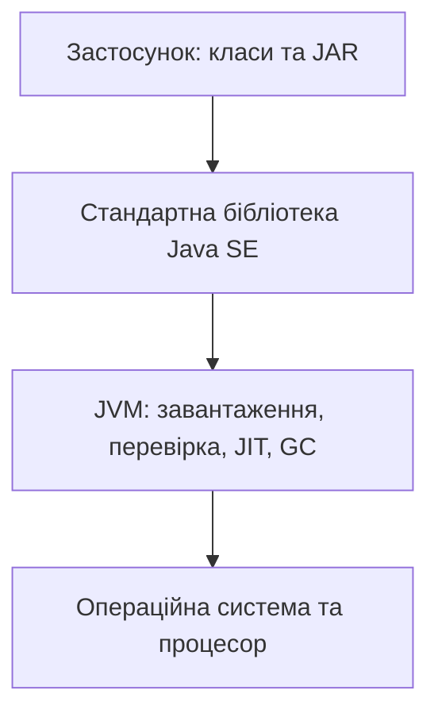

# Платформа Java і JDK

## Мова та платформа

**Java** – мова програмування і назва платформи виконання. Файл із текстом програми ще не є готовим процесом. Компілятор перевіряє текст і створює байт-код, а віртуальна машина завантажує класи та виконує їхні інструкції. Це розділення дозволяє переносити програму між системами, для яких існує сумісна JVM. Проте доступ до файлів, кодування консолі й нативні бібліотеки залишаються залежними від середовища.

Офіційний навчальний портал: <https://dev.java/learn/>. Документація платформи: <https://docs.oracle.com/en/java/>. Користуйтеся документацією тієї версії, на якій запускаєте код. Випадковий приклад для Java 8 може бути правильним, але не показувати сучасні засоби мови.

Java була представлена у 1995 році; Java 1.0 вийшла у 1996 році. Важливими етапами стали узагальнення, лямбда-вирази, модулі, записи та зіставлення зі зразком. Вивчення мови не означає запам’ятовування всіх новинок одночасно: спочатку потрібні точні поняття типу, значення й виклику. Нові конструкції розглядатимемо тоді, коли вони допомагають розв’язати конкретну задачу.

У курсі використовується **JDK 27**, випущена 15 вересня 2026 року. Це не LTS-випуск у поширених політиках постачальників. LTS означає політику довготривалої підтримки конкретного дистрибутива, а не інший синтаксис мови. Перевіряйте умови підтримки та ліцензування саме обраного постачальника.

Сторінка розробки випуску: <https://openjdk.org/projects/jdk/27/>. Архів поточного OpenJDK: <https://jdk.java.net/27/>. Опис змін: <https://www.oracle.com/java/technologies/javase/27-relnote-issues.html>.

## JDK, JVM та бібліотека класів

**JVM** виконує байт-код. **JDK** містить JVM, стандартну бібліотеку й інструменти розробника. Назва **JRE** історично позначала середовище виконання без компілятора. Для лабораторних робіт потрібна саме JDK: окрема стара інсталяція JRE не замінює `javac`.



Рис. 1.1. Компоненти платформи та межа операційної системи {.caption}

Завантажувач класів знаходить байт-код, верифікатор перевіряє його структурну коректність, а середовище виконання керує пам’яттю й потоками. HotSpot може інтерпретувати код і компілювати часто виконувані ділянки в машинні інструкції. **JIT** не є окремою командою, яку студент повинен запускати вручну.

Збирач сміття звільняє пам’ять об’єктів, які більше не потрібні програмі. Він не замінює закриття файла чи з’єднання з базою даних. Час звільнення об’єкта не є способом планування дій програми. Цю відмінність повернемо до практики в темі винятків.

До JDK входять такі інструменти:

| **Команда** | **Призначення** |
| --- | --- |
| `java` | Запуск програми або файла вихідного коду |
| `javac` | Компіляція вихідних файлів |
| `jshell` | Інтерактивні експерименти з виразами |
| `jar` | Створення й перегляд архівів класів |
| `javadoc` | Документація публічного програмного інтерфейсу |
| `jlink` | Формування спеціалізованого образу виконання |

Java SE містить базову платформу. JavaFX постачається окремо; наявність JDK не гарантує наявності її модулів. Jakarta EE та Android мають власні середовища й обмеження. Програма для однієї платформи не стає програмою для іншої лише через схожість синтаксису.

## Встановлення JDK та перевірка шляху

Для Windows у навчальному середовищі використано офіційний архів OpenJDK 27 для x64. Розпакуйте його в постійний каталог. Не переносіть із архіву окремий `java.exe`: йому потрібні інші файли дистрибутива. Для ARM64, Linux і macOS оберіть збірку саме своєї архітектури та перевірте підтримку на сторінці постачальника.

Інсталятор і архів є різними способами доставлення JDK. Не всі дистрибутиви пропонують однакові формати. Не вводьте неперевірений ідентифікатор пакета WinGet і не припускайте, що пакет `openjdk-27-jdk` уже є в репозиторії будь-якого Linux-дистрибутива. Наявність пакета перевіряють у вибраному джерелі.

Після розпакування виконайте команди через повний шлях:

```powershell
& 'C:/Tools/jdk-27/bin/java.exe' --version
& 'C:/Tools/jdk-27/bin/javac.exe' --version
```

Шлях `C:/Tools/jdk-27` є прикладом: підставте фактичний. Команди повинні показувати версію 27. У звіті збережіть повний номер збірки й постачальника, а не лише слово Java. Однаковий номер мови не означає однакову ліцензію чи однакові додаткові компоненти дистрибутива.

::: info Знімок екрана
PowerShell: absolute java and javac paths, both version27; hide user home.
:::

Рис. 1.2. Версії інструментів із вибраної JDK {.caption}

`JAVA_HOME` указує на корінь JDK, без завершального `bin`. `PATH` визначає, де оболонка шукає команду. Для одного термінала можна тимчасово задати:

```powershell
$env:JAVA_HOME = 'C:/Tools/jdk-27'
$env:PATH = "$env:JAVA_HOME/bin;" + $env:PATH
Get-Command java
java --version
javac --version
```

Така зміна діє лише в поточному процесі та його нащадках. Для постійного налаштування використовуйте системний діалог змінних середовища, після чого відкрийте новий термінал. У PowerShell команда `where` може бути псевдонімом; для пошуку виконуваного файла використовуйте `Get-Command java` або `where.exe java`.

Якщо встановлено кілька JDK, перевірте всі три місця: термінал, **Project SDK** в IDE та JVM системи збирання. У темі 13 Gradle запускатиметься на сумісній JDK 25, а код курсу компілюватиметься й виконуватиметься JDK 27. Налаштування процесу збирання та цільового інструментарію не слід ототожнювати.
