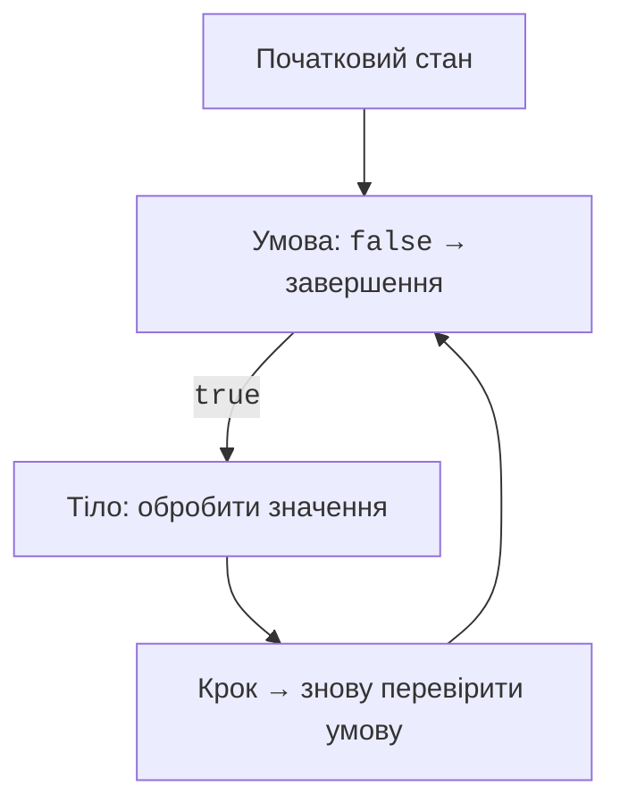

# Цикли та інваріанти

## Цикли та стан обчислення

`while` перевіряє умову перед тілом. `do-while` виконує тіло принаймні один раз. `for` об’єднує початковий стан, умову й крок зміни лічильника. Вибір конструкції має підкреслювати контракт: відомий діапазон зручно обходити через `for`, невідому кількість рядків до EOF – через `while`.



Рис. 2.4. Стан циклу та перевірка його завершення {.caption}

`break` завершує цикл, `continue` пропускає решту поточної ітерації. У `for` після `continue` виконується крок оновлення; у `while` потрібно перевірити, що важлива зміна стану не пропущена. Мітка дозволяє завершити зовнішній цикл, але надмірна кількість міток ускладнює читання.

```java
public class SearchPair {
    public static void main(String[] args) {
        outer:
        for (int a = 1; a <= 5; a++) {
            for (int b = 1; b <= 5; b++) {
                if (a * a + b * b == 25) {
                    System.out.println(a + ", " + b);
                    break outer;
                }
            }
        }
    }
}
```

Перша пара – `3, 4`. Завершення лише внутрішнього циклу дозволило б продовжити зовнішній і надрукувати інші пари. Перевіряйте не тільки формулу умови, а й те, який саме цикл завершується.

### Приклад 3. Видача решти

Для навчальних номіналів 100, 50, 20, 10 і суми, кратної 10, жадібний розклад дає мінімальне число купюр. Це твердження не поширюється автоматично на довільний набір номіналів.

```java
import java.util.Scanner;

public class Change {
    public static void main(String[] args) {
        Scanner input = new Scanner(System.in);
        if (!input.hasNextInt()) {
            System.out.println("Потрібне ціле число");
            return;
        }
        int amount = input.nextInt();
        if (amount < 0 || amount > 100_000 || amount % 10 != 0) {
            System.out.println("Некоректна сума");
            return;
        }
        int rest = amount;
        int hundreds = rest / 100;
        rest %= 100;
        int fifties = rest / 50;
        rest %= 50;
        int twenties = rest / 20;
        rest %= 20;
        int tens = rest / 10;
        int count = hundreds + fifties + twenties + tens;
        System.out.printf("100: %d; 50: %d; 20: %d; 10: %d%n",
                hundreds, fifties, twenties, tens);
        System.out.println("Купюр: " + count);
    }
}
```

Для 280 отримуємо 2, 1, 1, 1 купюру відповідних номіналів, усього 5. Перевірка відновлення суми важливіша за сам вигляд таблиці. Для нуля всі кількості мають бути нульовими, для 15 ввід відхиляється.

### Приклад 4. Таблиця значень

Обчислити `y = x*x - 2*x + 1` для цілих x від −2 до 2. Межі тут цілі, тому цикл не накопичує похибку додавання десяткового кроку. Форматування вирівнює числа за правим краєм стовпців.

```java
import java.util.Locale;

public class FunctionTable {
    public static void main(String[] args) {
        double total = 0;
        System.out.printf("%5s %10s%n", "x", "y");
        for (int x = -2; x <= 2; x++) {
            double y = (double) x * x - 2 * x + 1;
            total += y;
            System.out.printf(Locale.US, "%5d %10.2f%n", x, y);
        }
        System.out.printf(Locale.US, "Total: %.2f%n", total);
    }
}
```

Значення y: 9, 4, 1, 0, 1; підсумок 15.00. `%n` використовує переведення рядка платформи, `%d` очікує ціле, `%.2f` – дійсне з двома знаками. Ширина поля є мінімальною: довге значення може розширити стовпець. Вивід не повинен приховувати значення лише заради красивої рамки.

## Інваріант, межі та контрольні випадки

**Інваріант** – твердження про стан, яке зберігається між ітераціями. У таблиці перед черговим x змінна `total` містить суму вже надрукованих рядків. Якщо додати поточне значення двічі, таблиця рядків виглядатиме правильно, але інваріант підсумку порушиться.

Для завершення циклу потрібний вимірюваний прогрес: лічильник наближається до межі, залишок зменшується або кожна ітерація споживає новий токен. Перевірка неправильного вводу без його споживання не забезпечує такого прогресу. Ліміт ітерацій потрібний чисельним алгоритмам, навіть якщо вони зазвичай збігаються.

::: info Знімок екрана
Debug FunctionTable at x=0; show x,y,total and selected loop line.
:::

Рис. 2.5. Значення лічильника й накопиченої суми {.caption}

Таблиця тестів повинна містити звичайний випадок, обидві межі дозволеного діапазону, значення поруч із межами, неправильний формат і EOF. Для дробів додайте `NaN`, `Infinity`, десяткову кому та крапку. Результат відмови також є частиною контракту: чи завершується програма, чи повторює запит, чи зберігає попередній правильний стан.

Не використовуйте випадкові числа як єдину перевірку. Випадковий набір може не потрапити на найважливішу межу. Спочатку створіть маленькі приклади з ручним результатом, потім розширюйте обсяг перевірки. Коли додаєте нову умову, поясніть, який клас помилок вона відсікає.
