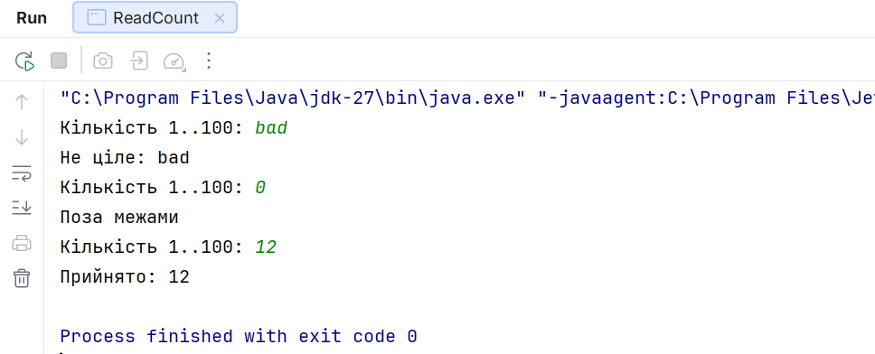
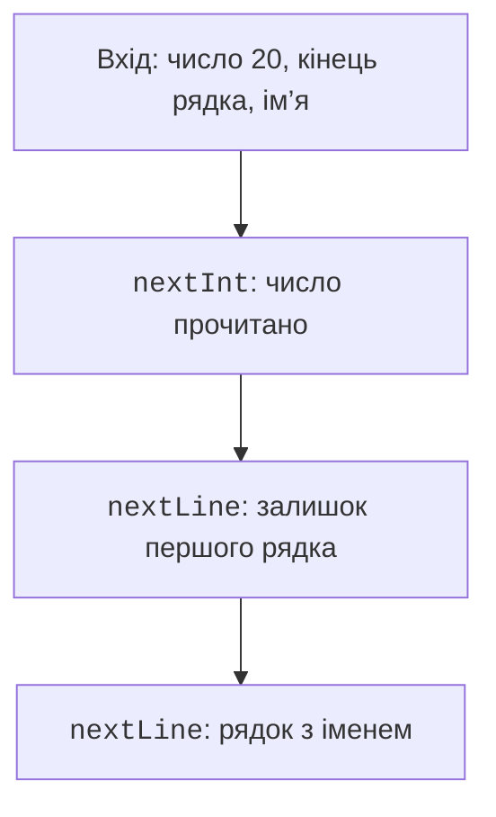

# Операції та консольне введення

## Операції та логічні умови

Арифметичні операції `+`, `-`, `*`, `/`, `%` залежать від типів. `7 / 2` дає `3`, а `7 / 2.0` дає `3.5`. Остача `-7 % 3` дорівнює `-1`; для нормалізації циклічного індексу зручний `Math.floorMod(-7, 3)`, який дає `2`.

Оператори `++` і `--` змінюють значення. Префіксна й постфіксна форми відрізняються значенням виразу. Не поєднуйте кілька змін тієї самої змінної в одному складному виразі: розбийте його на кроки. Це полегшує перевірку і зменшує залежність від запам’ятовування пріоритетів.

Порівняння дає `boolean`. Ланцюг `0 <= x <= 10` не є коректним Java-кодом; пишіть `x >= 0 && x <= 10`. Оператори `&&` та `||` мають коротке замикання: другий операнд обчислюється лише коли потрібний.

```java
int divisor = 0;
boolean valid = divisor != 0 && 100 / divisor > 2;
```

У цьому фрагменті ділення не виконується. Заміна `&&` на `&` для логічних операндів змусила б обчислити обидві частини. Побітові `&`, `|`, `^`, `~`, `<<`, `>>`, `>>>` для цілих значень оперують бітами, а не умовами. `>>` зберігає знак, `>>>` заповнює старші біти нулями.

Умовний оператор `condition ? a : b` повертає одне з двох значень. Він корисний для короткого вибору, але вкладені ланцюги часто гірше читаються за звичайний `if`. Присвоєння `=` не слід плутати з перевіркою рівності `==`.

## Консольне введення та локаль

У цій темі основний інструмент – `Scanner`. Для чисел із крапкою задаємо `Locale.US`, щоб контракт не залежав від системної мови Windows. У тексті можна використовувати українську кому, але машинний формат вводу має бути однозначним.

Документація Scanner: <https://docs.oracle.com/en/java/javase/26/docs/api/java.base/java/util/Scanner.html>. Описаний API перевірено виконанням на JDK 27.

`Scanner` за замовчуванням розділяє токени пропусками. `hasNextInt` перевіряє наступний токен, але не вилучає неправильний. Якщо повторювати перевірку без `next`, цикл назавжди залишиться на тому самому рядку. EOF означає кінець потоку, а не неправильне число.

### Приклад 1. Надійне введення кількості

```java
import java.util.Scanner;

public class ReadCount {
    public static void main(String[] args) {
        Scanner input = new Scanner(System.in, "UTF-8");
        while (true) {
            System.out.print("Кількість 1..100: ");
            if (!input.hasNext()) {
                System.out.println("Кінець вводу");
                return;
            }
            if (!input.hasNextInt()) {
                System.out.println("Не ціле: " + input.next());
                continue;
            }
            int count = input.nextInt();
            if (count < 1 || count > 100) {
                System.out.println("Поза межами");
                continue;
            }
            System.out.println("Прийнято: " + count);
            break;
        }
    }
}
```

Для токенів `bad 0 12` програма відхиляє текст, потім нуль, потім приймає 12. Неправильний токен кожного разу вилучається. Для порожнього потоку програма завершується, а не повторює запит без кінця. У простій CLI-програмі `System.in` належить процесу; не закривайте його всередині допоміжного методу, після якого інший код ще має читати ввід.



Рис. 2.2. Послідовне відхилення неправильного вводу {.caption}

`nextInt()` залишає роздільник після токена, а `nextLine()` читає решту поточного рядка. Після числа без іншого тексту ця решта часто порожня. Виберіть послідовну стратегію: токени для всього вводу або рядки з подальшим розбором.



Рис. 2.3. Токен числа та залишок рядка {.caption}

```java
import java.util.Scanner;

public class ReadProfile {
    public static void main(String[] args) {
        Scanner input = new Scanner(System.in, "UTF-8");
        if (!input.hasNextInt()) return;
        int age = input.nextInt();
        if (!input.hasNextLine()) return;
        input.nextLine();
        if (!input.hasNextLine()) return;
        String name = input.nextLine();
        System.out.println(name + ": " + age);
    }
}
```

Для двох рядків `20` і `Олена Коваль` очікується `Олена Коваль: 20`. Додатковий `nextLine()` тут навмисно споживає решту першого рядка. Якщо контракт дозволяє ім’я після числа в тому самому рядку, потрібний інший алгоритм, а не механічне копіювання цього.
