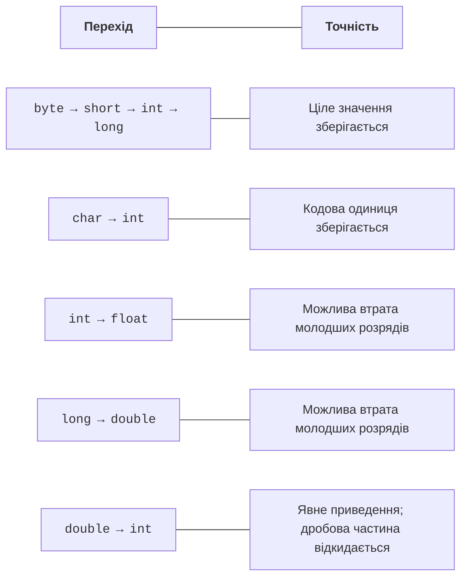

# Типи, змінні та перетворення

## Значення та оголошення змінної

Змінна має тип, ім’я й значення. Тип визначає допустимі операції та спосіб представлення даних. У Java тип локальної змінної не змінюється після оголошення. Присвоєння нового значення не створює новий тип.

```java
int students = 24;
double distance = 12.5;
boolean finished = false;
char grade = 'A';
String title = "Лабораторна робота";
```

Це фрагмент тіла методу, а не окрема програма. Локальну змінну потрібно ініціалізувати перед читанням. Правила початкових значень полів і елементів масиву розглянемо окремо; не переносіть їх на локальні змінні. Компілятор відхилить читання локального `int`, якому не присвоєно значення на всіх можливих шляхах.

`final` забороняє повторне присвоєння. Для посилання це не означає автоматичної незмінності об’єкта. `var` дозволяє компілятору вивести тип локальної змінної з ініціалізатора. Це не динамічний тип і не дозвіл присвоїти пізніше будь-яке значення.

```java
final int MAX_ATTEMPTS = 5;
var count = 3;       // int
var ratio = 3.0;     // double
```

Змінна `var value = null` не має достатньої інформації для виведення типу. Для першого читання прикладів курсу явні типи допомагають пояснювати контракт. Використовуйте `var` там, де тип зрозумілий без пошуку далекого оголошення.

Офіційні основи мови: <https://dev.java/learn/language-basics/>. Специфікації Java: <https://docs.oracle.com/javase/specs/>.

## Примітивні типи та діапазони

Java має вісім примітивних типів. `String` до них не належить: це клас. Розрядність цілих типів задана мовою і не залежить від того, чи ОС є 32-бітною.

| **Тип** | **Розмір** | **Призначення / межі** |
| --- | --- | --- |
| `byte` | 8 біт | від −128 до 127 |
| `short` | 16 біт | від −32768 до 32767 |
| `int` | 32 біти | від −2147483648 до 2147483647 |
| `long` | 64 біти | цілі великого діапазону |
| `float` | 32 біти | дійсні, приблизно 6–7 значущих цифр |
| `double` | 64 біти | дійсні, приблизно 15–16 значущих цифр |
| `char` | 16 біт | кодова одиниця UTF-16 |
| `boolean` | логічний тип | лише true або false |

Для `boolean` не слід вигадувати гарантовану мовою кількість байтів об’єкта чи масиву. Для `char` не слід обіцяти, що кожен видимий символ уміщується в одному значенні: емодзі часто потребує двох кодових одиниць. Unicode детальніше розглянемо в темі 3.

Літерал `1_000_000` читається легше за суцільний ряд цифр. Суфікс `L` задає `long`, `f` – `float`. Шістнадцятковий префікс – `0x`, двійковий – `0b`. Початковий нуль у цілому літералі може означати вісімкову систему; не додавайте нулі як декорацію.

```java
long population = 8_000_000_000L;
int mask = 0b1010;
int color = 0xFF;
float factor = 1.5f;
double scientific = 2.5e3;
```

Класи-обгортки `Integer`, `Long`, `Double`, `Boolean` представляють значення як об’єкти. Обгортка може мати `null`, примітив – ні. Автоматичне розпакування `null` спричинить виняток. Не використовуйте `==` для порівняння значень обгорток через можливе кешування; у базових числових алгоритмах надавайте перевагу примітивам.

## Перетворення та переповнення

Розширення типу не завжди зберігає точність. Перехід `int` до `long` зберігає значення, але перехід великого `long` до `double` може втратити молодші розряди. Назва «розширення» описує дозволене перетворення типів, а не гарантію точного результату.



Рис. 2.1. Числові перетворення та можлива втрата точності {.caption}

Звуження потребує явного приведення. Воно не є перевіркою діапазону: `(byte) 130` дає `-126`. Перетворення `double` до `int` відкидає дробову частину в напрямку нуля. Для математичного округлення існують окремі операції, наприклад `Math.round`.

```java
public class NumericLimits {
    public static void main(String[] args) {
        int side = 50_000;
        int wrong = side * side;
        long correct = (long) side * side;
        System.out.println(wrong);
        System.out.println(correct);
        System.out.println((int) -3.9);
        System.out.println(Math.round(-3.9));
    }
}
```

Результат: `-1794967296`, `2500000000`, `-3`, `-4`. Приведення має відбутися **до** множення. Запис `long value = side * side` спочатку множить два `int`, тому широка змінна не виправляє переповнення. Для контрольованої арифметики існує `Math.multiplyExact`; вона повідомляє про переповнення винятком.

`double` використовує двійкове представлення. Десяткові дроби на кшталт 0,1 не завжди подаються точно. Порівняння обчислених результатів виконують з допуском, який визначає задача, а не випадкове число. Для цілих копійок використовуйте `long`; десяткові фінансові розрахунки з правилами округлення потребують `BigDecimal`, який розглядається пізніше.

```java
public class Approximation {
    public static void main(String[] args) {
        double value = 0.1 + 0.2;
        double expected = 0.3;
        double tolerance = 1e-12;
        System.out.println(value == expected);
        System.out.println(Math.abs(value - expected) < tolerance);
        System.out.println(Double.isFinite(1.0 / 0.0));
    }
}
```

Результат: `false`, `true`, `false`. Ділення цілих на нуль спричиняє виняток, а операції з `double` можуть дати нескінченність або `NaN`. Успішний розбір рядка ще не доводить, що число є скінченним. Для фізичних величин часто потрібні і `isFinite`, і перевірка предметного діапазону.
