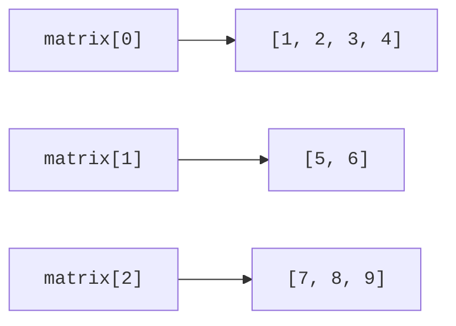

# Двовимірні масиви та аргументи

## Двовимірні й зубчасті масиви

`int[][]` є масивом посилань на int-масиви. Рядки можуть мати різну довжину й навіть бути null. `new int[3][4]` створює прямокутну структуру, а `new int[3][]` створює лише зовнішній масив із трьома null. Кожний рядок тоді потрібно створити окремо перед доступом до його елементів.

Під час обходу використовуйте довжину саме поточного рядка. Вираз matrix[0].length не гарантує довжину всіх інших рядків і недоступний для порожнього зовнішнього масиву. Алгоритм матриці повинен спочатку перевірити прямокутність, якщо вона є його передумовою.



Рис. 3.4. Рядки двовимірного масиву мають власні довжини {.caption}

## Приклад 2. Поворот матриці на 90 градусів

Матриця m на n після повороту за годинниковою стрілкою має n рядків і m стовпців. Елемент source[row][col] переходить у result[col][rows − 1 − row]. Новий масив не ділить рядки з вихідним, тому подальші зміни результату не змінюють джерело.

```java
import java.util.Arrays;

public class Main {
    static int[][] rotate(int[][] source) {
        if (source == null || source.length == 0
                || source[0] == null || source[0].length == 0) {
            throw new IllegalArgumentException("Empty matrix");
        }
        int rows = source.length;
        int cols = source[0].length;
        for (int[] row : source) {
            if (row == null || row.length != cols) {
                throw new IllegalArgumentException("Jagged matrix");
            }
        }
        int[][] result = new int[cols][rows];
        for (int row = 0; row < rows; row++) {
            for (int col = 0; col < cols; col++) {
                result[col][rows - 1 - row] = source[row][col];
            }
        }
        return result;
    }
    public static void main(String[] args) {
        int[][] source = {{1, 2, 3}, {4, 5, 6}};
        int[][] rotated = rotate(source);
        System.out.println(Arrays.deepToString(source));
        System.out.println(Arrays.deepToString(rotated));
        rotated[0][0] = 99;
        System.out.println(source[1][0]);
    }
}
```

```text
[[1, 2, 3], [4, 5, 6]]
[[4, 1], [5, 2], [6, 3]]
4
```

Для перевірки індексів корисні матриці 1 на 1, 1 на n і m на 1: вони швидко виявляють плутанину між rows та cols. Чотири послідовні повороти мають повернути початковий вміст. Порівнюйте вкладені масиви через Arrays.deepEquals, а не equals.

## Аргументи командного рядка

Параметр main `String[] args` містить аргументи після імені класу або JAR. Ім’я самої програми не входить до масиву. Кожний елемент є рядком; число потрібно розібрати, наприклад через Integer.parseInt. Перед args[0] перевірте length, інакше запуск без аргументів завершується помилкою.

Консольна програма може приймати `--help`, іменовану опцію й складене значення, наприклад `--marks "70;80;90"`. Лапки обробляє оболонка, а програма одержує один рядок із роздільниками. Якщо аргументів немає, можна запитати ті самі дані через Scanner. Не дублюйте обчислення: обидва шляхи введення повинні викликати ті самі методи.

Повідомлення про помилку належить до System.err, звичайний результат – до System.out. Коди завершення потрібно документувати. Для поглиблених варіантів курсу використовуємо 0 для успіху, 2 для помилки введення та 1 для непередбаченої відмови виконання. Перехоплення винятків і централізований вихід буде детально пояснено в наступній темі.
