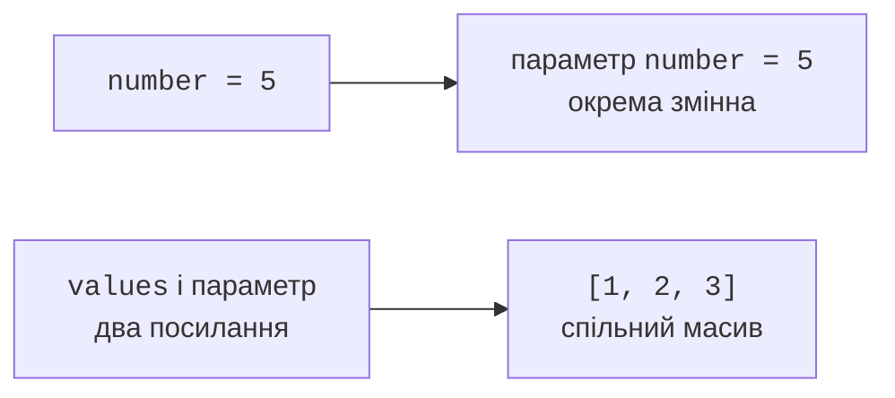

# Методи та параметри

## Метод як окремий крок алгоритму

Програма стає складною задовго до появи тисяч рядків: достатньо змішати введення, перевірку, обчислення й друк у main. **Метод** відокремлює дію з власним іменем, параметрами та результатом. Наприклад, average обчислює середнє, а printReport лише представляє вже обчислені дані. Такі частини легше перевіряти окремо та повторно використовувати.

У цій темі методи оголошуємо static усередині Main. Вони належать класу й викликаються без створення екземпляра. Конструкція містить модифікатори, тип результату, ім’я, список параметрів і тіло. Параметр є локальною змінною методу, яка одержує значення аргументу під час конкретного виклику.

`return` завершує поточний виклик. Метод із числовим результатом повинен повернути сумісне значення на кожному шляху нормального завершення. Тип `void` означає відсутність результату, але не відсутність роботи: метод може друкувати або змінювати елементи масиву. `return;` у void дозволяє завершити дію раніше.

Локальні змінні мають область дії блока й не отримують автоматичного початкового значення. Компілятор вимагає присвоєння до читання. Два виклики одного методу мають окремі параметри й локальні змінні. Назви можуть збігатися з назвами в іншому методі, але значення не стають спільними.

Контракт методу описує допустимі аргументи, одиниці, результат і побічні ефекти. Для середнього треба визначити поведінку на порожньому масиві. Для пошуку – що означає «не знайдено». Такі рішення важливіші за короткість сигнатури. Вступ до мови: <https://dev.java/learn/language-basics/>.

## Передавання параметрів за значенням

Java завжди передає аргументи **за значенням**. Для int копіюється число. Зміна параметра не змінює змінну виклику. Для масиву копіюється значення посилання: обидві локальні змінні можуть вказувати на той самий масив. Через це метод може змінити його елемент, але переприсвоєння параметра іншому масиву не переприсвоює змінну клієнта.

```java
import java.util.Arrays;

public class Main {
    static void change(int number, int[] values) {
        number = 99;
        values[0] = 99;
        values = new int[]{7, 8};
        values[1] = 0;
    }

    public static void main(String[] args) {
        int number = 5;
        int[] values = {1, 2, 3};
        change(number, values);
        System.out.println(number);
        System.out.println(Arrays.toString(values));
    }
}
```

```text
5
[99, 2, 3]
```

Останнє присвоєння values у change змінює лише локальне посилання. Новий масив не стає результатом виклику, бо метод void. Щоб одержати новий масив, потрібно повернути його й явно присвоїти результат у клієнтському коді. Спроба «поміняти місцями» два посилання тільки переприсвоєнням параметрів також не змінить змінні виклику.



Рис. 3.1. Копія числа та копія посилання {.caption}

## Перевантаження, varargs і документація

Методи можна перевантажувати: однакове ім’я має різні списки параметрів. Компілятор обирає сигнатуру за типами аргументів. Лише іншого типу результату недостатньо для перевантаження. Не створюйте багато схожих варіантів, якщо читач не може передбачити, який буде обрано після числового перетворення.

Параметр `int... values` називається varargs. Він дозволяє передати нуль або більше int чи готовий int-масив. Усередині методу values є масивом. Varargs може бути лише останнім параметром і лише одним у сигнатурі. Нуль аргументів означає порожній масив, а не null; явний null усе одно можливий, тому контракт має визначати його допустимість.

Класичний документаційний коментар починається `/**` і завершується `*/`. У JDK 27 можна також використовувати сусідні рядки `///` з Markdown. Звичайні `//` коментарі не стають документацією API. Теги `@param` та `@return` описують параметри й результат; перше речення стисло формулює дію. Правила актуального javadoc: <https://docs.oracle.com/en/java/javase/27/javadoc/using-markdown-documentation-comments.html>.

Документація має пояснювати не очевидне повторення імені, а межі: «повертає середнє непорожнього масиву; не змінює елементи». Якщо метод сортує переданий масив, це обов’язково слід зазначити. Інакше клієнт може втратити важливий вхідний порядок без жодної помилки компіляції.

## Приклад 1. Статистика масиву

Методи min, max і average працюють із непорожнім масивом оцінок. Для int середнє накопичується в long, щоб сума не переповнювала int. Перевантаження average для double має окрему перевірку скінченності й навчальних меж. Умову порушення повідомляємо через IllegalArgumentException; механіку перехоплення винятків буде докладно розглянуто в темі 4.

```java
import java.util.Arrays;

public class Main {
    static void requireData(int[] values) {
        if (values == null || values.length == 0) {
            throw new IllegalArgumentException("Empty data");
        }
    }

    /** Returns the smallest element of a nonempty array.
     * @param values input; not modified
     * @return minimum value
     */
    public static int min(int[] values) {
        requireData(values);
        int result = values[0];
        for (int value : values) {
            if (value < result) { result = value; }
        }
        return result;
    }

    static int max(int[] values) {
        requireData(values);
        int result = values[0];
        for (int value : values) {
            if (value > result) { result = value; }
        }
        return result;
    }

    /// Returns the arithmetic mean without changing the array.
    /// @param values a nonempty array
    /// @return sum divided by element count
    public static double average(int[] values) {
        requireData(values);
        long total = 0;
        for (int value : values) { total += value; }
        return (double) total / values.length;
    }

    static double average(double[] values) {
        if (values == null || values.length == 0) {
            throw new IllegalArgumentException("Empty data");
        }
        double total = 0;
        for (double value : values) {
            if (!Double.isFinite(value) || Math.abs(value) > 1e9) {
                throw new IllegalArgumentException("Invalid value");
            }
            total += value;
        }
        return total / values.length;
    }

    public static void main(String[] args) {
        int[] marks = {70, 90, 80, 100};
        System.out.println(Arrays.toString(marks));
        System.out.println(min(marks));
        System.out.println(max(marks));
        System.out.println(average(marks));
        System.out.println(average(new double[]{1.5, 2.5}));
    }
}
```

```text
[70, 90, 80, 100]
70
100
85.0
2.0
```

Початковий мінімум дорівнює першому елементу, а не нулю. Інакше масив додатних оцінок помилково давав би мінімум 0. Так само максимум не слід починати з нуля для даних, які можуть бути від’ємними. Окремо перевірте масив з одним елементом, усі однакові значення та крайні int для середнього.

Методи не сортують і не змінюють масив. Їхня складність лінійна за кількістю елементів, а додаткова пам’ять стала. Для мінімуму, максимуму й суми можна зробити один спільний прохід, але окремі методи спочатку краще показують контракти.
