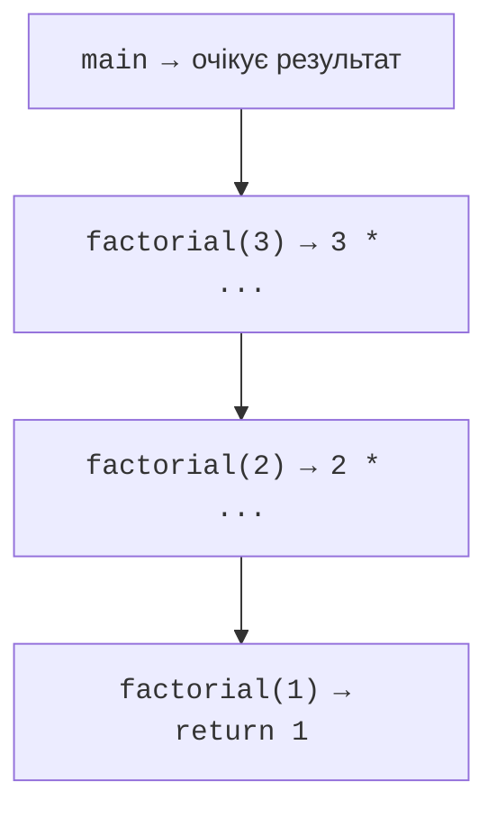
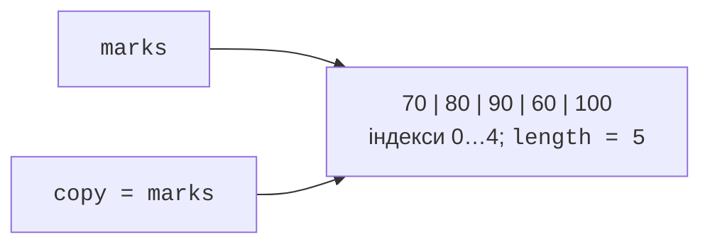

# Рекурсія та масиви

## Рекурсія та стек викликів

**Рекурсивний метод** викликає сам себе для меншої підзадачі. Потрібні базовий випадок і крок, який наближає до нього. Для факторіала базові значення 0 і 1 дають 1, а решта обчислюється як n помножити на factorial(n − 1). Аргумент не повинен відходити від базового випадку або залишатися незмінним.

Кожний виклик має окремий кадр стека з параметрами й позицією повернення. Після повернення нижчого виклику вищий продовжує незавершене множення. Це не одна змінна n, яка постійно перезаписується, а кілька одночасно активних локальних значень.



Рис. 3.2. Виклики та повернення рекурсивного факторіала {.caption}

```java
public class Main {
    static long factorial(int n) {
        if (n < 0 || n > 20) {
            throw new IllegalArgumentException("Expected 0..20");
        }
        if (n <= 1) { return 1; }
        return n * factorial(n - 1);
    }
    static int sum(int... values) {
        int result = 0;
        for (int value : values) {
            result = Math.addExact(result, value);
        }
        return result;
    }
    public static void main(String[] args) {
        System.out.println(factorial(0));
        System.out.println(factorial(3));
        System.out.println(factorial(20));
        System.out.println(sum());
        System.out.println(sum(2, 3, 4));
    }
}
```

```text
1
6
2432902008176640000
0
9
```

Межа 20 пов’язана з діапазоном long, а не з визначенням факторіала. Рекурсія без обмеження може спричинити StackOverflowError раніше, ніж закінчиться вся пам’ять програми. Не провокуйте таку помилку як звичайний спосіб завершення. Для довгої лінійної послідовності цикл простіший і не потребує окремого кадру на кожний елемент.

## Масив: довжина, індекси та посилання

Масив зберігає фіксовану кількість елементів одного типу. `new int[5]` створює п’ять нулів; boolean отримує false, посилальні елементи – null. Індекси лежать від 0 до length − 1. Поле length не є методом і не потребує дужок. Розмір масиву не змінюється після створення, але елементи можна переприсвоювати.

Ініціалізатор `{70, 80, 90}` визначає елементи й довжину. У довільному виразі використовуйте `new int[]{70, 80, 90}`. Порожній масив має length 0 і є коректним об’єктом; це не те саме, що null. Звернення до елемента за межами спричиняє ArrayIndexOutOfBoundsException.

Присвоєння `copy = marks` створює друге посилання на той самий масив. Зміна copy[0] помітна через marks[0]. Для незалежного контейнера потрібна копія. Цикл for-each читає кожне значення в локальну змінну; присвоєння цій локальній змінній не переписує елемент масиву. Для зміни елементів зручно використовувати індексний цикл.



Рис. 3.3. Два посилання на один масив {.caption}

## Стандартні операції Arrays

`Arrays.toString` друкує одновимірний масив, `deepToString` – вкладені масиви. Звичайний println масиву не дає бажаного списку елементів. `sort` сортує сам переданий масив за зростанням. `binarySearch` вимагає попереднього сортування за тим самим порядком; на несортованих даних результат не має потрібної гарантії.

Успішний binarySearch повертає індекс. За відсутності елемента результат від’ємний і кодує точку вставки формулою `-(insertionPoint) - 1`. Це не завжди −1. Для дублікатів не обіцяється саме перший збіг. Якщо потрібний перший, знайдіть його окремою перевіркою меж або власним варіантом пошуку.

`fill` заповнює елементи одним значенням. `copyOf` створює масив заданої довжини, за потреби доповнюючи стандартними значеннями. `copyOfRange` використовує ліву межу включно й праву невключно. Перевіряйте параметри копіювання, особливо якщо довжини надходять від користувача.

`clone()` копіює контейнер масиву; для int це незалежні значення, для масиву об’єктів – ті самі посилання всередині нового контейнера. `System.arraycopy` копіює частину в уже створений масив і коректно працює з перекриттям ділянок. `Arrays.equals` порівнює елементи одновимірних масивів, а не ідентичність контейнерів.

Не копіюйте дані лише для друку або підрахунку: це зайві витрати. Копія потрібна, коли алгоритм змінює порядок, а початковий порядок треба зберегти, або коли необхідна незалежність стану. Документація операцій: <https://docs.oracle.com/en/java/javase/27/docs/api/java.base/java/util/Arrays.html>.
