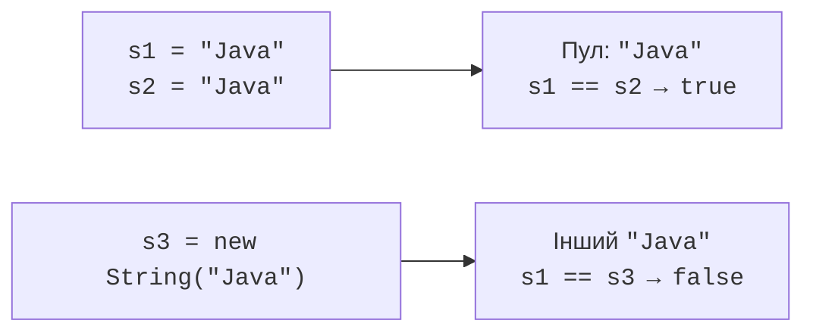

# Рядки String і Unicode

## String: незмінність і порівняння

String є незмінним: strip, replace або toUpperCase не редагують наявний об’єкт, а повертають рядок результату. Якщо результат ігнорувати, змінна продовжить посилатися на попередній текст. Присвоєння нового результату змінює посилання, а не внутрішні символи старого String.

Літерали можуть посилатися на один інтернований об’єкт у пулі рядків. Тому порівняння двох однакових літералів через `==` іноді дає true й створює хибне враження, що так треба порівнювати текст. Рядок, прочитаний із консолі або створений через new String, не має такої гарантії.



Рис. 3.5. Однаковий текст не гарантує однакове посилання {.caption}

Для вмісту використовуйте equals, а за визначеною потребою – equalsIgnoreCase. `compareTo` дає лексикографічний порядок UTF-16, а не повний мовний порядок українського словника. Перевіряйте знак результату, а не очікуйте тільки −1 або 1. За можливого null викликайте equals на відомому ненульовому літералі або перевіряйте null явно.

`charAt` читає одну кодову одиницю за індексом, `substring(begin, end)` бере ліву межу включно, праву невключно. `indexOf` повертає −1 за відсутності, `contains` – логічний результат. `replace` виконує буквальну заміну, тоді як replaceAll приймає регулярний вираз. `join` поєднує елементи заданим роздільником.

`strip` прибирає крайові символи, які Java визначає як whitespace; `isBlank` перевіряє порожній або такий пробільний рядок. Це не обіцянка видалити всі можливі типографічні пробіли Unicode. `repeat` повторює текст задану невід’ємну кількість разів. Межі кількості потрібні, щоб не створювати надмірний результат.

## Unicode: кодові одиниці та кодові точки

String використовує UTF-16. Значення char має 16 біт і не завжди представляє цілий символ Unicode: додаткові кодові точки записуються сурогатною парою. Тому length рахує кодові одиниці, а не видимі символи. Наприклад, емодзі може мати length 2.

`chars()` надає потік кодових одиниць, `codePoints()` поєднує коректні сурогатні пари в кодові точки. На цьому етапі можна одержати масив через toArray і обійти звичайним циклом; функціональні операції потоків вивчатимемо пізніше. `Character.isLetter(int)` та isDigit працюють із кодовими точками, а не лише ASCII.

Навіть кількість кодових точок не завжди дорівнює кількості видимих графем: літера може складатися з базового символу й комбінувального знака. Для задачі треба явно обрати рівень обробки. Українські літери базового набору вміщуються в char, проте загальний текст може містити емодзі й інші додаткові символи.

Для перевірки українського stdout у перенаправленому Windows-процесі запускали `java -Dstdout.encoding=UTF-8`. Консоль або файл-одержувач також має читати UTF-8; `javac -encoding UTF-8` окремо задає кодування вихідного Java-файлу, а не каналу виведення.

Зміна регістру рядка може залежати від Locale. Для технічних ключів використовуйте Locale.ROOT, для мовного інтерфейсу – визначену локаль. Не порівнюйте паролі без урахування регістру лише тому, що такий метод існує. API String: <https://docs.oracle.com/en/java/javase/27/docs/api/java.base/java/lang/String.html>.

## Приклад 3. Нормалізація слів

Навчальне правило: прибрати крайові пробіли, розділити за Java whitespace, перетворити кожне слово на нижній регістр і зробити першу кодову точку великою. Це не повний редактор власних імен: дефіси, апострофи й мовні винятки мають окремі правила, які треба додати за потреби.

```java
import java.util.Locale;

public class Main {
    static String normalize(String input) {
        if (input == null) {
            throw new IllegalArgumentException("Missing text");
        }
        String clean = input.strip();
        if (clean.isEmpty()) { return ""; }
        String[] words = clean.split("\\p{javaWhitespace}+");
        for (int i = 0; i < words.length; i++) {
            String word = words[i].toLowerCase(Locale.ROOT);
            int count = Character.charCount(word.codePointAt(0));
            String first = word.substring(0, count);
            words[i] = first.toUpperCase(Locale.ROOT)
                    + word.substring(count);
        }
        return String.join(" ", words);
    }

    public static void main(String[] args) {
        System.out.println(normalize("  оЛЕНА\tпЕТРЕНКО  "));
        System.out.println("[" + normalize(" \n\t ") + "]");
        String sample = "А😀";
        System.out.println(sample.length());
        System.out.println(sample.codePoints().toArray().length);
        System.out.println(Character.isLetter('Ї'));
    }
}
```

```text
Олена Петренко
[]
3
2
true
```

Метод charCount визначає, скільки позицій UTF-16 займає перша кодова точка. Це не дозволяє випадково відрізати половину сурогатної пари. Зміна регістру виконується над підрядком, бо для деяких мов результат може містити більше однієї кодової точки.
