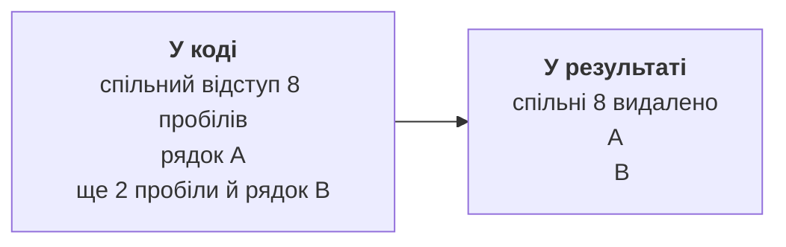

# Складання тексту та регулярні вирази

## StringBuilder і складання тексту

У циклі `result += part` кожний крок логічно створює новий String, копіюючи попередній вміст. Для великої кількості частин краще StringBuilder: він має змінюваний буфер, append додає дані, insert вставляє, deleteCharAt видаляє кодову одиницю, reverse змінює порядок. Остаточний String отримують через toString.

Місткість capacity не дорівнює поточній довжині length. Буфер може резервувати додаткове місце, щоб не перевиділяти пам’ять на кожному append. Заздалегідь відома приблизна місткість корисна, але не повинна походити з неперевіреного величезного числа користувача. StringBuilder не є потокобезпечним; синхронізований StringBuffer тут лише згадуємо як інший інструмент.

Reverse зберігає коректні сурогатні пари, але не гарантує перестановку цілих видимих графем. DeleteCharAt також може розірвати пару, якщо не контролювати індекси. Для задачі паліндрома нижче явно обмежуємо алфавіт, щоб правило порівняння було зрозумілим.

StringJoiner корисний для послідовності з роздільником і рамками. Він дозволяє не додавати кому після останнього елемента й не обрізати її вручну. String.join достатній, коли всі частини вже є в масиві. Вибирайте інструмент відповідно до того, як надходять частини.

::: info Знімок екрана
In IntelliJ IDEA enable the string-concatenation-in-loop inspection. Show result += part inside a loop and Alt+Enter Replace with StringBuilder intention.
:::

Рис. 3.6. Підказка для конкатенації в циклі {.caption}

## Текстові блоки й відступи

Текстовий блок починається трьома подвійними лапками з наступним переведенням рядка. Він зручний для багаторядкового HTML, JSON або SQL, бо не вимагає екранувати кожні подвійні лапки. Результат усе одно є String, а не окремим типом.

Компілятор нормалізує завершення рядків і видаляє випадкові спільні відступи. Позиція закривального роздільника може впливати на збережений відступ. Зворотна коса риска перед завершенням рядка прибирає це переведення, а `\s` явно зберігає пробіл, зокрема наприкінці рядка. Відступи обробляються до escape-послідовностей.



Рис. 3.7. Відступ вихідного коду й відступ результату {.caption}

`formatted` підставляє аргументи за правилами форматування, але не виконує контекстне екранування. Підстановка довільного тексту в HTML потребує HTML-екранування, у JSON – JSON-екранування, а SQL із даними надалі використовуватиме параметризовані запити. Сам текстовий блок не захищає від зміни структури. Офіційний опис: <https://docs.oracle.com/en/java/javase/27/language/text-blocks.html>.

## Приклад 4. HTML-звіт із рядків таблиці

Кожне ім’я перед вставленням у текстову комірку екранується. Спочатку замінюється амперсанд, щоб не екранувати повторно щойно створені сутності. Дані тут вставляються в текст елемента, а не в JavaScript, CSS чи довільний атрибут.

```java
public class Main {
    static String escapeHtml(String text) {
        return text.replace("&", "&amp;")
                .replace("<", "&lt;").replace(">", "&gt;");
    }
    static String report(String[] names, int[] marks) {
        if (names == null || marks == null
                || names.length != marks.length) {
            throw new IllegalArgumentException("Different lengths");
        }
        StringBuilder rows = new StringBuilder();
        for (int i = 0; i < names.length; i++) {
            if (names[i] == null || marks[i] < 0 || marks[i] > 100) {
                throw new IllegalArgumentException("Invalid row");
            }
            rows.append("  <tr><td>").append(escapeHtml(names[i]))
                    .append("</td><td>").append(marks[i])
                    .append("</td></tr>\n");
        }
        return """
                <table>
                %s</table>
                """.formatted(rows);
    }
    public static void main(String[] args) {
        System.out.print(report(new String[]{"A&B", "<Olena>"},
                new int[]{80, 95}));
    }
}
```

```text
<table>
  <tr><td>A&amp;B</td><td>80</td></tr>
  <tr><td>&lt;Olena&gt;</td><td>95</td></tr>
</table>
```

Порожні масиви дають порожню таблицю, а різні довжини – явну відмову. Метод не пише файл: його результат можна надрукувати, перевірити або пізніше передати файловому API. Це приклад відокремлення побудови даних від введення та виведення.

## Регулярні вирази: короткий практичний вступ

Регулярний вираз описує шаблон тексту. Matches перевіряє весь рядок, а Matcher.find шукає черговий фрагмент. `[0-9]{4}` означає чотири ASCII-цифри, `[A-Z]+` – одну або більше великих латинських літер. Знак крапки є спеціальним, тому для буквальної крапки потрібне екранування.

У Java-літералі зворотна коса риска також спеціальна: шаблон пробілів записують як `"\\s+"`. Типовий `\s` без Unicode-режиму не означає всі пробіли всіх мов. Для заданої семантики можна використати клас `"\\p{javaWhitespace}+"`, як у нормалізації.

Split приймає шаблон, тому розділення за крапкою вимагає `"\\."`, а за вертикальною рискою – `"\\|"`. Варіант split з одним параметром відкидає порожні поля наприкінці. Для рядка таблиці використовуйте limit −1, щоб зберегти останню порожню комірку й правильно перевірити кількість полів.

Pattern компілює шаблон, а Matcher виконує пошук у конкретному рядку. Для багаторазового пошуку не потрібно компілювати той самий шаблон усередині кожної ітерації. Групи в дужках дозволяють дістати частини збігу. Регулярний вираз перевіряє форму, але не обов’язково зміст: дата 31.02 має правильні цифри, проте не існує в календарі.

```java
import java.util.Arrays;
import java.util.regex.Matcher;
import java.util.regex.Pattern;

public class Main {
    public static void main(String[] args) {
        System.out.println("AB-1234".matches("[A-Z]{2}-[0-9]{4}"));
        System.out.println(Arrays.toString("A;B;".split(";", -1)));
        Pattern pattern = Pattern.compile("[0-9]+");
        Matcher matcher = pattern.matcher("Room 12, floor 3");
        while (matcher.find()) {
            System.out.println(matcher.group());
        }
        System.out.println("A  B\tC".replaceAll("\\s+", " "));
        StringBuilder builder = new StringBuilder("ab");
        builder.insert(1, "X").append("c").deleteCharAt(0);
        System.out.println(builder.reverse());
        System.out.println("-".repeat(3));
    }
}
```

```text
true
[A, B, ]
12
3
A B C
cbX
---
```

Для динамічного буквального шаблону існує Pattern.quote, для буквальної заміни в Matcher – quoteReplacement. Це різні контексти: символи долара та косої риски в replacement мають спеціальне значення. Не використовуйте replaceAll замість простого replace без потреби в шаблоні.
