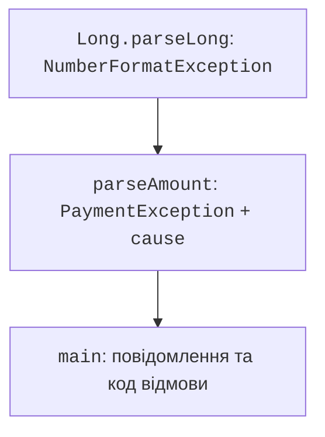
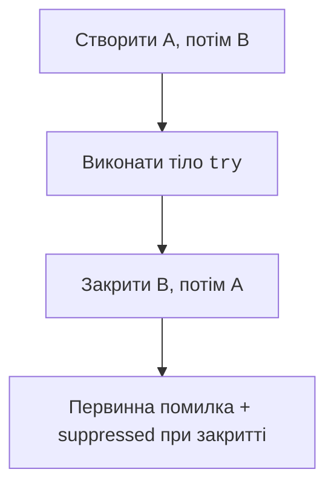

# Власні винятки та ресурси

## Власний тип та початкова причина

Власний виняток потрібний, коли викликач повинен розрізняти предметний випадок за типом. Не створюйте новий клас для кожного тексту повідомлення. Повідомлення пояснює ситуацію людині; поля й тип допомагають програмному обробнику.

У цій темі використовується мінімальний клас винятку, а повна будова класів буде наступною темою. Конструктор передає повідомлення і причину базовому `Exception`. Так зберігається початковий стек і тип помилки розбору.

### Приклад 3. Розбір та списання суми

```java
class PaymentException extends Exception {
    PaymentException(String message, Throwable cause) {
        super(message, cause);
    }
}

class InsufficientFundsException extends Exception {
    InsufficientFundsException(long available, long requested) {
        super("Є " + available + ", потрібно " + requested);
    }
}

public class Payment {
    static long parseAmount(String text) throws PaymentException {
        try {
            long amount = Long.parseLong(text);
            if (amount <= 0 || amount > 1_000_000) {
                throw new IllegalArgumentException("Сума 1..1000000");
            }
            return amount;
        } catch (IllegalArgumentException e) {
            throw new PaymentException(
                    "Не вдалося прочитати суму", e);
        }
    }

    static long withdraw(long balance, long amount)
            throws InsufficientFundsException {
        if (balance < 0 || amount <= 0) {
            throw new IllegalArgumentException(
                    "Некоректні аргументи");
        }
        if (amount > balance) {
            throw new InsufficientFundsException(balance, amount);
        }
        return balance - amount;
    }

    public static void main(String[] args) {
        long balance = 5_000;
        try {
            balance = withdraw(balance, parseAmount("7000"));
        } catch (PaymentException | InsufficientFundsException e) {
            System.out.println(e.getMessage());
        }
        System.out.println("Баланс: " + balance);
        try {
            parseAmount("abc");
        } catch (PaymentException e) {
            String type = e.getCause().getClass().getSimpleName();
            System.out.println(type);
        }
    }
}
```

Невдале списання залишає баланс 5000. Помилка розбору зберігає `NumberFormatException` як причину. Вираз праворуч від присвоєння має успішно завершитися, перш ніж зміниться `balance`. Це забезпечує незмінність саме цієї локальної змінної при відмові.

Запис `throw new PaymentException(e.getMessage(), null)` втратив би тип і стек причини. Запис лише тексту в журнал також не замінює коректного контракту між методами. Не друкуйте секретні аргументи, паролі чи повні реквізити у винятку.



Рис. 4.3. Передавання причини від розбору до межі програми {.caption}

## Автоматичне закриття ресурсів

Файл, мережевий потік і з’єднання з базою даних мають життєвий цикл, відмінний від пам’яті об’єкта. `try`-with-resources працює з `AutoCloseable`: оголошені ресурси закриваються у зворотному порядку. Це відбувається і при успіху, і при винятку в тілі.

Для першого прикладу не потрібний зовнішній файл: використаємо `StringReader` та `BufferedReader`. Кожен непорожній рядок має містити коректний `int`; сума накопичується в `long`.

```java
import java.io.BufferedReader;
import java.io.IOException;
import java.io.StringReader;

public class ReaderSum {
    static long sum(String text) throws IOException {
        long total = 0;
        try (var reader =
                new BufferedReader(new StringReader(text))) {
            String line;
            while ((line = reader.readLine()) != null) {
                if (!line.isBlank()) {
                    total = Math.addExact(total,
                            Integer.parseInt(line.strip()));
                }
            }
        }
        return total;
    }

    public static void main(String[] args) throws IOException {
        System.out.println(sum("10\n20\n30\n"));
    }
}
```

Результат – `60`. `throws IOException` в `main` є допустимим для маленької демонстрації, але готова користувацька програма має визначити зрозумілу реакцію на межі CLI. Ресурс закриється навіть тоді, коли один рядок не є числом.



Рис. 4.4. Зворотний порядок закриття та додаткові помилки {.caption}

Якщо тіло `try` уже кинуло виняток, а `close` також завершилося помилкою, помилка закриття додається до первинної як **suppressed**. Вона не є `cause`: це інший зв’язок між помилками. Продемонструємо його на простому навчальному ресурсі.

```java
class Probe implements AutoCloseable {
    private final String name;

    Probe(String name) {
        this.name = name;
    }

    public void close() {
        System.out.println("Закрито: " + name);
        throw new IllegalStateException("close " + name);
    }
}

public class SuppressedDemo {
    public static void main(String[] args) {
        try (var first = new Probe("A");
                var second = new Probe("B")) {
            throw new IllegalArgumentException("body");
        } catch (IllegalArgumentException e) {
            System.out.println("Основна: " + e.getMessage());
            for (Throwable extra : e.getSuppressed()) {
                System.out.println(
                        "Додаткова: " + extra.getMessage());
            }
        }
    }
}
```

Порядок: закрито B, закрито A, основна `body`, додаткові `close B` та `close A`. Така перевірка пояснює поведінку, яку легко пропустити при читанні лише одного верхнього рядка трасування. У власному ресурсі `close` повинен мати зрозумілий контракт, а не навмисно кидати виняток як у демонстрації.
