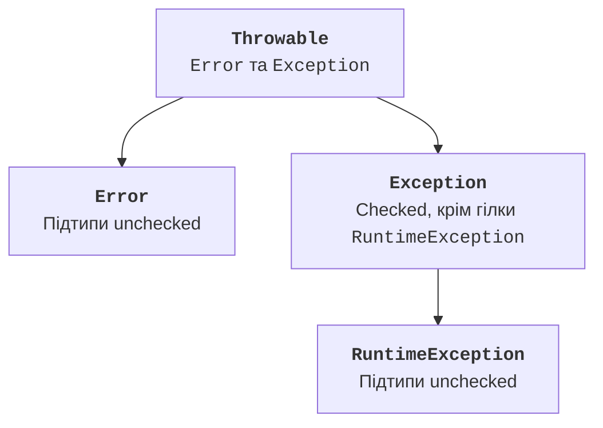

# Винятки та ієрархія Throwable

## Помилка як частина контракту

Успішний результат – лише одна з можливих поведінок програми. Користувач може ввести неправильний рядок, файл може бути недоступним, а предметна операція – неприпустимою для поточного стану. Коректна програма не повинна мовчки перетворювати таку ситуацію на звичайне число, яке виглядає правдоподібним.

Розрізняйте помилку компіляції, виняток під час виконання та логічну помилку. Пропущена дужка не виправляється через `catch`, а неправильний знаменник середнього може не спричинити жодного винятку. Для кожного виду потрібна своя перевірка.

**Виняток** – об’єкт, який повідомляє про незвичайне завершення операції. Після `throw` звичайний шлях виконання переривається. JVM шукає сумісний обробник у поточному виклику, а потім у викликах вище в стеку. Значення локальних змінних не відкочуються автоматично.

Матеріал про винятки: <https://dev.java/learn/exceptions/>. API Throwable: <https://docs.oracle.com/en/java/javase/26/docs/api/java.base/java/lang/Throwable.html>. Усі повні приклади цієї теми перевіряються на JDK 27.

## Ієрархія Throwable

`Throwable` є базою для `Exception` та `Error`. `RuntimeException` належить до гілки `Exception`. Винятки `RuntimeException` та їхні підтипи, а також `Error` та його підтипи є неперевірюваними компілятором – **unchecked**. Інші винятки є **checked**.



Рис. 4.1. Перевірювані та неперевірювані винятки {.caption}

Метод, який може передати checked-виняток назовні, повинен оголосити його у `throws` або перехопити. Це правило компілятора, а не оцінка серйозності ситуації. `NumberFormatException` є unchecked, але неправильний рядок цілком очікуваний у CLI. `IOException` є checked, але не завжди відновлюваний на рівні конкретного допоміжного методу.

Не використовуйте `catch (Throwable error)` як універсальну перевірку вводу. Такий обробник також перехоплює серйозні помилки середовища, після яких продовження роботи може бути некоректним. Обирайте тип, який відповідає відомому контракту.

`NullPointerException` часто сигналізує про помилку програмування або порушений контракт null. `IllegalArgumentException` – про неприпустимий аргумент. `IllegalStateException` – про стан, у якому операція не дозволена. Вдалий вибір типу допомагає викликачеві відрізнити ці ситуації без пошуку слів у повідомленні.

## try та порядок catch

`try` охоплює операцію, а `catch` описує реакцію на сумісний виняток. Перший відповідний обробник виконується один раз. Підтип розташовують перед надтипом, інакше вузький обробник стане недосяжним. Java перевіряє багато таких помилок під час компіляції.

`multi-catch` дозволяє об’єднати кілька незалежних типів через `|`. Не можна записати разом тип і його підтип, наприклад `Exception` та `NumberFormatException`: ширший тип уже охоплює вузький.

### Приклад 1. Цілочисельне ділення

Контракт: два аргументи, кожен є коректним `int`. Вивести частку та остачу. Неправильний формат і нульовий дільник мають різні причини, але однаковий код відмови CLI. Окремо заборонено пару `Integer.MIN_VALUE` і `-1`: математична частка не вміщується в `int`.

```java
public class SafeDivide {
    static int run(String[] args) {
        if (args.length != 2) {
            System.err.println("Usage: SafeDivide a b");
            return 2;
        }
        try {
            int a = Integer.parseInt(args[0]);
            int b = Integer.parseInt(args[1]);
            if (a == Integer.MIN_VALUE && b == -1) {
                throw new ArithmeticException("Частка завелика");
            }
            System.out.println("Частка: " + a / b);
            System.out.println("Остача: " + a % b);
            return 0;
        } catch (NumberFormatException | ArithmeticException e) {
            System.err.println("Помилка: " + e.getMessage());
            return 2;
        } finally {
            System.err.println("Спробу завершено");
        }
    }

    public static void main(String[] args) {
        System.exit(run(args));
    }
}
```

Для `17 5` stdout містить частку 3 та остачу 2, код завершення 0. Для `17 0` або `abc 5` успішний результат не друкується, код 2. Системний текст причини може залежати від JDK; перевіряйте передусім власний контракт, потоки та код.

У цьому прикладі ділення є першою операцією формування результату. У складнішому звіті спочатку обчисліть усі потрібні значення, а вже потім друкуйте підсумок, щоб помилка посередині не залишила оманливий частковий успіх.
