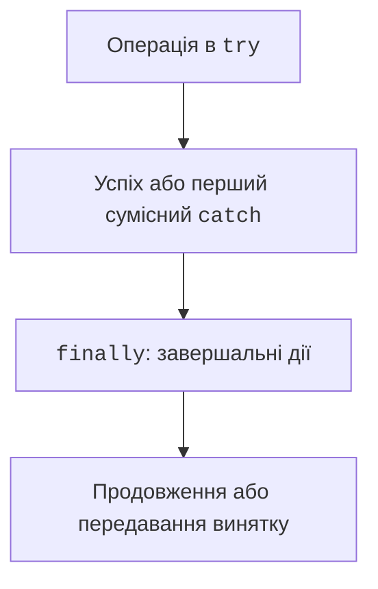

# finally, throw і throws

## finally і завершення керування

`finally` виконується при звичайному виході з `try` та під час передавання винятку. Він також виконується перед завершенням `return` із `try` або `catch`. Проте це не гарантія на випадок примусового завершення процесу, збою ОС чи вимкнення живлення.



Рис. 4.2. Вибір обробника та завершальні дії {.caption}

Не повертайте значення з `finally`: такий `return` може приховати попередній результат або виняток. Так само новий виняток із `finally` може замаскувати початкову причину. Для ресурсів надавайте перевагу `try`-with-resources, а не ручному закриттю в кількох гілках програми.

Виклик `System.exit` завершує процес і не повинен бути способом виходу зсередини незавершеної роботи з ресурсами. У CLI зручно мати метод `run`, який повертає код, і викликати `System.exit` лише після повернення з нього, як у прикладі ділення.

### Контрольоване завершення програми

У прикладах курсу код 0 означає успіх або показ довідки, код 2 – неправильні дані користувача, код 1 – операційну помилку, наприклад недоступний файл. Це контракт навчальної CLI-програми, а не універсальне значення кожного коду для всіх програм у світі. Для автоматичного запуску код надійніший за аналіз мови повідомлення.

У PowerShell останній код зовнішнього процесу доступний через `$LASTEXITCODE`. Перевіряйте його відразу після потрібної команди, до іншого запуску. Stdout призначений для результату, stderr – для діагностики. Оболонка може показувати обидва потоки разом, але це не робить їх одним потоком.

## throw, throws і передумови

`throw` виконує передавання конкретного об’єкта винятку. `throws` є частиною оголошення методу і повідомляє про можливість передавання назовні. Сам запис `throws` нічого не кидає й не обробляє.

Передумова описує допустимі аргументи. Перевіряйте її до зміни стану. Якщо метод спочатку зменшить баланс, а потім перевірить ліміт, виняток не поверне баланс автоматично. Атомарність предметної операції потрібно забезпечити порядком дій.

### Приклад 2. Перевірка аргументів

Метод обчислює вартість квитків у копійках. Назва не може бути null або порожньою; кількість від 1 до 100, ціна від 0 до 1 000 000 копійок.

```java
import java.util.Objects;

public class TicketCost {
    static long cost(String event, int count, long price) {
        Objects.requireNonNull(event, "event");
        if (event.isBlank()) {
            throw new IllegalArgumentException("Порожня назва");
        }
        if (count < 1 || count > 100) {
            throw new IllegalArgumentException("Кількість 1..100");
        }
        if (price < 0 || price > 1_000_000) {
            throw new IllegalArgumentException("Неправильна ціна");
        }
        return Math.multiplyExact(price, count);
    }

    public static void main(String[] args) {
        System.out.println(cost("Концерт", 3, 12_500));
        try {
            cost("Концерт", 0, 12_500);
        } catch (IllegalArgumentException e) {
            System.out.println(e.getMessage());
        }
    }
}
```

Результат – `37500`, потім `Кількість 1..100`. Межі гарантують, що правильний добуток уміщується в `long`; `multiplyExact` додатково робить намір щодо переповнення явним. Метод не друкує результат, тому його можна використати з консолі, GUI або тесту.

`Objects.requireNonNull` повертає перевірене посилання, але тут використаний лише його ефект перевірки. Null та порожній рядок – різні стани. Перетворення null на порожній рядок без предметної причини приховує відмінність між ними.
