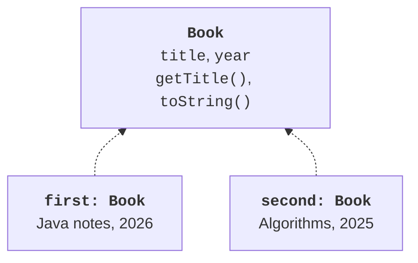
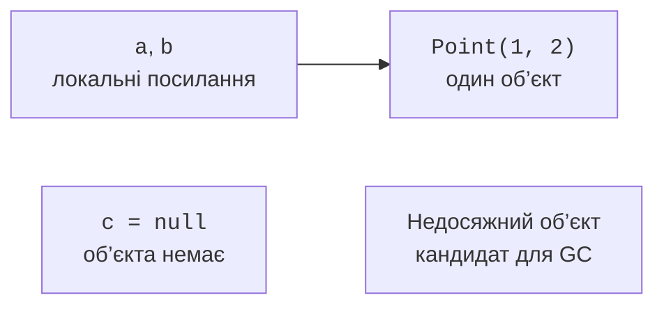
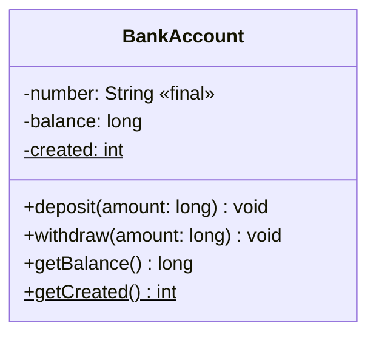

# Клас, поля та конструктор

## Клас об’єднує дані та правила

Програма обліку рахунків працює з номером, власником і залишком. Якщо ці значення розміщені в незалежних змінних, кожний фрагмент програми має пам’ятати, які дані належать разом. Ще складніше забезпечити правило: залишок не може стати від’ємним. Клас об’єднує стан і дії над ним, щоб правильність можна було перевіряти в одному місці.

**Клас** – опис типу об’єктів, його полів, методів і способів створення. **Об’єкт** – конкретний екземпляр із власною ідентичністю та станом. **Метод** задає дію або запит, а **поле** зберігає частину стану. Офіційний вступ: <https://dev.java/learn/classes-objects/>.

Клас повинен мати чітку відповідальність. BankAccount перевіряє суми та змінює баланс; консольний інтерфейс читає рядки й показує повідомлення. Конструктор рахунку не повинен запитувати клавіатуру. Така модель придатна і для тесту, і для майбутнього графічного інтерфейсу.



Рис. 5.1. Клас і конкретні екземпляри {.caption}

**Інваріант** – умова, яка виконується після успішного створення та після кожної завершеної публічної операції. Для рахунку це правильний номер і невід’ємний залишок. Передумова окремого withdraw додатково вимагає додатної суми. Після відмови стан повинен залишитися попереднім.

## Поля, посилання та пам’ять

Вираз `new Point(1, 2)` створює екземпляр і повертає посилання. Присвоєння `Point b = a` копіює посилання, а не сам об’єкт. Якщо через b змінити спільний екземпляр, це побачить і клієнт a. Операція `==` для посилань перевіряє тотожність, а змістовну рівність визначає equals. Докладний контракт equals розглядається в темі 6.

Поля числових типів початково мають нуль, boolean – false, char – нульовий символ, посилання – null. Це не стосується локальних змінних: перед читанням їм потрібно явно присвоїти значення. Компілятор аналізує гарантовану ініціалізацію. Початковий null не створює вкладений об’єкт автоматично.



Рис. 5.2. Два посилання на один об’єкт і відсутнє посилання {.caption}

Стек викликів зручно уявляти як місце локальних змінних і контексту методів, а купу – як сховище об’єктів. Це пояснювальна модель, а не вимога до всіх оптимізацій JVM. Збирач сміття звільняє пам’ять недосяжних об’єктів, але не гарантує негайного запуску після присвоєння null. Файли та інші ресурси закривають явно, зокрема через try-with-resources із теми 4.

Виклик методу через null породжує NullPointerException. На межі моделі перевіряйте обов’язкові посилання через `Objects.requireNonNull` або явно визначене повідомлення. Не використовуйте null як універсальну заміну всім неправильним станам: клієнт має розуміти його значення.

## Конструктор і this

Конструктор має ім’я класу й не має типу результату, навіть void. Якщо не оголошено жодного конструктора, компілятор може надати конструктор за замовчуванням. Після оголошення власного конструктора безпараметровий варіант автоматично не додається. Явно створіть його за потреби.

`this.field` означає поле поточного екземпляра. Це усуває затінення параметром із таким самим ім’ям. Запис `balance = balance` у конструкторі лише присвоює параметр самому собі, якщо поле не кваліфіковано. IDE може попередити про таку помилку, але відповідальність залишається автору.

Перевантажені конструктори мають різні списки параметрів. `this(...)` делегує іншому конструктору цього класу й допомагає не дублювати перевірки. Циклічний ланцюжок делегування заборонений. Конструктор не є звичайним методом, який можна повторно викликати для «перезапуску» екземпляра.

### Приклад 1. Перевірений банківський рахунок

Суми навчальної моделі зберігаються цілими копійками long. Верхня межа дозволяє перевірити додавання до виконання операції. Лічильник рахує успішно створені екземпляри, а не живі об’єкти: збирач сміття не зменшує його. Приклади з кількома класами збережіть у файлі Main.java.

```java
class BankAccount {
    private static int created;
    private static final long LIMIT = 1_000_000_000L;
    private final String number;
    private long balance;

    BankAccount(String number, long initial) {
        if (number == null || number.isBlank()) {
            throw new IllegalArgumentException("Empty number");
        }
        if (initial < 0 || initial > LIMIT) {
            throw new IllegalArgumentException("Invalid balance");
        }
        this.number = number;
        this.balance = initial;
        created++;
    }

    BankAccount(String number) {
        this(number, 0);
    }

    public long getBalance() { return balance; }
    public static int getCreated() { return created; }

    public void deposit(long amount) {
        if (amount <= 0 || amount > LIMIT - balance) {
            throw new IllegalArgumentException("Invalid deposit");
        }
        balance += amount;
    }

    public void withdraw(long amount) {
        if (amount <= 0 || amount > balance) {
            throw new IllegalArgumentException("Invalid withdrawal");
        }
        balance -= amount;
    }

    public String toString() { return number + ": " + balance; }
}

public class Main {
    public static void main(String[] args) {
        BankAccount a = new BankAccount("A1", 1000);
        BankAccount b = a;
        BankAccount c = new BankAccount("A2");
        b.deposit(500);
        a.withdraw(200);
        System.out.println(a);
        System.out.println(c);
        System.out.println(a == b);
        try {
            a.withdraw(2000);
        } catch (IllegalArgumentException error) {
            System.out.println(error.getMessage());
        }
        System.out.println(a.getBalance());
        System.out.println(BankAccount.getCreated());
    }
}
```

```text
A1: 1300
A2: 0
true
Invalid withdrawal
1300
2
```

Відмова не змінює баланс, оскільки всі умови стоять перед присвоєнням. Setter для balance відсутній: клієнт не може обійти правило через прямий запис. Getter відкриває лише необхідне читання. ToString дає діагностичний текст і не є форматом збереження або доказом рівності рахунків.



Рис. 5.3. Публічний контракт і закритий стан рахунку {.caption}
