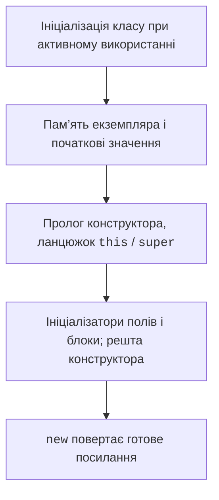

# Ініціалізація, доступ і статичні члени

## Порядок ініціалізації та сучасний конструктор

Клас ініціалізується при першому активному використанні, а не обов’язково просто під час завантаження. Статичні ініціалізатори виконуються один раз для відповідного класу в контексті його завантажувача. Для екземпляра спершу виділяється пам’ять із початковими значеннями, далі виконується ланцюжок конструкторів, ініціалізатори полів і блоки екземпляра та решта тіла конструктора.



Рис. 5.4. Основні етапи побудови екземпляра {.caption}

Починаючи з фіналізованої можливості JDK 25, перед явним this або super дозволені інструкції в ранньому контексті побудови. Це дає змогу перевірити й підготувати аргументи. Не можна читати ще неготовий стан екземпляра або викликати його методи. Є спеціальні дозволи на раннє присвоєння власних полів; для початкового навчання використовуємо просту перевірку аргументів без доступу до this. <https://docs.oracle.com/en/java/javase/26/language/flexible-constructor-bodies.html>.

```java
class Student {
    private final String name;
    private final int year;

    Student(String name, int year) {
        if (name == null || name.isBlank() || year < 1 || year > 6) {
            throw new IllegalArgumentException("Invalid student");
        }
        this.name = name;
        this.year = year;
    }

    Student(String name, String yearText) {
        int parsed = Integer.parseInt(yearText);
        if (parsed < 1 || parsed > 6) {
            throw new IllegalArgumentException("Invalid year");
        }
        this(name, parsed);
    }

    public String toString() { return name + ": " + year; }
}

public class Main {
    public static void main(String[] args) {
        System.out.println(new Student("Olena", "2"));
        try {
            new Student("Taras", "9");
        } catch (IllegalArgumentException error) {
            System.out.println(error.getMessage());
        }
    }
}
```

```text
Olena: 2
Invalid year
```

Це стабільний синтаксис JDK 27, параметр enable-preview не потрібний. Основна перевірка імені й року залишається в первинному за змістом конструкторі, щоб усі способи створення забезпечували один інваріант. Перевірка текстового вводу доповнює цей контракт, а не замінює його.

## Доступ та інкапсуляція

Public відкриває API клієнтам, private обмежує доступ реалізацією класу. Відсутність модифікатора означає пакетний доступ, а не public. Protected і правила між пакетами розглядаються в темі 6. Клас верхнього рівня може бути public або мати пакетний доступ; public-клас у звичайному файлі має узгоджене з файлом ім’я.

Getter і setter – звичайні методи з домовленими іменами. Java не створює їх автоматично для звичайного класу. Не генеруйте setter для кожного поля механічно: незмінний номер і залишок, що змінюється лише операціями, мають різні правила доступу. Метод withdraw пояснює намір краще, ніж універсальний setBalance.

Інкапсуляція не означає криптографічної таємниці. Private зменшує залежності вихідного коду, але не робить пароль безпечним сам по собі. У навчальних прикладах використовуйте вигадані дані й не виводьте закриті секрети через toString. Важливо також не віддавати зовнішньому коду змінний внутрішній масив, навіть якщо саме поле private.

## Статичні члени та фабрики

Статичне поле належить класу, а поле екземпляра – кожному об’єкту. Тому balance не може бути static: усі рахунки отримали б один спільний залишок. Статичний метод не має this і не може без посилання звернутися до поля екземпляра. Викликайте його через ім’я класу, щоб це було видно читачу.

`static final` часто застосовують до констант. Final забороняє переприсвоєння, але для посилання не гарантує незмінності вкладеного об’єкта. Статична фабрика має змістовне ім’я та може повертати контрольований екземпляр. На відміну від конструктора, фабрика не зобов’язана щоразу створювати новий об’єкт; це має визначати її контракт.

### Приклад 2. Незмінна точка

Координати final, сетери відсутні, а переміщення повертає новий об’єкт. Межі координат перевіряються і для нового результату. Origin є фабрикою початку координат, а не публічним змінним полем. Подання toString спрощує перевірку.

```java
final class Point {
    private final int x;
    private final int y;

    Point(int x, int y) {
        if (x < -1_000_000 || x > 1_000_000
                || y < -1_000_000 || y > 1_000_000) {
            throw new IllegalArgumentException("Invalid coordinate");
        }
        this.x = x;
        this.y = y;
    }

    public static Point origin() { return new Point(0, 0); }
    public int getX() { return x; }
    public int getY() { return y; }

    public Point move(int dx, int dy) {
        return new Point(Math.addExact(x, dx), Math.addExact(y, dy));
    }

    public double distanceTo(Point other) {
        java.util.Objects.requireNonNull(other);
        return Math.hypot(x - other.x, y - other.y);
    }

    public String toString() { return "(" + x + ", " + y + ")"; }
}

public class Main {
    public static void main(String[] args) {
        Point start = Point.origin();
        Point moved = start.move(3, 4);
        System.out.println(start);
        System.out.println(moved);
        System.out.println(start.distanceTo(moved));
        System.out.println(start == moved);
    }
}
```

```text
(0, 0)
(3, 4)
5.0
false
```

Final-клас не дозволяє підкласу додати змінний стан під виглядом того самого контракту. Про final і наслідування буде наступна тема. Для незмінної моделі також важливі захисні копії: якщо конструктор приймає масив, скопіюйте його; якщо getter повертає масив, поверніть копію. Копіювання лише посилання на масив не захищає його елементи.
