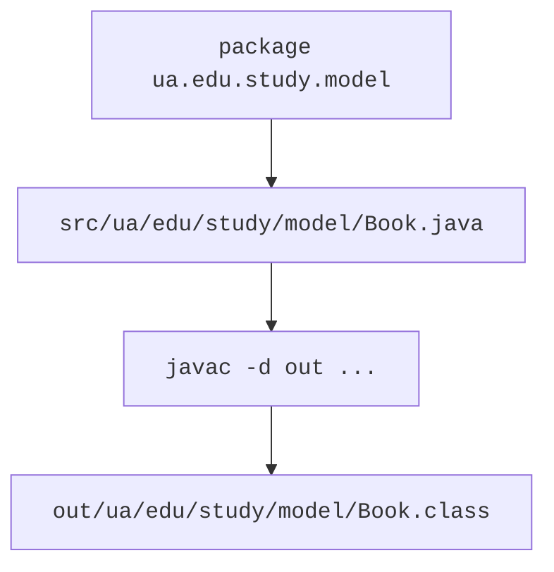

# Пакети, classpath і JAR

## Пакети та шляхи

Пакет дає простір імен і межу пакетного доступу. Оголошення package стоїть перед import. Імена будують малими літерами, часто від оберненого домену організації. Для проєкту курсу використовуємо ua.edu.study, не заявляючи власність на реальний зовнішній сервіс. <https://dev.java/learn/packages/>.

Import дозволяє коротке ім’я типу, але не копіює код і не створює об’єкт. Імпорт java.lang доступний неявно. Імпорт пакета через зірочку не охоплює його підпакети. Якщо два класи мають однакове просте ім’я, використайте повне ім’я для одного з них; Java не має import-as.



Рис. 5.5. Пакети вихідного коду та результат компіляції {.caption}

### Приклад 3. Книги в пакетах

Створіть Book.java в src/ua/edu/study/model. Поля книги незмінні, а назва перевірена. Публічний тип доступний консольному пакету. Масив бібліотеки копіюється, щоб клієнт не міг замінити її внутрішні посилання через свій масив.

```java
package ua.edu.study.model;

public final class Book {
    private final String title;
    private final int year;

    public Book(String title, int year) {
        if (title == null || title.isBlank()
                || year < 1450 || year > 2100) {
            throw new IllegalArgumentException("Invalid book");
        }
        this.title = title;
        this.year = year;
    }

    public String getTitle() { return title; }
    public String toString() { return title + " (" + year + ")"; }
}
```

Library.java розмістіть у тому самому пакеті model. Копія масиву є поверхневою, але Book незмінний, тому спільні посилання на книги не порушують контракт.

```java
package ua.edu.study.model;

public final class Library {
    private final Book[] books;

    public Library(Book[] books) {
        this.books = java.util.Objects.requireNonNull(books).clone();
        for (Book book : this.books) {
            java.util.Objects.requireNonNull(book);
        }
    }

    public Book[] getBooks() { return books.clone(); }
    public int size() { return books.length; }
}
```

Точка входу Main.java належить пакету ua.edu.study.app.

```java
package ua.edu.study.app;

import ua.edu.study.model.Book;
import ua.edu.study.model.Library;

public class Main {
    public static void main(String[] args) {
        Book[] source = {new Book("Java notes", 2026)};
        Library library = new Library(source);
        source[0] = new Book("Other", 2025);
        Book[] snapshot = library.getBooks();
        snapshot[0] = null;
        System.out.println(library.size());
        System.out.println(library.getBooks()[0]);
    }
}
```

```text
1
Java notes (2026)
```

Ця перевірка охоплює обидві межі володіння: початковий масив і результат getter. Clone масиву створює новий масив, але не викликає довільного глибокого копіювання його елементів. Для змінних Book потрібний інший контракт копіювання.

## Компіляція, classpath і JAR

З кореня проєкту скомпілюйте всі три файли. Параметр -d визначає теку результатів, де javac відтворить пакети. Classpath указує корінь дерева пакетів, а не теку конкретного Main.class. У командах нижче перенесення backtick є синтаксисом PowerShell, а не частиною Java.

```powershell
javac -encoding UTF-8 -d out `
  src/ua/edu/study/model/Book.java `
  src/ua/edu/study/model/Library.java `
  src/ua/edu/study/app/Main.java
java -cp out ua.edu.study.app.Main
jar --create --file library.jar `
  --main-class ua.edu.study.app.Main -C out .
java -jar library.jar
```

JAR пакує class-файли та ресурси. Main-Class у маніфесті визначає точку входу для java -jar. Сам JAR не містить автоматично встановлену JVM; спосіб розповсюдження застосунку докладніше розглядатиметься пізніше. Порожній classpath або неправильне повне ім’я не означають помилку конструктора.


Рис. 5.6. Компіляція пакетів і запуск JAR {.caption}
