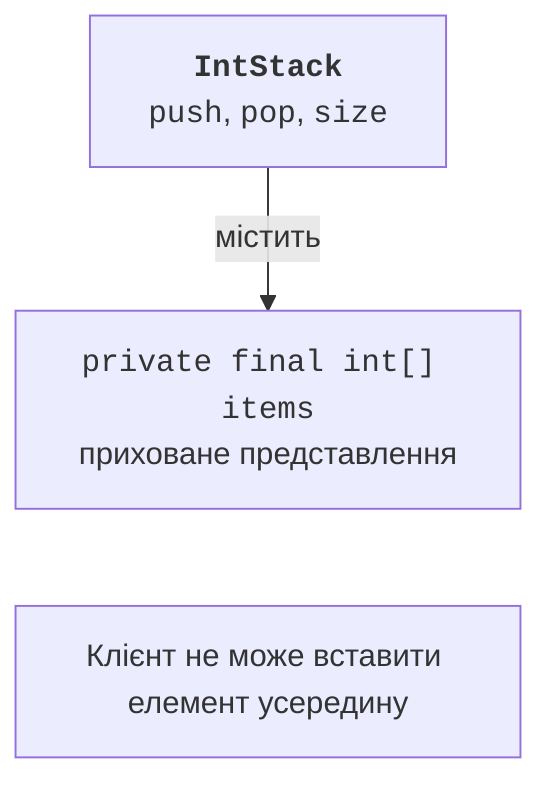

# Композиція та принцип підстановки

## Композиція та принцип підстановки

**Принцип підстановки Лісков** означає, що підтип можна використати замість базового типу зі збереженням його обіцяної поведінки. Підклас не повинен вимагати більше для дозволеної базової операції або гарантувати менше після її успішного виконання. Перевірки компілятора сигнатур не доводять виконання цього принципу.

Наприклад, змінюваний квадрат із незалежними `setWidth` і `setHeight` погано підставляється замість прямокутника: зміна лише ширини може неочікувано змінити висоту. Математичний зв’язок фігур не визначає автоматично правильний контракт змінюваних об’єктів. Можна зробити фігури незмінними або змінити спільний інтерфейс так, щоб незалежних сетерів не було.

**Крихкий базовий клас** виникає, коли підклас залежить від внутрішнього порядку викликів базового класу. Зміна реалізації базової операції може двічі викликати перевизначений метод і зламати лічильник підкласу. Композиція зменшує таку залежність: об’єкт містить помічника й явно делегує лише потрібні дії.



Рис. 6.5. Стек надає вузький контракт поверх контейнера {.caption}

## Приклад 4. Стек через композицію

`IntStack` приховує масив і відкриває тільки стекові операції. Він не успадковує довільні операції списку, які дозволяли б вставляти елементи посередині. Перевірки виконуються до зміни `size`, тому відмова залишає стан незмінним. Порожній стек і переповнений стек – різні ситуації з різними повідомленнями.

```java
final class IntStack {
    private final int[] items;
    private int size;
    IntStack(int capacity) {
        if (capacity < 1 || capacity > 1000) {
            throw new IllegalArgumentException("Invalid capacity");
        }
        items = new int[capacity];
    }
    public void push(int value) {
        if (size == items.length) {
            throw new IllegalStateException("Full stack");
        }
        items[size++] = value;
    }
    public int pop() {
        if (size == 0) {
            throw new IllegalStateException("Empty stack");
        }
        return items[--size];
    }
    public int size() { return size; }
}

public class Main {
    public static void main(String[] args) {
        IntStack stack = new IntStack(2);
        stack.push(10);
        stack.push(20);
        try {
            stack.push(30);
        } catch (IllegalStateException ex) {
            System.out.println(ex.getMessage());
        }
        System.out.println(stack.size());
        System.out.println(stack.pop());
        System.out.println(stack.pop());
        try {
            stack.pop();
        } catch (IllegalStateException ex) {
            System.out.println(ex.getMessage());
        }
        System.out.println(stack.size());
    }
}
```

```text
Full stack
2
20
10
Empty stack
0
```

Складність `push` і `pop` тут стала: операція не перебирає весь масив. Місткість фіксована, тому клас відмовляє, коли місця немає. Автоматичне розширення можна додати пізніше без зміни публічного контракту, якщо спочатку не було обіцяно саме фіксовану місткість. Приховане представлення дозволяє змінювати реалізацію.

## Перевірка ієрархії в IntelliJ IDEA

Позначки біля перевизначених методів у полі редактора ведуть до базового оголошення або реалізацій. Вікно ієрархії допомагає знайти непрямі підкласи, які можуть залежати від змінюваного методу. Документація: <https://www.jetbrains.com/help/idea/viewing-structure-and-hierarchy-of-the-source-code.html>.

::: info Знімок екрана
Open Employee and HourlyEmployee. Show the gutter override icon beside salary and its navigation popup.
:::

Рис. 6.6. Перехід між базовим і перевизначеним методом {.caption}

::: info Знімок екрана
Select HourlyEmployee. Open Navigate &gt; Type Hierarchy. Expand Employee and Object; keep source visible.
:::

Рис. 6.7. Ієрархія типів працівників {.caption}

::: info Знімок екрана
In Point use Code &gt; Generate &gt; equals() and hashCode(). Show selected x and y fields; review generated source afterwards.
:::

Рис. 6.8. Генерування методів рівності {.caption}

Генератор коду економить набір, але не обирає предметну семантику за програміста. Перевірте, чи бере участь у рівності службове поле, чи не порушує підклас симетрію, чи збігається набір полів у `equals` і `hashCode`. Для перевірки створіть три однакові значення, інше значення, `null` і об’єкт іншого типу. Окремо перевірте, що дві копії не є одним посиланням.

Під час налагодження розрізняйте тип змінної й тип об’єкта. Зупиніться всередині циклу `Employee[]`: змінна оголошена як Employee, але debugger показує HourlyEmployee для другого елемента. Крок у `salary` має привести до реалізації підкласу. Крок у `super.salary()` – до реалізації базового класу.
