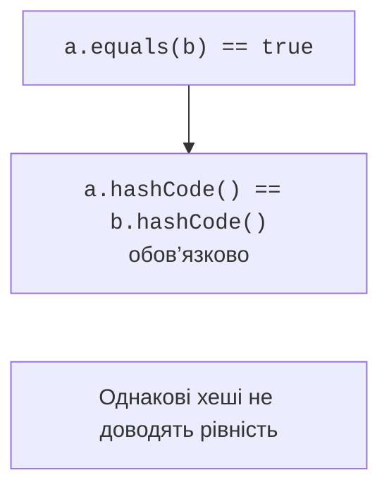

# Object, рівність і копіювання

## Object і логічна рівність

Кожний звичайний об’єкт має методи `Object`, зокрема `toString`, `equals`, `hashCode`, `getClass`. Опис API: <https://docs.oracle.com/en/java/javase/27/docs/api/java.base/java/lang/Object.html>. Типовий `toString` містить ім’я класу й шістнадцяткове представлення хешу; це не гарантована адреса пам’яті. Перевизначення має показувати корисний стан, не розкриваючи паролів чи інших закритих даних.

Оператор `==` для посилань перевіряє, чи це той самий об’єкт, або чи обидва посилання `null`. Метод `equals` може визначати логічну рівність значень. Дві точки з координатами 2 і 3 можуть бути рівними, хоча створені двома операторами `new`. Оберіть значущі поля свідомо: службовий лічильник переглядів зазвичай не визначає ідентичність предметного значення.

Контракт `equals` вимагає рефлексивності, симетричності, транзитивності й узгодженості, доки значущі поля не змінюються. Будь-який ненульовий об’єкт не дорівнює `null`. Якщо `a.equals(b)` істинне, хеші повинні збігатися. Зворотне твердження хибне: різні значення можуть мати однаковий хеш. Колізія є нормальною, а не доказом помилки хеш-функції.



Рис. 6.4. Рівність значень та обов’язкова узгодженість хешів {.caption}

## Приклад 3. Незмінна точка як значення

Клас `Point` фінальний, тому `instanceof Point` не створює проблеми порівняння з майбутніми підкласами. Координати незмінні, отже хеш не зміниться під час перебування об’єкта в колекції. `Objects.hash` зручний для навчальної моделі; він не є криптографічним хешем і не призначений для захисту даних.

```java
import java.util.Arrays;
import java.util.Objects;

final class Point {
    private final int x;
    private final int y;

    Point(int x, int y) {
        this.x = x;
        this.y = y;
    }

    Point(Point other) {
        this(Objects.requireNonNull(other).x, other.y);
    }

    @Override
    public boolean equals(Object other) {
        if (this == other) { return true; }
        return other instanceof Point point
                && x == point.x && y == point.y;
    }

    @Override
    public int hashCode() { return Objects.hash(x, y); }
    @Override
    public String toString() { return "(" + x + ", " + y + ")"; }
}

public class Main {
    public static void main(String[] args) {
        Point a = new Point(2, 3);
        Point b = new Point(a);
        System.out.println(a == b);
        System.out.println(a.equals(b));
        System.out.println(a.hashCode() == b.hashCode());
        System.out.println(a.equals(null));
        System.out.println(a.equals("(2, 3)"));
        Point[] first = {a};
        Point[] second = {b};
        System.out.println(first.equals(second));
        System.out.println(Arrays.equals(first, second));
        System.out.println(b);
    }
}
```

```text
false
true
true
false
false
false
true
(2, 3)
```

Масиви не перевизначують `equals` як порівняння вмісту: два різні масиви тут нерівні. `Arrays.equals` перевіряє відповідні елементи одновимірного масиву. Для вкладених масивів існує `Arrays.deepEquals`. `Objects.equals(a, b)` допомагає порівнювати значення, коли будь-який аргумент може бути `null`.

Якщо клас відкритий для наслідування, порівняння `instanceof Base` може вважати базовий об’єкт рівним похідному, тоді як похідний враховує додаткове поле. Так порушується симетричність. Перевірка `getClass() == other.getClass()` задає рівність лише в межах одного точного класу. Це свідомий вибір семантики, а не універсальна заміна `instanceof`. Для простих об’єктів-значень фінальний клас часто дозволяє уникнути всієї проблеми.

## Копіювання: посилання, поля та вкладені об’єкти

Присвоєння `b = a` копіює посилання. Копіювальний конструктор `new Point(a)` створює новий екземпляр і дозволяє явно визначити, які дані копіюються. Для примітивних координат цього достатньо. Якщо поле містить змінюваний масив або об’єкт, просте копіювання поля залишає спільний вкладений стан.

`Object.clone()` виконує неглибоке копіювання полів і пов’язаний із маркером `Cloneable`. Метод у `Object` захищений, а маркер сам не оголошує публічного `clone`. Тому підтримка клонування потребує додаткового контракту та роботи з винятками. Для власних навчальних класів віддаємо перевагу копіювальному конструктору або фабриці: правила видно в коді й можна перевірити.

Глибока копія не завжди потрібна. Незмінний `String` або незмінну точку безпечно розділяти. Масив точок можна скопіювати через `clone`, зберігши ті самі незмінні елементи. Натомість масив змінюваних рахунків після копіювання контейнера все ще посилається на спільні рахунки. Назва «копія» має супроводжуватися поясненням рівня незалежності.
