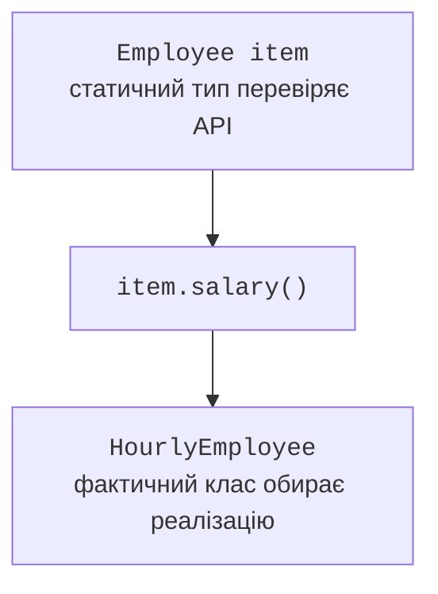

# Перевизначення та приведення типів

## Доступ protected не означає public

`private` закриває член усередині його класу, пакетний доступ дозволяє використання в пакеті, а `public` відкриває доступ там, де доступний сам тип. `protected` додатково надає спеціальний доступ підкласам з інших пакетів. Це не право будь-якого стороннього коду працювати з полем через довільний об’єкт базового типу.

У тому самому пакеті `protected` діє також як пакетний доступ. В іншому пакеті звернення підкласу до захищеного екземплярного члена через посилання має додаткове обмеження: тип кваліфікатора повинен бути цим підкласом або його підтипом. Наприклад, код `SavingsAccount` може працювати зі своєю захищеною операцією через `this`, але не отримує загального права змінювати довільний `Account`, переданий як параметр.

Практично поля краще лишати приватними, а підкласам відкривати вузьку захищену операцію. `protected deposit` із перевіркою суми безпечніший за `protected balance`: підклас не може присвоїти залишку від’ємне значення, обійшовши контроль. Доступ – частина контракту, який важко звузити після появи зовнішніх підкласів.

## Перевизначення, перевантаження та приховування

**Перевизначення** (*overriding*) замінює успадковану екземплярну реалізацію для конкретного підтипу. Ім’я та параметри мають відповідати сигнатурі. Тип результату може бути коваріантним: замість базового посилального типу допускається його підтип. Для примітивних типів таке звуження не працює. Доступ не можна звужувати, а перелік перевірюваних винятків не можна довільно розширювати порівняно з базовим контрактом.

Анотація `@Override` просить компілятор перевірити намір програміста. Без неї випадкова заміна параметра `Object` на `Point` у методі `equals` створює перевантаження, а не потрібне перевизначення. Програма може компілюватися, але бібліотечний код і далі викликатиме успадкований `equals(Object)`.

**Перевантаження** (*overloading*) – різні списки параметрів з одним ім’ям. Відповідну сигнатуру обирає компілятор за типами виразів. Після цього для перевизначуваного екземплярного методу JVM обирає реалізацію за фактичним класом об’єкта. Це два різні кроки; динамічний тип аргументу сам по собі не перемикає перевантаження.

Статичні методи не перевизначуються. Однойменний статичний метод підкласу приховує базовий, а вибір залежить від зазначеного типу. Поля також не мають поліморфного вибору. Не оголошуйте однакові поля в базовому й похідному класах: об’єкт матиме два поля, а читач легко помилиться щодо того, яке використано.

`final` для методу забороняє перевизначення, для класу – наслідування, для змінної – повторне присвоєння. Це різні гарантії. Фінальний клас із змінюваними полями не стає автоматично незмінним. Приватний метод також не перевизначується; однойменний метод підкласу є окремим методом і не змінює виклик усередині базового.



Рис. 6.3. Статичний тип і динамічний вибір методу {.caption}

## Приклад 2. Фігури та безпечне приведення

Базова `Shape` описує фігуру з нульовою площею. У наступній темі замінимо таку умовну реалізацію абстрактним методом, якщо безпосередній екземпляр не потрібний. Наразі приклад показує, як уже готовий спільний метод працює з різними підтипами.

Підняття типу (*upcast*) від `Circle` до `Shape` безпечне та не створює нового об’єкта. Зворотне приведення (*downcast*) потребує перевірки. Зразок `instanceof Circle circle` одночасно перевіряє тип і вводить локальне посилання потрібного типу.

```java
class Shape {
    public double area() { return 0; }
    @Override
    public String toString() { return "Shape: " + area(); }
}

final class Circle extends Shape {
    private final double radius;
    Circle(double radius) {
        if (!Double.isFinite(radius) || radius <= 0
                || radius > 10_000) {
            throw new IllegalArgumentException("Invalid radius");
        }
        this.radius = radius;
    }
    public double radius() { return radius; }
    @Override
    public double area() { return Math.PI * radius * radius; }
    @Override
    public String toString() { return "Circle(" + radius + ")"; }
}

final class Rectangle extends Shape {
    private final double width;
    private final double height;
    Rectangle(double width, double height) {
        if (!Double.isFinite(width) || !Double.isFinite(height)
                || width <= 0 || height <= 0
                || width > 10_000 || height > 10_000) {
            throw new IllegalArgumentException("Invalid sides");
        }
        this.width = width;
        this.height = height;
    }
    @Override
    public double area() { return width * height; }
}

public class Main {
    public static void main(String[] args) {
        Shape[] shapes = {new Circle(1), new Rectangle(3, 4)};
        for (Shape shape : shapes) {
            System.out.println(shape);
            System.out.printf(java.util.Locale.ROOT,
                    "Area: %.2f%n", shape.area());
            if (shape instanceof Circle circle) {
                System.out.println("Radius: " + circle.radius());
            }
        }
        Shape absent = null;
        System.out.println(absent instanceof Circle);
    }
}
```

```text
Circle(1.0)
Area: 3.14
Radius: 1.0
Shape: 12.0
Area: 12.00
false
```

`Locale.ROOT` фіксує крапку в перевірюваному результаті. Друга фігура використовує базовий `toString`, але перевизначену площу. Змінна `circle` доступна лише там, де компілятор може довести успішність перевірки. Перевірка `null instanceof Circle` дає `false`, тому окрема перевірка на `null` перед нею не потрібна.

Приведення `(Circle) shape` без перевірки не змінює об’єкт Rectangle на коло: воно завершується `ClassCastException`. Якщо код часто розгалужується за типами лише для виклику однакової операції, перенесіть цю операцію до спільного контракту. `instanceof` залишається корисним для справді спеціальної можливості, якої немає в кожного підтипу.
