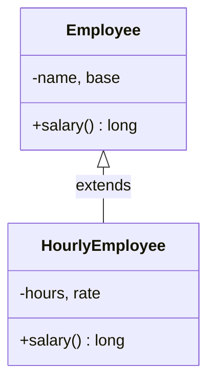
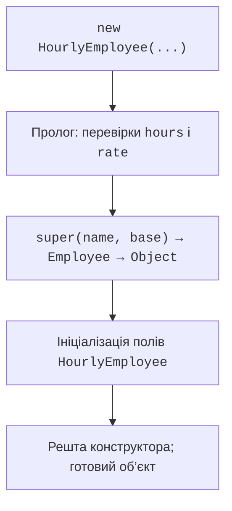

# Підкласи та їхні конструктори

## Спільна поведінка предметних типів

У відомості підприємства є працівники з фіксованою оплатою та працівники з погодинною оплатою. Обидва мають ім’я і можуть повідомити зарплату. Формула розрахунку різна, але код друку відомості не повинен перевіряти назву кожного конкретного класу. Для цього потрібний спільний контракт.

**Наслідування** (*inheritance*) утворює підтип на основі наявного класу. У Java клас має не більше одного безпосереднього суперкласу, зазначеного після `extends`. Якщо його не вказано, звичайний клас безпосередньо наслідує `Object`. Ланцюжок може містити кілька рівнів, але глибока ієрархія ускладнює розуміння поведінки.

Підклас не є копією вихідного файлу суперкласу. Його екземпляр містить також стан базової частини; доступ до цього стану визначається модифікаторами. Приватне поле суперкласу існує в об’єкті, але не доступне безпосередньо з коду підкласу. Конструктори не успадковуються. Якщо `Employee` має конструктор з ім’ям, `HourlyEmployee` потребує власного конструктора, який викличе базовий.

Зв’язок «є різновидом» має означати можливість заміни в програмі. Коло є фігурою, а принтер має картридж. Другий зв’язок описують полем, тобто композицією, а не наслідуванням принтера від картриджа. Подібність полів сама по собі не створює відношення підтипу.

Офіційний вступ до наслідування: <https://dev.java/learn/inheritance/>. У цій лекції використовуємо конкретний базовий клас, який має змістовну стандартну поведінку. Абстрактний контракт без реалізації окремих операцій розглянемо далі.



Рис. 6.1. Працівник як спільний тип оплати {.caption}

## Конструктор підкласу і базова частина

Конструктор відповідає за весь новий об’єкт, а не лише за поля поточного класу. Він прямо або опосередковано викликає конструктор суперкласу через `super(...)`. Якщо явного виклику `this(...)` або `super(...)` немає, компілятор вставляє `super()`. Тому суперклас без доступного конструктора без параметрів вимагає явного вибору конструктора з аргументами.

`this(...)` делегує іншому конструктору того самого класу. Ланцюжок повинен зрештою дійти до `super(...)`, а не утворити цикл. `super` не означає окремий об’єкт: це спосіб звернутися до базової реалізації в межах поточного екземпляра. Звичайний `new HourlyEmployee` створює один об’єкт, у якому є базові та похідні поля.

У JDK 27 перед явним викликом конструктора можна виконувати дозволений пролог: наприклад, перевіряти аргумент або обчислювати локальну змінну. Це стабільна можливість, не режим preview. Водночас ранній контекст не дозволяє довільно читати ще не ініціалізований об’єкт, викликати його методи або передавати `this` назовні. У навчальних прикладах пролог лише перевіряє параметри.

Загальна послідовність така: пам’ять отримує початкові значення, виконуються прологи й виклики конструкторів уздовж ланцюжка, після повернення базового конструктора виконуються ініціалізатори поточного класу та решта його конструктора. Присвоєння в ініціалізаторі поля може перезаписати значення, установлене раніше у прологу; не використовуйте таку залежність як навчальний прийом.



Рис. 6.2. Ланцюжок конструювання об’єкта підкласу {.caption}

Не викликайте перевизначуваний метод із конструктора базового класу. Динамічний вибір працює вже під час створення, коли поля підкласу ще можуть мати нулі або `null`. Помилка виглядає як несправність методу, хоча її причина – занадто ранній виклик. Приватний допоміжний метод конструктора не перевизначується й простіший для аналізу, але також не повинен публікувати `this`.

## Приклад 1. Відомість працівників

Суми зберігаємо в копійках типу `long`. Фіксований працівник отримує базову суму; погодинний додає оплату годин до базової суми. Межі навчальної моделі гарантують, що множення не переповнює `long`. Це умовні правила прикладу, а не правила розрахунку реальної зарплати.

Кожний клас перевіряє власні параметри. Підклас виконує перевірки ставки й годин у прологу, потім доручає перевірку імені й базової суми суперкласу. Метод `salary()` базового класу повторно використовується явним викликом `super.salary()`.

```java
class Employee {
    private final String name;
    private final long base;

    Employee(String name, long base) {
        if (name == null || name.isBlank()
                || base < 0 || base > 100_000_000) {
            throw new IllegalArgumentException("Invalid employee");
        }
        this.name = name.strip();
        this.base = base;
    }

    public long salary() { return base; }
    public final String getName() { return name; }

    @Override
    public String toString() {
        return name + ": " + salary();
    }
}

final class HourlyEmployee extends Employee {
    private final int hours;
    private final long rate;

    HourlyEmployee(String name, long base, int hours, long rate) {
        if (hours < 0 || hours > 250 || rate < 0
                || rate > 1_000_000) {
            throw new IllegalArgumentException("Invalid hours/rate");
        }
        super(name, base);
        this.hours = hours;
        this.rate = rate;
    }

    @Override
    public long salary() {
        return super.salary() + hours * rate;
    }
}

public class Main {
    public static void main(String[] args) {
        Employee[] staff = {
            new Employee("Olena", 200_000),
            new HourlyEmployee("Taras", 100_000, 20, 5_000)
        };
        long total = 0;
        for (Employee employee : staff) {
            System.out.println(employee);
            total += employee.salary();
        }
        System.out.println("Total: " + total);
        try {
            new HourlyEmployee("Ivan", 0, -1, 5_000);
        } catch (IllegalArgumentException ex) {
            System.out.println(ex.getMessage());
        }
    }
}
```

```text
Olena: 200000
Taras: 200000
Total: 400000
Invalid hours/rate
```

Масив має тип `Employee[]`, але другий елемент посилається на `HourlyEmployee`. Цикл не знає ставки та годин: він звертається до загальної операції. Навіть базовий `toString()` викликає перевизначений `salary()` для погодинного працівника. Саме тому базовий код повинен документувати, які методи він викликає і які гарантії очікує від підкласів.

Для граничної перевірки задайте нуль годин і нуль ставки: результат дорівнює базовій сумі. Від’ємні години та 251 мають відхилятися до створення об’єкта. Порожнє ім’я відхиляє конструктор `Employee`, незалежно від способу створення конкретного підтипу.
