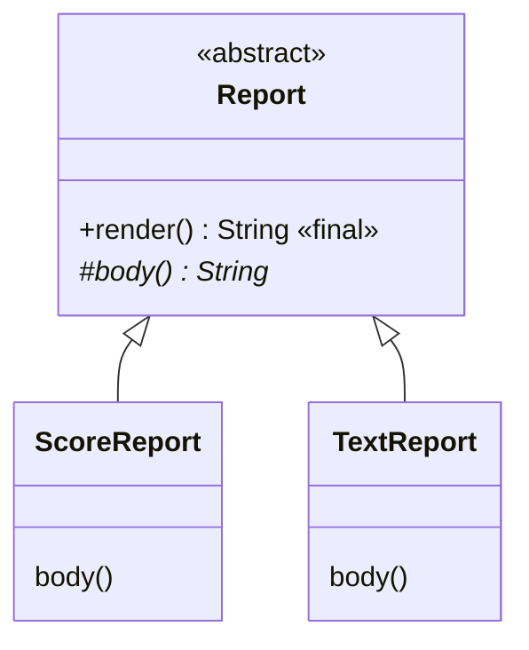

# Абстрактні класи та шаблонний метод

## Контракт без готової реалізації

У попередній темі базова фігура повертала нульову площу. Таке значення дозволяє показати механізм наслідування, але в реальній моделі фігура без конкретної геометрії не має змістовної формули. Потрібно оголосити операцію й вимагати від кожного конкретного підтипу її реалізацію.

**Абстрактний клас** позначається `abstract`. Створити його безпосередній екземпляр через `new` не можна. Він може містити поля, конструктори, готові методи та абстрактні методи без тіла. Якщо підклас не реалізував усі успадковані абстрактні операції, він також повинен бути абстрактним. Конкретний підклас завершує контракт і стає придатним до створення.

Абстрактний метод має сигнатуру й крапку з комою, наприклад `public abstract double area();`. Він не може бути одночасно `private`, `static` або `final`: ці модифікатори суперечили б необхідності екземплярного перевизначення підкласом. Абстрактний клас може не мати абстрактних методів, якщо автор свідомо забороняє безпосереднє створення базового типу.

Конструктор абстрактного класу викликається під час створення підкласу через `super`. Тому перевірка спільного імені чи ідентифікатора лишається в одному місці. Заборона `new Report(...)` не означає, що базова частина об’єкта не потребує ініціалізації. Не викликайте абстрактні або перевизначувані методи з конструктора: стан підкласу ще може бути неготовим.



Рис. 7.1. Абстрактний контракт і конкретні реалізації {.caption}

## Приклад 1. Шаблонний метод звіту

Шаблонний метод фіксує послідовність кроків, залишаючи підкласу одну змінну частину. `render` формує заголовок, тіло й завершення; `body` визначає лише зміст. Метод `render` фінальний, отже формат не можна випадково замінити в підкласі. Вхідний масив копіюється, щоб зовнішня зміна не впливала на вже створений звіт.

```java
import java.util.Arrays;

abstract class Report {
    private final String title;
    Report(String title) {
        if (title == null || title.isBlank()) {
            throw new IllegalArgumentException("Empty title");
        }
        this.title = title.strip();
    }
    protected abstract String body();
    public final String render() {
        return "[" + title + "]\n" + body() + "\nEND";
    }
}
final class ScoreReport extends Report {
    private final int[] scores;
    ScoreReport(String title, int[] scores) {
        super(title);
        if (scores == null || scores.length == 0
                || scores.length > 100) {
            throw new IllegalArgumentException("Invalid scores");
        }
        this.scores = scores.clone();
        for (int score : this.scores) {
            if (score < 0 || score > 100) {
                throw new IllegalArgumentException("Invalid score");
            }
        }
    }
    @Override
    protected String body() {
        int total = 0;
        for (int score : scores) { total += score; }
        return Arrays.toString(scores) + "\nTotal: " + total;
    }
}
public class Main {
    public static void main(String[] args) {
        int[] source = {80, 90, 100};
        Report report = new ScoreReport("Group A", source);
        source[0] = 0;
        System.out.println(report.render());
        try {
            new ScoreReport("Bad", new int[]{101});
        } catch (IllegalArgumentException ex) {
            System.out.println(ex.getMessage());
        }
    }
}
```

```text
[Group A]
[80, 90, 100]
Total: 270
END
Invalid score
```

Змінна має тип Report, а об’єкт – ScoreReport. Клієнт знає тільки публічний render. Захищений body є точкою розширення для підкласів, а не публічною операцією для зовнішнього коду. Контракт body має вказувати, чи допускається порожній результат і чи можливі винятки, інакше шаблонний метод не зможе надійно поєднувати кроки.

Перевірка source після створення демонструє захисну копію: звіт продовжує містити 80. Неправильна оцінка відхиляється конструктором. Для порожнього масиву визначено явну відмову, а не неочікуване ділення на нуль під час майбутнього обчислення середнього.
