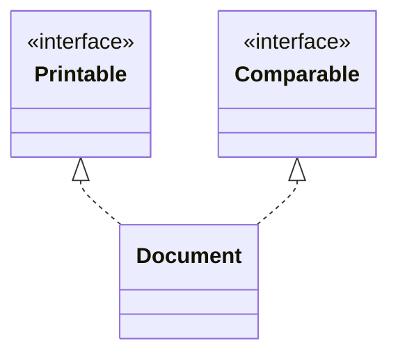
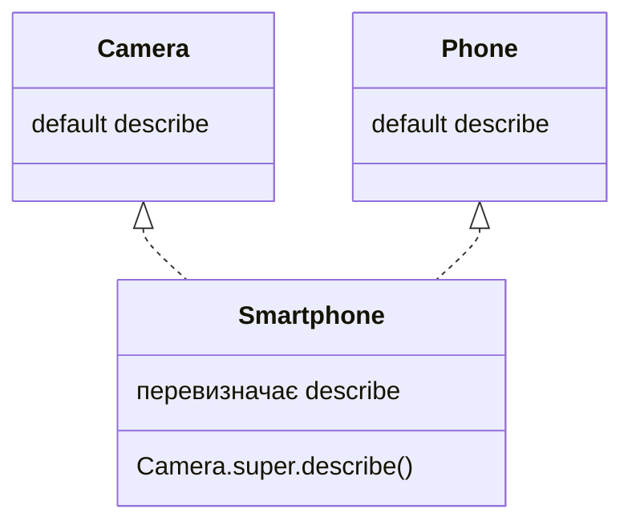

# Інтерфейси та їхні методи

## Інтерфейс як роль об’єкта

**Інтерфейс** описує роль, яку можуть виконувати різні класи. Його оголошують через `interface`, а реалізацію класом – через `implements`. Клас може наслідувати лише один клас, але реалізувати кілька інтерфейсів. Наприклад, документ може бути придатним до друку, порівняння й закриття, не будучи підкласом принтера.

Звичайний метод інтерфейсу без тіла неявно `public abstract`. Реалізація в класі повинна бути публічною, навіть якщо в оголошенні інтерфейсу public пропущено. Поля інтерфейсу неявно `public static final` і потребують ініціалізації. Це константи, а не стан окремого екземпляра. Не використовуйте інтерфейс лише як контейнер констант для успадкування їхніх імен.

Інтерфейс може розширювати один або кілька інтерфейсів через `extends`. Клас, що реалізує похідний інтерфейс, повинен задовольнити всі успадковані контракти. Змінна інтерфейсного типу може посилатися на будь-яку його реалізацію. Вона відкриває лише операції цієї ролі, а не всі методи конкретного класу.

Офіційний матеріал: <https://dev.java/learn/interfaces/>. Розділяйте інтерфейси за поведінкою: невеликий `Printable` простіше реалізувати й перевірити, ніж інтерфейс із десятками не пов’язаних операцій. Метод, якому потрібно лише друкувати, має приймати Printable, а не конкретний великий клас документа.



Рис. 7.2. Один клас може виконувати кілька ролей {.caption}

## Default, static і private

Метод `default` має реалізацію в інтерфейсі та може успадковуватися класом. Він корисний для поведінки, яку можна виразити через інші операції контракту, без власного стану. Клас може його перевизначити. Метод `static` належить самому інтерфейсу й викликається через його ім’я, а не через екземпляр.

Приватні методи інтерфейсу допомагають не повторювати код усередині default або static реалізацій. Вони не входять до зовнішнього контракту й не успадковуються реалізаціями як доступні операції. Приватний static помічник не має екземпляра; приватний екземплярний помічник може працювати з методами поточної реалізації.

Якщо клас успадковує конкретний метод від суперкласу, такий метод має перевагу над default. Якщо один інтерфейс розширює інший і перевизначає default, перевагу має більш конкретний контракт. Два незалежні default з однаковою сигнатурою створюють конфлікт: клас повинен явно обрати або поєднати поведінку.

```java
interface Camera {
    default String describe() { return label("camera"); }
    private String label(String text) { return "[" + text + "]"; }
}
interface Phone {
    default String describe() { return "[phone]"; }
    static boolean validNumber(String value) {
        return value != null && value.matches("[0-9]{10}");
    }
}
final class Smartphone implements Camera, Phone {
    @Override
    public String describe() {
        return Camera.super.describe() + Phone.super.describe();
    }
}
public class Main {
    public static void main(String[] args) {
        Camera item = new Smartphone();
        System.out.println(item.describe());
        System.out.println(Phone.validNumber("0123456789"));
        System.out.println(Phone.validNumber("abc"));
    }
}
```

```text
[camera][phone]
true
false
```

`Camera.super.describe()` звертається до конкретної default реалізації без створення об’єкта Camera. Такий синтаксис застосовують до відповідного безпосереднього суперинтерфейсу. Не слід обирати довільну старішу реалізацію в обхід більш конкретного успадкованого контракту.



Рис. 7.3. Явне розв’язання конфлікту default {.caption}

## Абстрактний клас чи інтерфейс

Обидва механізми можуть задавати тип параметра й вимагати реалізацію операцій. Вибір визначається спільним станом та характером зв’язку, а не кількістю рядків. Абстрактний клас зручний для споріднених реалізацій зі спільними інваріантами; інтерфейс – для незалежної ролі, яку виконують різні типи.

Таблиця 7.1. Абстрактний клас та інтерфейс {.caption}

| Ознака | Абстрактний клас | Інтерфейс |
| --- | --- | --- |
| Стан екземпляра | Поля та конструктор | Немає полів екземпляра |
| Спадкування класом | Один суперклас | Кілька ролей |
| Готова поведінка | Звичайні методи | default, static, private |
| Видимість | Різні рівні | Контракт публічний |
| Типова мета | Спільна основа сімейства | Можливість або стратегія |

Великий абстрактний клас із багатьма protected полями пов’язує підкласи з представленням. Інтерфейс із надто багатьма default методами може приховати складні залежності між операціями. Починайте з найменшого контракту, який дозволяє клієнтові виконати роботу; спільний код можна винести в окремого помічника.
